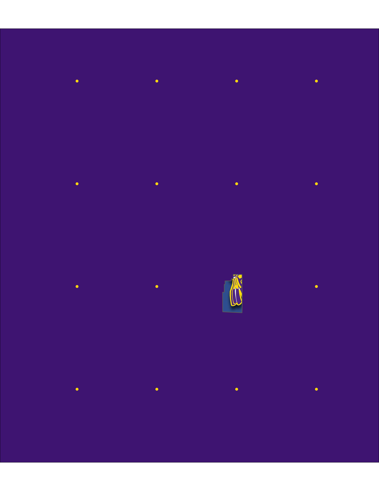

\let\oldsection\section
\renewcommand\section{\clearpage\oldsection}
```{r}


options(knitr.kable.NA = '')


```

# Climate futures for [Haskell Indian Nations University](https://www.haskell.edu)


## Prepare your environment
1. Install Climate Futures Toolbox

```{r, eval=FALSE}
install.packages("cft")
```

2. Load other packages
```{r, warning=FALSE, message=FALSE}
library(tidyverse)
library(tidync)
library(cft)
library(sf)
library(ggplot2)
library(ggthemes)
library(ggpattern)
library(magick)
library(future)
library(tidytable)
library(janitor)
options(timeout = 600L)
```

## Finding basic layers in OpenStreetMap
  Explain the basics of APIs and the premise of fast downloads.

### Use plain lnaguage to request a bounding box
1. Find the general area on Open Street Map
We use a function from the osmdata package to find a bounding box for our area of interest. This is a nice function for this purpose because it can use plan language declarations (e.g. "Lawrence, Kansas" or "Boulder, Colorado") for the location. 
  You do not need to use this function to define a bounding box. You can define your bounding box from any source. The benefit of this method is that is it is rather easy and reliable. 
```{r, cache=TRUE}
bb <- getbb("Lawrence, Kansas")
bb
```

```{r, warning=FALSE, message=FALSE, cache=TRUE}
bbb <- bb
bbb[1,1] <- bbb[1,1] - 0.001
bbb[1,2] <- bbb[1,2] + 0.001
bbb[2,1] <- bbb[2,1] - 0.03
bbb[2,2] <- bbb[2,2] + 0.001
xlimit <- bbb[1,]
ylimit <- bbb[2,] 
xmid <- xlimit[1] + diff(xlimit) / 2 
ratio <- diff(xlimit) / diff(ylimit)
```

2. Find any buildings associated with any University in our "Lawrence, Kansas" bounding box. 
  This request first calls the opq() function, which mounts to the OpenStreetMap database and then queries the "building" key (i.e. all the building footprints) for any building types matching the value "university". This is a representation of the "key" and "value" system that OSM uses to query data. The final step is to convert the OSM output into a spatial format that works well in R, called sf. 
  
```{r, fig.cap="Buildings labeled 'Haskell' in OSM", cache=TRUE}
my_boundary <- opq(bb) %>% 
  add_osm_feature(key = "building", value = "university") %>% 
osmdata_sf() 

summary(my_boundary)
```
 3. The output from this request shows a list of multipolygons, polygons, linestrings, and points. Each of these data types have a different storage structure, so we can't look at them all at the same time. Instead, lets start with polygons, which likely represent a single building footprint. Printing 'my_boundary$osm_polygons' shows that there are two Universities in Lawrence and we need to filter those results down to only include Haskell building. 
```{r, cache=TRUE}
boundaries <- my_boundary$osm_polygons %>% 
  filter(operator == "Haskell Indian Nations University") 
boundaries1 <- boundaries[1,] #take the first building (e.g. first row) of the returns
```

```{r, echo=FALSE, warning=FALSE, message=FALSE}
boundaries1 <- janitor::remove_empty(as.data.frame(boundaries1), which = "cols")
boundaries1
```

4. Plot our discovered footprint to visually confirm
 It looks like we found [Winona Hall](https://www.kansasmemory.org/item/449914) in the OpenStreetMap database. This is how we plot the perimeters associated with it. 
 
```{r, warning=FALSE, fig.width=12, fig.height=3, fig.cap="This seems to match.", cache=TRUE}

basemap <- ggplot(data = st_as_sf(boundaries1)) +
  geom_sf(fill = "blueviolet") +
  geom_sf_text(aes(label = name), size=10) +
  theme_tufte()

basemap
```


## Build a basemap from OpenStreetMap

### Set your color palette
1. Download the Haskell university logo
```{r, cache=TRUE, warning=FALSE, message=FALSE, fig.cap="This is the Haskell logo that I downloaded to this working directory from the schools website. This is the only element that we haven't retrieved directly through and API."}
seamless_image_filenames <- c(
  'Haskell_logo copy.jpg'
)

```
{width=50%}


2. Sample the colors on that logo to make a custom color palette for our basemap
```{r, cache=TRUE}
our_blue <- "#3A4E8B"
our_yellow <- "#FFD60F"
our_beige <- "#EDEDF0"
our_purple <- "#3E1471"
our_purple_alpha <- "#3E1471999"
```


### Download all the layers you want to include in your basemap

1. Download the Haskell University footprint
```{r,  warning=FALSE, message=FALSE, fig.cap="Buildings labeled 'Haskell' in OSM", cache=TRUE}
my_boundary <- opq(bb) %>% 
  add_osm_feature(key = "amenity", value = "university") %>% 
osmdata_sf() 

haskell_poly <- my_boundary$osm_multipolygons[1,]
```

```{r ,warning=FALSE, message=FALSE, echo=FALSE}
ggplot() +
   geom_sf( data=haskell_poly, color=our_yellow, size=0.5) +
  geom_sf_pattern( 
     data = haskell_poly,
     size=0,
    pattern       = 'image',
    pattern_type  = 'tile',
    pattern_scale =0.4,
    pattern_filename = seamless_image_filenames
  ) +
  theme_void() +
  theme(panel.background = element_rect(fill = our_purple),
        plot.background = element_rect(fill = NA)) +
   coord_sf(ylim = ylimit, xlim = xlimit, expand = TRUE)
  
```


2. Download street vector layers
  The street vector is divided into two different downloads in order to create two different objects for coloring in the final figure. This first download will be in the foreground. It includes the larger and faster roadways. 
```{r, warning=FALSE, message=FALSE, cache=TRUE}
# the big streets
streets <- 
  opq(bb) %>% 
  add_osm_feature(key = "highway", 
                  value = c("motorway", "trunk",  "primary", 
                            "secondary", "tertiary")) %>% 
  osmdata_sf() 

streets_crop <- streets$osm_lines %>%
  st_crop(y = c(ymin = bb[2,1], ymax = bb[2,2], xmin = bb[1,1], xmax = bb[1,2]))

```

```{r ,warning=FALSE, message=FALSE, echo=FALSE}
ggplot() +
   geom_sf( data=streets_crop, color=our_yellow, size=0.5) +
  theme_void() +
  theme(panel.background = element_rect(fill = our_purple),
        plot.background = element_rect(fill = NA)) +
   coord_sf(ylim = ylimit, xlim = xlimit, expand = TRUE)
  
```

The second street download is for the small side streets and footpaths. These lines will be more faint and in the background. 
```{r, warning=FALSE, message=FALSE, cache=TRUE}
small_streets <-  
  opq(bb) %>% 
  add_osm_feature(
    key = "highway", 
    value = c("residential", "living", "unclassified", 
              "service", "footway")) %>% 
  osmdata_sf()

small_streets_crop <- small_streets$osm_lines %>%
  st_crop(y = c(ymin = bb[2,1], ymax = bb[2,2], xmin = bb[1,1], xmax = bb[1,2]))

```

```{r ,warning=FALSE, message=FALSE, echo=FALSE}
ggplot() +
   geom_sf( data=small_streets_crop, color=our_beige, size=0.5, alpha=0.4) +
  theme_void() +
  theme(panel.background = element_rect(fill = our_purple),
        plot.background = element_rect(fill = NA)) +
   coord_sf(ylim = ylimit, xlim = xlimit, expand = TRUE)
  
```


3. Download water features. 
  The water features are first divided into moving and stationary water. We will download the river layer from the waterway key. 
```{r, warning=FALSE, message=FALSE, cache=TRUE}
water <- 
  opq(bb) %>% 
  add_osm_feature(key = "waterway", value = "river") %>% 
  osmdata_sf()
```

We divide the water into large and small waterways in the same way we did with the road. We are interested in making the main river much larger and the remaining waterways collectively smaller. The Kansas river is the large feature in this map so, we pull it out first. 
```{r, warning=FALSE, message=FALSE, cache=TRUE}
Kansas_river_multi <- water$osm_multilines %>%
  filter(name == "Kansas River")  %>% 
  st_as_sf() %>%
  st_crop(y = c(ymin = bb[2,1], ymax = bb[2,2], xmin = bb[1,1], xmax = bb[1,2]))
```

```{r ,warning=FALSE, message=FALSE, echo=FALSE}
ggplot() +
   geom_sf( data=Kansas_river_multi, color=our_blue, size=3, alpha=1) +
  theme_void() +
  theme(panel.background = element_rect(fill = our_purple),
        plot.background = element_rect(fill = NA)) +
   coord_sf(ylim = ylimit, xlim = xlimit, expand = TRUE)
  
```

After removing the Kansas river, we are left with a number of remaining waterways that are stored as both linestrings and multilinestrings. We need to download each of those data types individually. 
```{r, warning=FALSE, message=FALSE, cache=TRUE}
small_water_multi <- water$osm_multilines %>%
  filter(name != "Kansas River")%>%
  st_as_sf() %>%
  st_crop(y = c(ymin = bb[2,1], ymax = bb[2,2], xmin = bb[1,1], xmax = bb[1,2]))

small_water_lines <- water$osm_lines %>%
  filter(name != "Kansas River")%>%
  st_as_sf() %>%
  st_crop(y = c(ymin = bb[2,1], ymax = bb[2,2], xmin = bb[1,1], xmax = bb[1,2]))
```

```{r ,warning=FALSE, message=FALSE, echo=FALSE}
ggplot() +
  geom_sf( data=small_water_multi, color=our_blue, size=3, alpha=1) +
   geom_sf( data=small_water_lines, color=our_blue, size=3, alpha=1) +
  theme_void() +
  theme(panel.background = element_rect(fill = our_purple),
        plot.background = element_rect(fill = NA)) +
   coord_sf(ylim = ylimit, xlim = xlimit, expand = TRUE)
  
```

The stationary water bodies are divided into two categories: lakes and reservoirs. We need to pull each of these individually. First, the reservoir. 
```{r, warning=FALSE, message=FALSE, cache=TRUE}
reservoir <- 
  opq(bb) %>% 
  add_osm_feature(key = "water", value = "reservoir") %>% 
  osmdata_sf()

reservoir_crop_multi <- reservoir$osm_multipolygons %>%
  st_as_sf() %>%
  st_crop(y = c(ymin = bb[2,1], ymax = bb[2,2], xmin = bb[1,1], xmax = bb[1,2]))

reservoir_crop_poly <- reservoir$osm_multipolygons %>%
  st_as_sf() %>%
  st_crop(y = c(ymin = bb[2,1], ymax = bb[2,2], xmin = bb[1,1], xmax = bb[1,2]))

reservoir_crop <- cbind(reservoir_crop_multi, reservoir_crop_poly)

```

```{r ,warning=FALSE, message=FALSE, echo=FALSE}
ggplot() +
   geom_sf( data=reservoir_crop, color=our_blue, fill=our_blue, size=1, alpha=1) +
  theme_void() +
  theme(panel.background = element_rect(fill = our_purple),
        plot.background = element_rect(fill = NA)) +
   coord_sf(ylim = ylimit, xlim = xlimit, expand = TRUE)
  
```

Now the lakes. 
```{r, warning=FALSE, message=FALSE, cache=TRUE}
lake <- 
  opq(bb) %>% 
  add_osm_feature(key = "water", value = "lake") %>% 
  osmdata_sf()

lake_crop <- lake$osm_polygons %>%
  st_as_sf() %>%
  st_crop(y = c(ymin = bb[2,1], ymax = bb[2,2], xmin = bb[1,1], xmax = bb[1,2]))


```

```{r ,warning=FALSE, message=FALSE, echo=FALSE}
ggplot() +
   geom_sf( data=lake_crop, color=our_blue, fill=our_blue, size=1, alpha=1) +
  theme_void() +
  theme(panel.background = element_rect(fill = our_purple),
        plot.background = element_rect(fill = NA)) +
   coord_sf(ylim = ylimit, xlim = xlimit, expand = TRUE)
  
```


### Stack downloaded OSM layers into a final basemap.
  
```{r, warning=FALSE, message=FALSE, fig.width=12, fig.height=12, fig.cap="This seems to match.", cache=TRUE}
haskel_basemap <- ggplot() +
  # plot moving water layers first
  geom_sf(data = Kansas_river_multi, alpha = .8,
          size = 3, colour = our_blue) +
  geom_sf(data = small_water_multi, alpha = .8,
          size = 0.5, colour = our_blue) +
  geom_sf(data = small_water_lines, alpha = .8,
          size = 0.5, colour = our_blue) +
  # Layer bodies of water over the moving water layers
  geom_sf(data = lake_crop, alpha = 1, fill = our_blue, size=0) +
  geom_sf(data = reservoir_crop, alpha = 1, fill = our_blue, size=0) +
  
  # Plot small streets in the background with a light fade
  geom_sf(data = small_streets_crop, alpha = .6, 
          size = .1, colour = our_beige) +
  # Layer large streets over the top of the small streets with a bold color.
  geom_sf(data = streets_crop, alpha = .8, 
          size = .4, colour = our_yellow ) +
  # Layer Haskell university property polygon in the foreground
  geom_sf( data=haskell_poly, color=our_yellow, size=0.5) +
  # Fill Haskell property polygon with Haskell logo
   geom_sf_pattern( 
     data = haskell_poly,
     size=0,
    pattern       = 'image',
    pattern_type  = 'tile',
    pattern_scale = 1.1,
    pattern_filename = seamless_image_filenames
  ) +
  # set limits on final figure 
  coord_sf(ylim = ylimit, xlim = xlimit, expand = TRUE) +
  # adding labels
  annotate(geom = "text", y = bbb[2,1]+ 0.013, x = xmid, 
           label = "Haskell Indian Nations University", size = 12, colour = our_beige
           ) +
  annotate(geom = "errorbarh", xmin = xlimit[1], xmax = xlimit[2], y = bbb[2,1]+ 0.005,   
           height = 0, size = 0.5, colour = our_beige) +
  annotate(geom = "text", y = bbb[2,1]+ 0.0001, x =  xmid,
           label = "38°93'88\"N  95°23'29\"W",  size = 6,
           colour = our_beige) +
  # clean out unused elements and set background color
  theme_void() +
  theme(panel.background = element_rect(fill = our_purple),
        plot.background = element_rect(fill = NA))
```


### Save the basemap in high resolution print
```{r, warning=FALSE, message=FALSE, cache=TRUE}
ggsave(haskel_basemap, filename = "All_roads_lead_to_Haskell.png", height = 11, width=8.5, 
       units="in", dpi=600)
```
		

## Mount the climate dataset
This dataset is way too big to download to a particular machine. Instead, you mount to the analysis ready data cube (i.e. netCDF) and only download the subsetted data that you want to pull. 

 
```{r, warning=FALSE, message=FALSE, echo=FALSE, cache=TRUE}
inputs <- cft::available_data()
times <- inputs$available_times

all_pts <- inputs$src %>% 
  hyper_filter(lat = lat <= c(bbb[4]+0.05) & lat >= c(bbb[2]-0.05)) %>% 
  hyper_filter(lon = lon <= c(bbb[3]+0.05) & lon >= c(bbb[1]-0.05)) %>%
  hyper_filter(time =   times$`Available times` ==  44558) %>% 
  hyper_tibble(select_var = "pr_MRI-CGCM3_r1i1p1_rcp85"
    ) %>%
  st_as_sf(coords = c("lon", "lat"), crs = 4326, agr = "constant")
```


```{r, warning=FALSE, message=FALSE, echo=FALSE, cache=TRUE, fig.cap="Climate data are gridded. This figure shows the distribution of data stached at particular spatial locations. You can see that one of the data source points is within the Haskell polygon. Capture that point, we can search for which point is within the polygon or, which point is closest to the centroid of the polygon. Distance to centroid is more generalizable. "}

climate_grid <- ggplot() +
   geom_sf( data=haskell_poly, color=our_yellow, size=0.5) +
  geom_sf_pattern( 
     data = haskell_poly,
     size=0,
    pattern       = 'image',
    pattern_type  = 'tile',
    pattern_scale = 1.1,
    pattern_filename = seamless_image_filenames
  ) +
  geom_sf(data = all_pts, color=our_yellow) +
  theme_void() +
  theme(panel.background = element_rect(fill = our_purple),
        plot.background = element_rect(fill = NA)) +
   coord_sf(ylim = ylimit, xlim = xlimit, expand = TRUE)
  
ggsave(climate_grid, filename = "climate_grid.png", height = 11, width=8.5, 
       units="in", dpi=600)
```


1. We calculate the center point for measuring to the nearest climate data point. 
```{r, warning=FALSE, message=FALSE, cache=TRUE}
haskel_centroid <- st_coordinates(st_centroid(haskell_poly))
lat_pt <- haskel_centroid[1,2]
lon_pt <- haskel_centroid[1,1]
```

2. Connect to the web server and activate the proper data dimensions. 
```{r, cache=TRUE, warning=FALSE, message=FALSE}
web_link = "https://cida.usgs.gov/thredds/dodsC/macav2metdata_daily_future"

# Change to "https://cida.usgs.gov/thredds/catalog.html?dataset=cida.usgs.gov/macav2metdata_daily_historical" for historical data. 

src <- tidync::tidync(web_link)
lons <- src %>% activate("D2") %>% hyper_tibble()
lats <- src %>% activate("D1") %>% hyper_tibble()
```


3. Search through the database of climate prediction points to find which one is closest to our centroid. We then spatially project that chosen pt into an sf object. 
```{r, cache=TRUE, warning=FALSE, message=FALSE}
known_lon <- lons[which(abs(lons-lon_pt)==min(abs(lons-lon_pt))),]
known_lat <- lats[which(abs(lats-lat_pt)==min(abs(lats-lat_pt))),]

chosen_pt <- st_as_sf(cbind(known_lon,known_lat), coords = c("lon", "lat"), crs = "WGS84", agr = "constant")
```


```{r, cache=TRUE, echo=FALSE,warning=FALSE, message=FALSE}
l <- st_union(st_centroid(haskell_poly),st_as_sf(chosen_pt) ) %>% 
  st_cast("LINESTRING")

p <- st_union(st_centroid(haskell_poly),st_as_sf(chosen_pt) ) %>% 
  st_cast("POINT") %>% mutate(label = c("Nearest point in \n climate database","Center of Haskell polygon"))

box <- st_bbox(haskell_poly)
```

```{r, cache=TRUE, warning=FALSE, message=FALSE, cache=TRUE, echo=FALSE, fig.cap="One of the downscaled climate datasets in within Haskell's property. From the centroid of the Haskell polygon, we measure the distance to each gridded climate data source and choose the nearest one. "}
grid_match <- ggplot() +
   geom_sf( data=haskell_poly, color=our_yellow, size=0.5, fill=our_blue) +
  geom_sf(data= l, color=our_yellow, size=3) +
  geom_sf(data = chosen_pt, color=our_yellow, size=5) +
geom_sf(data = st_centroid(haskell_poly), color=our_yellow, size=5) +
  theme_void() +
  theme(panel.background = element_rect(fill = our_purple),
        plot.background = element_rect(fill = NA)) +
      geom_sf_text(data = st_as_sf(p), aes(label = label), colour = "white", nudge_y=c(0.0013,-0.001), nudge_x = -0.001, size=4) 

ggsave(grid_match, filename = "grid_match.png", height = 5, width=4, 
       units="in", dpi=600)
```


## Downloading climate data for our bounding box. 

### Connect to the downscaled dataset. 
  We cannot download the entire dataset. Instead, we mount to that dataset by connecting to an api that route us to a particular part of the dataset based on the bounding box specified. 
   Mount to the USGS downscaled dataset. The resultant object called 'input' includes three elements The first is the full list of available data at each timestep. The second is a list of possible time steps. The third is a list of verbatim copy of the raw return from the server. This raw return shows the dimensions of the data and how many elements are available in each of those dimensions. 
```{r, cache=TRUE}
# Mount to the USGS downscaled dataset. 
inputs <- cft::available_data()
```

Element 1. Dataframe of availble data and descriptions of each of those variables. 
```{r}
head(inputs[[1]])
```

Element 2. Short list of available data you can request
```{r}
head(unique(inputs[[1]]$Variable))
```

Element 3. Dataframe of available times
```{r}
head(inputs[[2]])
```

## Compile your data request to send to the server.
Your data order needs to include three things: Variable, Scenario, and Model. Your options can be found in the input elements we explored in the previous section. 
```{r, cache=TRUE}
input_variables <- inputs$variable_names %>% 
  filter(Variable %in% c("Maximum Relative Humidity", 
                       "Minimum Relative Humidity",
                       "Maximum Temperature",
                       "Minimum Temperature",                 
                       "Precipitation",
                       "Eastward Wind",
                       "Northward Wind")) %>% 
  filter(Scenario %in% c( "RCP 8.5")) %>% 
  filter(Model %in% c(
    "Beijing Climate Center - Climate System Model 1.1",
    "Beijing Normal University - Earth System Model",
    "Canadian Earth System Model 2",                                                                
  "Centre National de Recherches Météorologiques - Climate Model 5",                              
  "Commonwealth Scientific and Industrial Research Organisation - Mk3.6.0",                       
  "Community Climate System Model 4",                                                             
  "Geophysical Fluid Dynamics Laboratory - Earth System Model 2 Generalized Ocean Layer Dynamics",
  "Geophysical Fluid Dynamics Laboratory - Earth System Model 2 Modular Ocean",                   
  "Hadley Global Environment Model 2 - Climate Chemistry 365 (day) ",                             
 "Hadley Global Environment Model 2 - Earth System 365 (day)",                                   
 "Institut Pierre Simon Laplace (IPSL) - Climate Model 5A - Low Resolution",                     
 "Institut Pierre Simon Laplace (IPSL) - Climate Model 5A - Medium Resolution",                  
 "Institut Pierre Simon Laplace (IPSL) - Climate Model 5B - Low Resolution",                     
 "Institute of Numerical Mathematics Climate Model 4",                                           
 "Meteorological Research Institute - Coupled Global Climate Model 3",                           
 "Model for Interdisciplinary Research On Climate - Earth System Model",                         
 "Model for Interdisciplinary Research On Climate - Earth System Model - Chemistry",             
 "Model for Interdisciplinary Research On Climate 5",                                            
 "Norwegian Earth System Model 1 - Medium Resolution"  )) %>%
  
  pull("Available variable")

head(as.data.frame(input_variables))
```


```{r, eval=FALSE, cache=TRUE, include=FALSE}
times <- inputs$available_times

start_time <- Sys.time()

Pulled_data_single_space_single_timepoint <- inputs$src %>% 
  hyper_filter(lat = lat <= c(center_point[4]+0.05) & lat >= c(center_point[2]-0.05)) %>% 
  hyper_filter(lon = lon <= c(center_point[3]+0.05) & lon >= c(center_point[1]-0.05)) %>%
  #hyper_filter(time = times$`Available times` ==  44558) %>% 
  hyper_tibble(select_var = input_variables[1:38]) %>%
  st_as_sf(coords = c("lon", "lat"), crs = 4326, agr = "constant") 

end_time <- Sys.time()
print(end_time - start_time)
```

## Prepare for parallelization
```{r, eval=FALSE, cache=TRUE}
n_cores <- availableCores() - 1
plan(multisession, workers = n_cores)
```

## Make parallel call to USGS server.
```{r, eval=FALSE, cache=TRUE}
out <- single_point_firehose(input_variables, known_lat, known_lon )
head(out)
```

## Save output
```{r, eval=FALSE, cache=TRUE}
haskell <- out
save(haskell, file = "haskell.RData")
```

## Load saved output
```{r, cache=TRUE}
load(file = "haskell.RData")
```


```{r, cache=TRUE}
df_precip <- haskell %>%
  st_drop_geometry() %>%
  select(time, which(startsWith(colnames(haskell), "pr"))) %>%
  gather(key = "variable", value = "value", -time)
head(df_precip)
```


```{r, cache=TRUE}
df_min_temp <- haskell %>%
  st_drop_geometry() %>%
  select(time, which(startsWith(colnames(haskell), "tasmin"))) %>%
  gather(key = "variable", value = "value", -time)

df_min_temp <- df_min_temp[which(df_min_temp$value > 200), ]
df_min_temp$variable <- as.character(as.numeric(as.factor(df_min_temp$variable)))

head(df_min_temp)
```


```{r, cache=TRUE}
df_RH <- haskell %>%
  st_drop_geometry() %>%
  select(time,which(startsWith(colnames(haskell), "rhs")) ) %>%
  gather(key = "variable", value = "value", -time)

df_RH_min <- haskell %>%
  st_drop_geometry() %>%
  select(time,which(startsWith(colnames(haskell), "rhsmin"))) %>%
  gather(key = "variable", value = "value", -time)

df_RH_max <- haskell %>%
  st_drop_geometry() %>%
  select(time,which(startsWith(colnames(haskell), "rhsmax"))) %>%
  gather(key = "variable", value = "value", -time)
head(df_RH_max)
```


```{r, cache=TRUE, warning=FALSE, message=FALSE}
all_climate_projections_RH <- ggplot(data= df_RH, aes(x = time, y = value, color = variable)) + 
  #geom_line()+
  
  scale_colour_viridis_d(option="A", alpha = 0.8) +
  geom_smooth() +
  theme_tufte() +
  theme(legend.position = "none") 
  

all_climate_projections_RH
```


```{r, cache=TRUE, warning=FALSE, message=FALSE}
all_climate_projections_RH <- ggplot(data= df_RH_min, aes(x = time, y = value) )+ 
  geom_smooth(data= df_RH_min, color=our_purple) +
  geom_smooth(data= df_RH_max, color=our_purple) +
  theme_tufte() +
  ylim(0,100)
  

all_climate_projections_RH
```


```{r, cache=TRUE, warning=FALSE, message=FALSE}


all_climate_projections <- ggplot(data= df_min_temp, aes(x = time, y = value, color = variable)) + 
  geom_line()+
  geom_smooth() +
  scale_colour_viridis_d(option="A")
  

all_climate_projections
```

```{r, cache=TRUE, warning=FALSE, message=FALSE}


ensemble_climate_projections <- ggplot(data= df_min_temp, aes(x = time, y = value)) + 
  geom_line(color=our_purple)+
  geom_smooth(color=our_yellow) +
  theme_tufte()
  

ensemble_climate_projections


ggplot(data= df_min_temp, aes(x = time, y = value)) + 
  geom_smooth(color=our_purple) +
  theme_tufte()
```


```{r, cache=TRUE, warning=FALSE}


all_climate_projections <- ggplot(data= df_precip, aes(x = time, y = value, color = variable)) + 
  geom_line(color=our_purple)+
  theme_tufte()
  

all_climate_projections
```

```{r, cache=TRUE, warning=FALSE,  message=FALSE}

df_precip_2 <- df_precip[which(df_precip$value != 0),]

ensemble_climate_projections <- ggplot(data= df_precip_2, aes(x = time, y = value)) + 
   geom_line(color=our_purple)+
  geom_smooth(color=our_yellow)+
  theme_tufte()
  

ensemble_climate_projections

ggplot(data= df_precip, aes(x = time, y = value)) + 
     geom_smooth(color=our_purple)+
  theme_tufte()
```


```{r, cache=TRUE}
df_precip_quant_95 <- df_precip %>% 
  mutate(quant = ntile(value, 100)) %>%
  filter(quant == 95)

df_precip_quant_96 <- df_precip %>% 
  mutate(quant = ntile(value, 100)) %>%
  filter(quant == 96)

df_precip_quant_97 <- df_precip %>% 
  mutate(quant = ntile(value, 100)) %>%
  filter(quant == 97)

df_precip_quant_98 <- df_precip %>% 
  mutate(quant = ntile(value, 100)) %>%
  filter(quant == 98)

df_precip_quant_99 <- df_precip %>% 
  mutate(quant = ntile(value, 100)) %>%
  filter(quant == 99)

df_precip_quant_100 <- df_precip %>% 
  mutate(quant = ntile(value, 100)) %>%
  filter(quant == 100)

df_precip_quant_1000 <- df_precip %>% 
  mutate(quant = ntile(value, 1000)) %>%
  filter(quant == 1000)

df_precip_quant_100000 <- df_precip %>% 
  mutate(quant = ntile(value, 100000)) %>%
  filter(quant == 100000)
```


```{r, cache=TRUE, warning=FALSE, message=FALSE}
ggplot(data= df_precip, aes(x = time, y = value)) + 
     geom_smooth(data= df_precip, color=our_purple)+ 
     geom_smooth(data= df_precip_quant_95, color=our_purple) +
    geom_smooth(data= df_precip_quant_96, color=our_purple) +
    geom_smooth(data= df_precip_quant_97, color=our_purple) +
    geom_smooth(data= df_precip_quant_98, color=our_purple) +
    geom_smooth(data= df_precip_quant_99, color=our_purple) +
  geom_smooth(data= df_precip_quant_100, color=our_purple) +
  geom_smooth(data= df_precip_quant_1000, color=our_purple) +
    geom_smooth(data= df_precip_quant_100000, color=our_purple) +
  theme_tufte()
```

