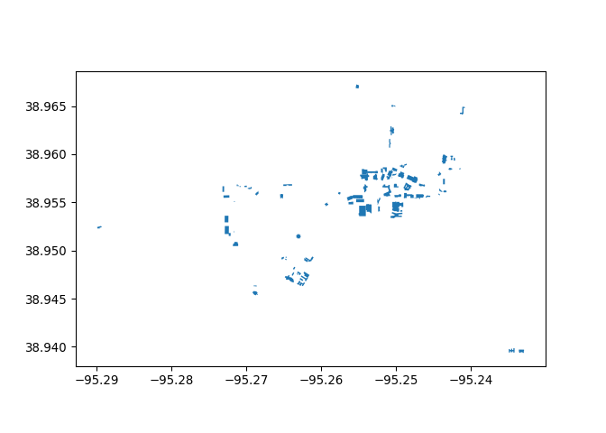
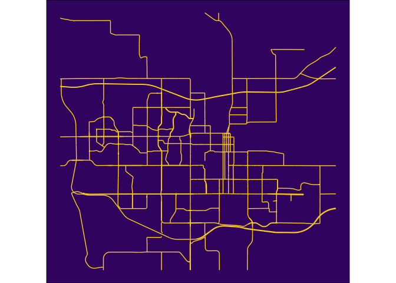
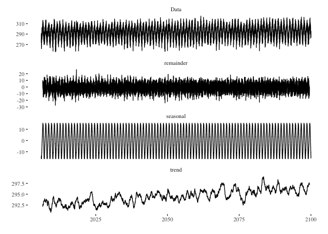
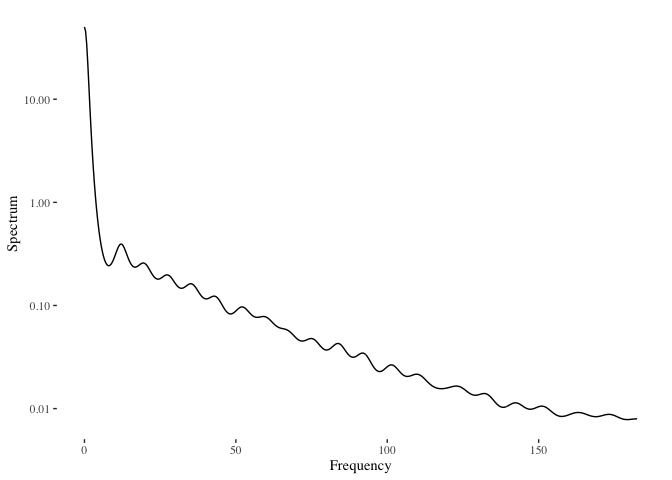
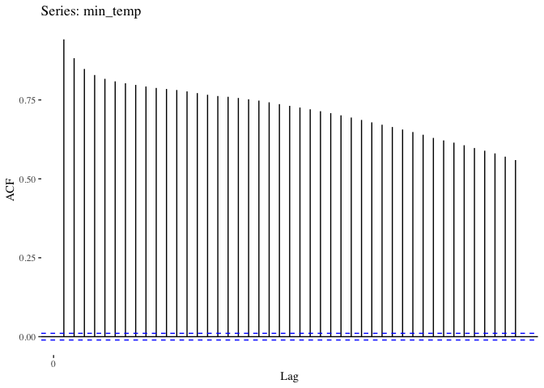
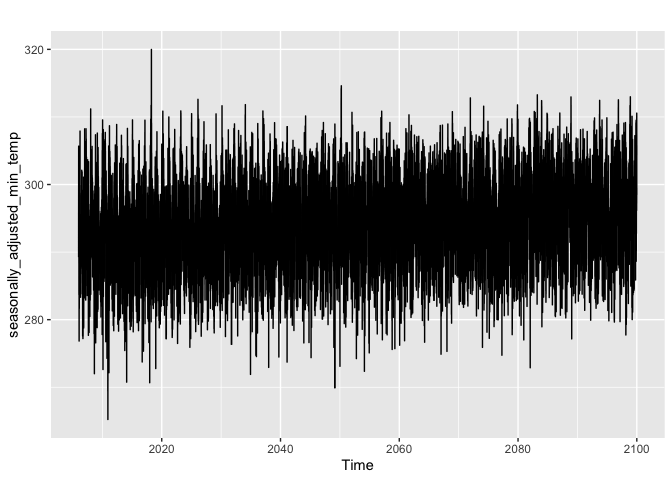
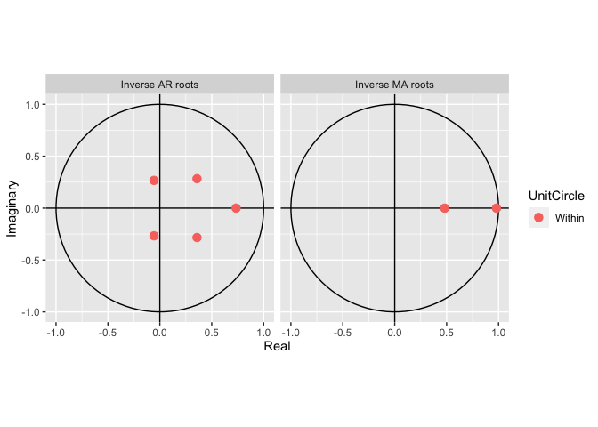
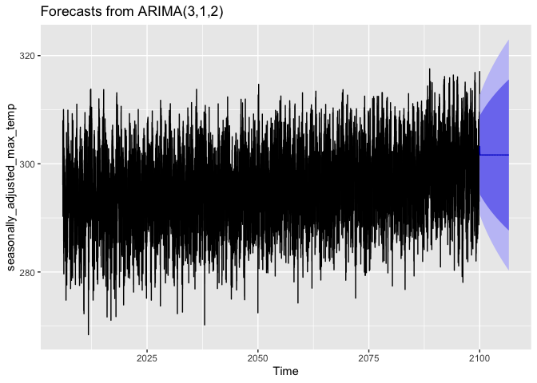
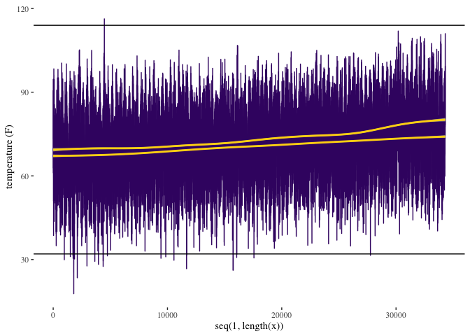
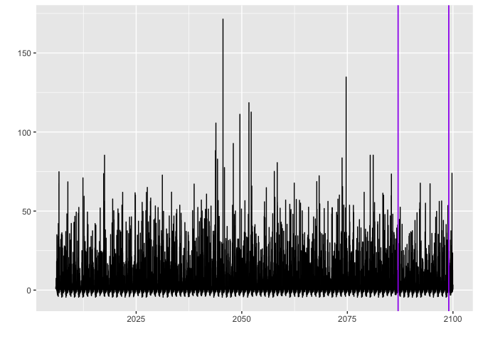

``` r
options(knitr.kable.NA = '')
```

# Climate futures for [Haskell Indian Nations University](https://www.haskell.edu)

## Prepare your environment

1.  Install Climate Futures Toolbox

``` r
install.packages("cft")
```

2.  Load other packages

``` r
library(tidyverse)
library(tidync)
library(cft)
library(sf)
library(ggplot2)
library(ggthemes)
library(ggpattern)
library(magick)
library(future)
library(forecast)
library(tidytable)
library(janitor)
options(timeout = 600)
library(ggfortify)
library(reticulate)
library(osmdata)
library(osmextract)
library(changepoint)
library(weathermetrics)
library(TSstudio)
 library(ggridges)
```

``` r
conda_update(conda = "auto")
py_install("numpy")
py_install("matplotlib")
py_install("pandas")
py_install("statsmodels")
py_install("osmnx")
py_install("geopandas")
```

### Set your color palette

1.  Download the Haskell university logo

``` r
seamless_image_filenames <- c(
  'Haskell_logo.png'
)
```


2.  Sample the colors on that logo to make a custom color palette for
    our basemap

``` r
our_blue <- "#3A4E8B"
our_yellow <- "#FFD60F"
our_beige <- "#EDEDF0"
our_purple <- "#3E1471"
```

## Finding basic layers in OpenStreetMap

Explain the basics of APIs and the premise of fast downloads.

### Use plain lnaguage to request a bounding box

1.  Find the general area on Open Street Map We use a function from the
    osmdata package to find a bounding box for our area of interest.
    This is a nice function for this purpose because it can use plan
    language declarations (e.g. “Lawrence, Kansas” or “Boulder,
    Colorado”) for the location. You do not need to use this function to
    define a bounding box. You can define your bounding box from any
    source. The benefit of this method is that is it is rather easy and
    reliable.

``` r
bb <- getbb("Lawrence, Kansas")
bb
```

    ##         min       max
    ## x -95.34454 -95.16662
    ## y  38.90447  39.03350

If you format your request a little differently, then it will return the
more complex polygon for the bounding box.

``` r
bb_sf <- getbb("Lawrence, Kansas", format_out = "sf_polygon")
ggplot(data=bb_sf$multipolygon) + geom_sf(fill=our_beige, color=our_purple) + theme_tufte()
```

<!-- -->

2.  Find any buildings associated with any University in our “Lawrence,
    Kansas” bounding box.

#### Using the package osmdata

This request first calls the opq() function, which mounts to the
OpenStreetMap database and then queries the “building” key (i.e. all the
building footprints) for any building types matching the value
“university”. This is a representation of the “key” and “value” system
that OSM uses to query data. The final step is to convert the OSM output
into a spatial format that works well in R, called sf.

``` r
library(osmdata)
University_buildings <- 
  opq(bb) %>% 
  add_osm_feature(key = "building", value = "university") %>% 
  osmdata_sf()
```

The output from this request shows a list of multipolygons, polygons,
linestrings, and points. Each of these data types have a different
storage structure, so we can’t look at them all at the same time.
Instead, lets start with polygons, which likely represent a single
building footprint. Printing ‘my_boundary$osm_polygons’ shows that there
are two Universities in Lawrence and we need to filter those results
down to only include Haskell building.

``` r
University_buildings <- University_buildings$osm_polygons
```

#### Using the package osmextract

The package OSMextract is calling the same OSM API, but it does it in a
slightly different way that can make if faster but also requires a
little better understanding of what you’re looking for. For example, by
default OSM extract only downloads the first 25 columns as their own
column and clumps the rest into a list that is difficult to read. You
can add columns to the api call as I did here (e.g. extra_tags =
c(“operator)) and it will return that column as a column instead of in
the list. You can also parse the list yourself or use osmdata() to
download a sample and then use osmextract to execute larger downloads.
This package usually clumps polygons and multipolygons by default so,
you just ask for multipolygons and get both back.

``` r
library(osmextract)
University_buildings <- oe_get(
  place = "Lawrence, Kansas", 
  layer = "multipolygons",
  query = "SELECT * FROM multipolygons WHERE building IN ('university')",
  quiet = TRUE,
  extra_tags = c("operator")
)

colnames(University_buildings)
```

    ##  [1] "osm_id"      "osm_way_id"  "name"        "type"        "aeroway"     "amenity"    
    ##  [7] "admin_level" "barrier"     "boundary"    "building"    "craft"       "geological" 
    ## [13] "historic"    "land_area"   "landuse"     "leisure"     "man_made"    "military"   
    ## [19] "natural"     "office"      "place"       "shop"        "sport"       "tourism"    
    ## [25] "operator"    "other_tags"  "geometry"

3.  Use the ‘operator’ column to identify the owner of those buildings
    and filter down to building operated by Haskell Indian Nations
    University.

``` r
Haskell_university_buildings <- University_buildings %>% 
  filter(operator == "Haskell Indian Nations University") 
Haskell_university_buildings1 <- Haskell_university_buildings[1,] #take the first building (e.g. first row) of the returns
head(Haskell_university_buildings1)
```

The janitor package is useful for performing automated cleaning tasks on
your data. Here we remove all of the columns that contain no data to
make our dataframe much smaller and easier to read.

4.  Plot our discovered footprint to visually confirm It looks like we
    found [Winona Hall](https://www.kansasmemory.org/item/449914) in the
    OpenStreetMap database. This is how we plot the perimeters
    associated with it. 

``` r
basemap <- ggplot(data = st_as_sf(boundaries1)) +
  geom_sf(fill = our_purple, color=our_yellow) +
  geom_sf_text(aes(label = name), size=10, color=our_yellow) +
  theme_tufte()

basemap
```


\#### OSM in python using osmnx The python interface for OSM uses a
slightly different syntax to write the requests, but it’s calling the
same OSM api that the R packages call. You still submit a plain-language
area-of-interest, a value, and a key. Those three inputs will return a
list of points, lines, and polygons for you to use and manipulate.

``` python
place_name = "Lawrence, Kansas"

# import osmnx
import osmnx as ox
import geopandas as gpd
import matplotlib.pyplot as plt

# Get place boundary related to the place name as a geodataframe
area = ox.geocode_to_gdf(place_name)
type(area)


# List key-value pairs for tags
```

    ## <class 'geopandas.geodataframe.GeoDataFrame'>

``` python
tags = {'building': 'university'}   


buildings = ox.geometries_from_place(place_name, tags)
buildings.plot()
plt.show()
```

<!-- -->

## Build a basemap from OpenStreetMap

### Download all the layers you want to include in your basemap

1.  Download the Haskell University footprint

``` r
amenity_poly <- oe_get(
  place = "Lawrence, Kansas", 
  layer = "multipolygons",
  query = "SELECT * FROM multipolygons WHERE amenity IN ('university')",
  quiet = TRUE,
  extra_tags = c("operator")
)


haskell_poly <- amenity_poly %>%
  filter(name =='Haskell Indian Nations University') %>%
  st_as_sf()
```

<!-- -->

2.  Download street vector layers The street vector is divided into two
    different downloads in order to create two different objects for
    coloring in the final figure. This first download will be in the
    foreground. It includes the larger and faster roadways.

``` r
# the big streets
big_streets_lines <- oe_get(
  place = "Lawrence, Kansas", 
  layer = "lines",
  query = "SELECT * FROM lines WHERE highway IN ('motorway', 'trunk',  'primary',  'secondary', 'tertiary')",
  quiet = TRUE
)

streets_crop <- big_streets_lines %>%
  st_crop(y = c(ymin = bb[2,1], ymax = bb[2,2], xmin = bb[1,1], xmax = bb[1,2]))
```

<!-- -->

The second street download is for the small side streets and footpaths.
These lines will be more faint and in the background.

``` r
small_streets <- oe_get(
  place = "Lawrence, Kansas", 
  layer = "lines",
  query = "SELECT * FROM lines WHERE highway IN ('residential', 'living',  'unclassified',  'service', 'footway')",
  quiet = TRUE
)

small_streets_crop <- small_streets %>%
  st_crop(y = c(ymin = bb[2,1], ymax = bb[2,2], xmin = bb[1,1], xmax = bb[1,2]))
```

<!-- -->

3.  Download water features. The water features are first divided into
    moving and stationary water. We will download the river layer from
    the waterway key.

``` r
water <- oe_get(
  place = "Lawrence, Kansas", 
  layer = "lines",
  query = "SELECT * FROM lines WHERE waterway IN ('river')",
  quiet = TRUE
)
```

We divide the water into large and small waterways in the same way we
did with the road. We are interested in making the main river much
larger and the remaining waterways collectively smaller. The Kansas
river is the large feature in this map so, we pull it out first.

``` r
Kansas_river_multi <- water %>%
  filter(name == "Kansas River")  %>% 
  st_as_sf() %>%
  st_crop(y = c(ymin = bb[2,1], ymax = bb[2,2], xmin = bb[1,1], xmax = bb[1,2]))
```

<!-- -->

After removing the Kansas river, we are left with a number of remaining
waterways that are stored as both linestrings and multilinestrings. We
need to download each of those data types individually.

``` r
small_water_lines <- water %>%
  filter(name != "Kansas River")%>%
  st_as_sf() %>%
  st_crop(y = c(ymin = bb[2,1], ymax = bb[2,2], xmin = bb[1,1], xmax = bb[1,2]))
```

<!-- -->

The stationary water bodies are a subcategory under the key=natural and
the value=water. We ask for the extra column named water to be include
in our returned sf table. We can use that column to filter our the lakes
and reservours as local water bodies.

``` r
# Request all water features using natural:water but also request the water tag be given it's own column. 
water_body <- oe_get(
  place = "Lawrence, Kansas", 
  layer = "multipolygons",
  query = "SELECT * FROM multipolygons WHERE natural IN ('water')",
  quiet = TRUE,
  extra_tags = c("water") #give water it's own column instead of clumping in supplimentary list
)

water_body_crop <- water_body %>%
  filter(water == 'lake' | water == "reservoir") %>%
  st_as_sf() 
```

<!-- -->

### Stack downloaded OSM layers into a final basemap.

This is a special edit to manually shift the bounding box so that it
better centered Haskell University in the basemap. Most people will not
need this adjustment but may enjoy the ability to microadjust their
basemap.

``` r
bbb <- bb
bbb[1,1] <- bbb[1,1] - 0.001
bbb[1,2] <- bbb[1,2] + 0.001
bbb[2,1] <- bbb[2,1] - 0.03
bbb[2,2] <- bbb[2,2] + 0.001
xlimit <- bbb[1,]
ylimit <- bbb[2,] 
xmid <- xlimit[1] + diff(xlimit) / 2 
ratio <- diff(xlimit) / diff(ylimit)
```

This is a long plot that calls each of the plot layers in order from the
back to the front. There is a section at the end that crop, format, and
append the basemap.

``` r
haskel_basemap <- ggplot() +
  # plot moving water layers first
  geom_sf(data = Kansas_river_multi, alpha = .8,
          size = 3, colour = our_blue) +
  geom_sf(data = small_water_lines, alpha = .8,
          size = 0.5, colour = our_blue) +
  # Layer bodies of water over the moving water layers
  geom_sf(data = water_body_crop, alpha = 1, fill = our_blue, size=0) +
  
  # Plot small streets in the background with a light fade
  geom_sf(data = small_streets_crop, alpha = .6, 
          size = .1, colour = our_beige) +
  # Layer large streets over the top of the small streets with a bold color.
  geom_sf(data = streets_crop, alpha = .8, 
          size = .4, colour = our_yellow ) +
  # Layer Haskell university property polygon in the foreground
  geom_sf( data=haskell_poly, color=our_yellow, size=1) +
  # Fill Haskell property polygon with Haskell logo
   geom_sf_pattern( 
     data = haskell_poly,
     size=0,
    pattern       = 'image',
    pattern_type  = 'tile',
    pattern_scale = 0.06,
    pattern_filename = seamless_image_filenames
  ) +
  # set limits on final figure 
  coord_sf(ylim = ylimit, xlim = xlimit, expand = TRUE) +
  # adding labels
  annotate(geom = "text", y = bbb[2,1]+ 0.013, x = xmid, 
           label = "Haskell Indian Nations University", size = 12, colour = our_beige
           ) +
  annotate(geom = "errorbarh", xmin = xlimit[1], xmax = xlimit[2], y = bbb[2,1]+ 0.005,   
           height = 0, size = 0.5, colour = our_beige) +
  annotate(geom = "text", y = bbb[2,1]+ 0.0001, x =  xmid,
           label = "38°93'88\"N  95°23'29\"W",  size = 6,
           colour = our_beige) +
  # clean out unused elements and set background color
  theme_void() +
  theme(panel.background = element_rect(fill = our_purple),
        plot.background = element_rect(fill = NA))
```


### Save the basemap in high resolution print

``` r
ggsave(haskel_basemap, filename = "All_roads_lead_to_Haskell.png", height = 11, width=8.5, 
       units="in", dpi=600)
```

## Mount the climate dataset

This dataset is way too big to download to a particular machine.
Instead, you mount to the analysis ready data cube (i.e. netCDF) and
only download the subsetted data that you want to pull.

 1. We calculate the center point for measuring to
the nearest climate data point.

``` r
haskel_centroid <- st_coordinates(st_centroid(haskell_poly))
lat_pt <- haskel_centroid[1,2]
lon_pt <- haskel_centroid[1,1]
```

2.  Connect to the web server and activate the proper data dimensions.

``` r
web_link = "https://cida.usgs.gov/thredds/dodsC/macav2metdata_daily_future"

# Change to "https://cida.usgs.gov/thredds/catalog.html?dataset=cida.usgs.gov/macav2metdata_daily_historical" for historical data. 

src <- tidync::tidync(web_link)
lons <- src %>% activate("D2") %>% hyper_tibble()
lats <- src %>% activate("D1") %>% hyper_tibble()
```

3.  Search through the database of climate prediction points to find
    which one is closest to our centroid. We then spatially project that
    chosen pt into an sf object.

``` r
known_lon <- lons[which(abs(lons-lon_pt)==min(abs(lons-lon_pt))),]
known_lat <- lats[which(abs(lats-lat_pt)==min(abs(lats-lat_pt))),]

chosen_pt <- st_as_sf(cbind(known_lon,known_lat), coords = c("lon", "lat"), crs = "WGS84", agr = "constant")
```


## Find and transfer climate data from an API

### Mount to the downscaled dataset and transfer metadata.

We cannot download the entire dataset. Instead, we mount to that dataset
by connecting to an api that route us to a particular part of the
dataset based on the bounding box specified. Mount to the USGS
downscaled dataset. The resultant object called ‘input’ includes three
elements The first is the full list of available data at each timestep.
The second is a list of possible time steps. The third is a list of
verbatim copy of the raw return from the server. This raw return shows
the dimensions of the data and how many elements are available in each
of those dimensions.

``` r
# Mount to the USGS downscaled dataset. 
inputs <- cft::available_data()
```

Element 1. Dataframe of availble data and descriptions of each of those
variables.

``` r
head(inputs[[1]])
```

Element 2. Short list of available data you can request

``` r
head(unique(inputs[[1]]$Variable))
```

    ## [1] "Specific Humidity"                   "Precipitation"                      
    ## [3] "Maximum Relative Humidity"           "Minimum Relative Humidity"          
    ## [5] "Surface Downswelling Shortwave Flux" "Maximum Temperature"

Element 3. Dataframe of available times

``` r
head(inputs[[2]])
tail(inputs[[2]])
```

### Decide which Variables, Scenarios, and Models you want to request

Your data order needs to include three things: Variable, Scenario, and
Model. Your options can be found in the input elements we explored in
the previous section.

``` r
input_variables <- inputs$variable_names %>% 
  filter(Variable %in% c("Maximum Relative Humidity", 
                       "Minimum Relative Humidity",
                       "Maximum Temperature",
                       "Minimum Temperature",                 
                       "Precipitation",
                       "Eastward Wind",
                       "Northward Wind")) %>% 
  filter(Scenario %in% c( "RCP 8.5")) %>% 
  filter(Model %in% c(
    "Beijing Climate Center - Climate System Model 1.1",
    "Beijing Normal University - Earth System Model",
    "Canadian Earth System Model 2",                                                                
  "Centre National de Recherches Météorologiques - Climate Model 5",                              
  "Commonwealth Scientific and Industrial Research Organisation - Mk3.6.0",                       
  "Community Climate System Model 4",                                                             
  "Geophysical Fluid Dynamics Laboratory - Earth System Model 2 Generalized Ocean Layer Dynamics",
  "Geophysical Fluid Dynamics Laboratory - Earth System Model 2 Modular Ocean",                   
  "Hadley Global Environment Model 2 - Climate Chemistry 365 (day) ",                             
 "Hadley Global Environment Model 2 - Earth System 365 (day)",                                   
 "Institut Pierre Simon Laplace (IPSL) - Climate Model 5A - Low Resolution",                     
 "Institut Pierre Simon Laplace (IPSL) - Climate Model 5A - Medium Resolution",                  
 "Institut Pierre Simon Laplace (IPSL) - Climate Model 5B - Low Resolution",                     
 "Institute of Numerical Mathematics Climate Model 4",                                           
 "Meteorological Research Institute - Coupled Global Climate Model 3",                           
 "Model for Interdisciplinary Research On Climate - Earth System Model",                         
 "Model for Interdisciplinary Research On Climate - Earth System Model - Chemistry",             
 "Model for Interdisciplinary Research On Climate 5",                                            
 "Norwegian Earth System Model 1 - Medium Resolution"  )) %>%
  
  pull("Available variable")

head(as.data.frame(input_variables))
```

### Prepare for parallelization

We have requested enough information to exceed our download limit and we
need to implement a ‘parallel’ approach to get all the data we want.
This strategy has each of the cores in your computer act as their own
computer and individually make small requests from the server and then
assemble all the little chunks into the final dataset you requested.
Here we tell our computer that we are about to send a parallel request
and tell the computer how we want to destribute the tasks we send.

``` r
# ask how many cores are available to be farmed out. I subtract one so I still have a core to use for controlling the whole process. 
n_cores <- availableCores() - 1

# set plan to take all cores except one. 
plan(multisession, workers = n_cores)
```

### Make parallel call to USGS server.

This is the parallel function from the CFT package. It will shuttle all
the data you requested, through all the cores you specified, for the
latitude and longitude you requested. This took about 45 minutes on my
home laptop with fiber internet. Virtual machines usually only have one
core. If you’re running this in the cloud, you may need to do some
special configuration to get this to actually parallelize.

``` r
out <- single_point_firehose(input_variables, known_lat, known_lon )
head(out)
```

### Save output

To save time, I have run the api request above and saved the results for
future use. There is no reason to run the api request over and over
again. It’s easy to save the data once their downloaded and save
yourself the download again in the future.

``` r
haskell <- out
save(haskell, file = "haskell.RData")
```

### Load saved output

If I have run my api request and saved it to my working directory, then
I can load it from here anytime I need. This will save you time as you
experiment with different downstream analyes.

``` r
load(file = "haskell.RData")
```

## Organize climate data

Our requested climate data are returned from the api server as two data
frames. The first data frame is the columns of data that are indexed by
a time reference number and the second, which is the list translations
from time reference number to actual time. We will join those tables
here to make those data easier to work with. Once joined, we convert the
time labels from characters to POSIX. POSIX is a special way of handling
time and date data in R. We reorder the columns so that the POSIX data
is in the first column. This will make it easy to later create a time
series object (ts) that can go into our statistical and forecasting
functions. Finally, we print the column names of the final transformed
data frame to verify that we have time data in the first column and all
the requested data as columns after that.

### Join data with dates

``` r
# make the time output into it's own dataframe and change column name
available_times <- inputs[[2]]
colnames(available_times)[1] <- "time"

# left join the time data into the spatial data
haskell_posix <- haskell %>%
  left_join(available_times, by="time")
  
# convert time format into POSIX, which is a format that deals with all the confusion of time and data formats (e.g. time zones and translation between numbers and word descriptions for time)
haskell_posix$dates <- as.POSIXct(haskell_posix$dates)
class(haskell_posix$dates)
```

    ## [1] "POSIXct" "POSIXt"

``` r
#reorder so that dates are the first column
haskell_posix <- haskell_posix[,c(93,2, 1,3:92)]
colnames(haskell_posix)
```

    ##  [1] "dates"                              "time"                              
    ##  [3] "pr_BNU-ESM_r1i1p1_rcp85"            "pr_CCSM4_r6i1p1_rcp85"             
    ##  [5] "pr_CNRM-CM5_r1i1p1_rcp85"           "pr_CSIRO-Mk3-6-0_r1i1p1_rcp85"     
    ##  [7] "pr_CanESM2_r1i1p1_rcp85"            "pr_GFDL-ESM2G_r1i1p1_rcp85"        
    ##  [9] "pr_GFDL-ESM2M_r1i1p1_rcp85"         "pr_HadGEM2-CC365_r1i1p1_rcp85"     
    ## [11] "pr_HadGEM2-ES365_r1i1p1_rcp85"      "pr_IPSL-CM5A-LR_r1i1p1_rcp85"      
    ## [13] "pr_IPSL-CM5A-MR_r1i1p1_rcp85"       "pr_IPSL-CM5B-LR_r1i1p1_rcp85"      
    ## [15] "pr_MIROC-ESM-CHEM_r1i1p1_rcp85"     "pr_MIROC-ESM_r1i1p1_rcp85"         
    ## [17] "pr_MIROC5_r1i1p1_rcp85"             "pr_MRI-CGCM3_r1i1p1_rcp85"         
    ## [19] "pr_NorESM1-M_r1i1p1_rcp85"          "pr_inmcm4_r1i1p1_rcp85"            
    ## [21] "rhsmax_BNU-ESM_r1i1p1_rcp85"        "rhsmax_CNRM-CM5_r1i1p1_rcp85"      
    ## [23] "rhsmax_CSIRO-Mk3-6-0_r1i1p1_rcp85"  "rhsmax_CanESM2_r1i1p1_rcp85"       
    ## [25] "rhsmax_GFDL-ESM2G_r1i1p1_rcp85"     "rhsmax_HadGEM2-CC365_r1i1p1_rcp85" 
    ## [27] "rhsmax_HadGEM2-ES365_r1i1p1_rcp85"  "rhsmax_IPSL-CM5A-LR_r1i1p1_rcp85"  
    ## [29] "rhsmax_IPSL-CM5A-MR_r1i1p1_rcp85"   "rhsmax_IPSL-CM5B-LR_r1i1p1_rcp85"  
    ## [31] "rhsmax_MIROC-ESM-CHEM_r1i1p1_rcp85" "rhsmax_MIROC-ESM_r1i1p1_rcp85"     
    ## [33] "rhsmax_MIROC5_r1i1p1_rcp85"         "rhsmax_MRI-CGCM3_r1i1p1_rcp85"     
    ## [35] "rhsmax_inmcm4_r1i1p1_rcp85"         "rhsmin_BNU-ESM_r1i1p1_rcp85"       
    ## [37] "rhsmin_CNRM-CM5_r1i1p1_rcp85"       "rhsmin_CSIRO-Mk3-6-0_r1i1p1_rcp85" 
    ## [39] "rhsmin_CanESM2_r1i1p1_rcp85"        "rhsmin_GFDL-ESM2G_r1i1p1_rcp85"    
    ## [41] "rhsmin_GFDL-ESM2M_r1i1p1_rcp85"     "rhsmin_HadGEM2-CC365_r1i1p1_rcp85" 
    ## [43] "rhsmin_HadGEM2-ES365_r1i1p1_rcp85"  "rhsmin_IPSL-CM5A-LR_r1i1p1_rcp85"  
    ## [45] "rhsmin_IPSL-CM5A-MR_r1i1p1_rcp85"   "rhsmin_IPSL-CM5B-LR_r1i1p1_rcp85"  
    ## [47] "rhsmin_MIROC-ESM-CHEM_r1i1p1_rcp85" "rhsmin_MIROC-ESM_r1i1p1_rcp85"     
    ## [49] "rhsmin_MIROC5_r1i1p1_rcp85"         "rhsmin_MRI-CGCM3_r1i1p1_rcp85"     
    ## [51] "tasmax_BNU-ESM_r1i1p1_rcp85"        "tasmax_CCSM4_r6i1p1_rcp85"         
    ## [53] "tasmax_CNRM-CM5_r1i1p1_rcp85"       "tasmax_CSIRO-Mk3-6-0_r1i1p1_rcp85" 
    ## [55] "tasmax_CanESM2_r1i1p1_rcp85"        "tasmax_GFDL-ESM2G_r1i1p1_rcp85"    
    ## [57] "tasmax_GFDL-ESM2M_r1i1p1_rcp85"     "tasmax_HadGEM2-CC365_r1i1p1_rcp85" 
    ## [59] "tasmax_HadGEM2-ES365_r1i1p1_rcp85"  "tasmax_IPSL-CM5A-LR_r1i1p1_rcp85"  
    ## [61] "tasmax_IPSL-CM5A-MR_r1i1p1_rcp85"   "tasmax_IPSL-CM5B-LR_r1i1p1_rcp85"  
    ## [63] "tasmax_MIROC-ESM-CHEM_r1i1p1_rcp85" "tasmax_MIROC-ESM_r1i1p1_rcp85"     
    ## [65] "tasmax_MIROC5_r1i1p1_rcp85"         "tasmax_MRI-CGCM3_r1i1p1_rcp85"     
    ## [67] "tasmax_NorESM1-M_r1i1p1_rcp85"      "tasmax_inmcm4_r1i1p1_rcp85"        
    ## [69] "tasmin_BNU-ESM_r1i1p1_rcp85"        "tasmin_CCSM4_r6i1p1_rcp85"         
    ## [71] "tasmin_CNRM-CM5_r1i1p1_rcp85"       "tasmin_CSIRO-Mk3-6-0_r1i1p1_rcp85" 
    ## [73] "tasmin_CanESM2_r1i1p1_rcp85"        "tasmin_GFDL-ESM2G_r1i1p1_rcp85"    
    ## [75] "tasmin_GFDL-ESM2M_r1i1p1_rcp85"     "tasmin_HadGEM2-CC365_r1i1p1_rcp85" 
    ## [77] "tasmin_HadGEM2-ES365_r1i1p1_rcp85"  "tasmin_IPSL-CM5A-LR_r1i1p1_rcp85"  
    ## [79] "tasmin_IPSL-CM5A-MR_r1i1p1_rcp85"   "tasmin_IPSL-CM5B-LR_r1i1p1_rcp85"  
    ## [81] "tasmin_MIROC-ESM-CHEM_r1i1p1_rcp85" "tasmin_MIROC-ESM_r1i1p1_rcp85"     
    ## [83] "tasmin_MIROC5_r1i1p1_rcp85"         "tasmin_MRI-CGCM3_r1i1p1_rcp85"     
    ## [85] "tasmin_NorESM1-M_r1i1p1_rcp85"      "tasmin_inmcm4_r1i1p1_rcp85"        
    ## [87] "pr_bcc-csm1-1_r1i1p1_rcp85"         "rhsmax_bcc-csm1-1_r1i1p1_rcp85"    
    ## [89] "rhsmin_bcc-csm1-1_r1i1p1_rcp85"     "rhsmin_inmcm4_r1i1p1_rcp85"        
    ## [91] "tasmax_bcc-csm1-1_r1i1p1_rcp85"     "tasmin_bcc-csm1-1_r1i1p1_rcp85"    
    ## [93] "geometry"

We imported temperature data, humidity data, and precipitation data.
Each of these are handled and modeled in a slightly different way. Here,
we’ll work through those three data types in sequence and try to draw
inference from synthesizing those three pieces of information.

### Temperature

Temperature is the most talked-about component of climate. It’s a great
indicator of the weather overall, it’s a direct output of climate
models, and it’s a defining characteristic of ecological niches.

#### Minimum temperature

1.  Organize data The climate data we are importing are ‘downscaled’
    from much larger and more complex models. This process of
    downscaling summarized that more complicated model. This means that
    we don’t need to calculate our own summary statistics (e.g. mean,
    minimum, or maximum) because we download those summary statistics
    instead of the raw data. We start by filtering our full downloaded
    data set and create a new data set with only minimum temperatures in
    it. We ordered one scenario from 18 different climate modeling
    agencies so, our filtered data set should be 18 columns of data plus
    geography and time tags. We then use the gather() function to
    reorganize that table so that we have three columns: dates,
    variable, and value. This reorganization makes the data easy to
    convert into a time series (ts) object for later analysis and
    visualization.

``` r
df_min_temp <- haskell_posix %>%
  st_drop_geometry() %>%
  select(dates, dates,  which(startsWith(colnames(haskell), "tasmin"))) %>%
  gather(key = "variable", value = "value", -dates)

df_min_temp <- df_min_temp[which(df_min_temp$value > 200), ]
df_min_temp$variable <- as.character(as.numeric(as.factor(df_min_temp$variable)))

colnames(df_min_temp)
```

    ## [1] "dates"    "variable" "value"

2.  Plot data If we plot our filtered minimum temperature data, we see a
    chaotic mess because all 18 models are represented on the same
    graph. We probably want to consider all of the models together.

``` r
all_climate_projections <- ggplot(data= df_min_temp, aes(x = dates, y = value, color = variable)) +
  geom_line()+
  geom_smooth() +
  scale_colour_viridis_d(option="A")

all_climate_projections
```

<!-- -->

3.  Plot as ensemble and fit a general additive model (GAM) to those
    data If we plot those same data again without the model distinction,
    we see the ensemble of all 18 climate models. These data were
    standardized during downscaling, so they are directly comparable now
    without any more fuss. Notice that these data are in Kelvin. You
    should alway complet all of your analyses in Kelvin and only
    translate to Celsius or Fahrenheit for final figures for a general
    audience. We apply a general additive model to the data to see what
    the basic trend looks like. It looks like we should expect a steady
    increasing in temperature from 281K to 289K between now and 2099.
    This line doesn’t offer much refinement to our existing expectation.
    Visually, it sits below an area of high data density and it doesn’t
    help us explain any of the season variation we see in the data. This
    fit makes us want something better.

``` r
ensemble_climate_projections <- ggplot(data= df_min_temp, aes(x = dates, y = kelvin.to.fahrenheit(value))) + 
  geom_line(color=our_purple)+
  geom_smooth(color=our_yellow) + #This applies a GAM (general additive model) to the data to find a trend line. 
  theme_tufte() +
  geom_hline(yintercept=32)+
  geom_hline(yintercept=87)+
  geom_hline(yintercept=105)

ensemble_climate_projections
```

<!-- -->

Number of days below freezing. Each generation will have one less month
of freeze.

Highest daily low. Each generation experiences an additional 10 days per
year with a daily low above 87 degrees F. Three generations see a lot of
change. for those trying to accomplish 8 generation planning, modern
science can only project less than half way there.

``` r
df_min_temp_F <- df_min_temp
df_min_temp_F$value <- kelvin.to.fahrenheit(df_min_temp_F$value)
df_min_temp_F$dates <- format(df_min_temp_F$dates, format = "%Y")

below_freezing <- df_min_temp_F %>%
  filter(value <=32) %>%
  group_by(dates)%>%
  summarise(cold_counts = n()/18)

high_lows <- df_min_temp_F %>%
  filter(value >=87) %>%
  group_by(dates)%>%
  summarise(high_lows_counts = n()/18)

 scorching_nights <- df_min_temp_F %>%
  filter(value >=105) %>%
  group_by(dates)%>%
  summarise(scorching_nights_counts = n()/18)

  ggplot(data = below_freezing, aes(x = dates, y=cold_counts)) +
           geom_point(color=our_purple)+
    geom_point(data = high_lows, aes(x = dates, y=high_lows_counts),color=our_yellow)+
    geom_point(data = scorching_nights, aes(x = dates, y=scorching_nights_counts),color=our_blue)+
  theme_tufte() +
    ylim(0,100) + 
    ylab("number of days") +
  geom_hline(yintercept=0)+
  geom_hline(yintercept=35)
```

<!-- -->

``` r
min_temp <- ts(df_min_temp[,3], frequency = 365, start = c(2006, 1), end = c(2099,365))
```

4.  Decompose the time series using fourier analysis. Fourier analyses
    are a convenient way to decompose repeating waves and are a mainstay
    of time series analyses. The analysis presented here finds the
    seasonal harmonic in the data and subtracts that harmonic from the
    data to show the difference between trend and noise. We start by
    converting our data into a ts object and passes that ts object to
    the decompose() function. When we plot that deconstruction, we see
    that the resultant trend line is much more nuanced than our previous
    fit.

Here is the GAM fit

``` r
min_temp %>%
  decompose() %>%
  autoplot() + theme_tufte()
```

<!-- -->

We can also use a different decompositions model, here the STL model,
which is a loess model for time series data. The STL

Here is the loess fit

``` r
min_temp %>%
 stl(s.window = "periodic") %>%
  autoplot() + theme_tufte()
```

<!-- --> \####
Estimate Spectral Density of a Time Series This is the fourier spectral
breakdown for the decomposition. You can see the strong first harmonic
that is easy to pull out and makes the decomposition of this data go
relatively fast for this size of dataset.

``` r
autoplot(spec.ar(min_temp, plot = FALSE))+ theme_tufte()
```

<!-- -->

#### Verify that our use of an additive model was appropriate.

Time series can come in a couple different flavors. The two that are
common in decomposition analyses are additive and multiplicative
harmonics. We made the assumption that temperature increase was additive
and we can validate that assumption here with an autocorrelation
function (ACF), which is the coefficient of correlation between two
values in a time series. The results show the gradual decline of ACF
along the time series. This is the result of our one-step-ahead climate
predictions that use the previous year to predict the next year. this
means that there is strong correlation between adjoining years, but that
the correlation degrades in one direction from no into the future. You
see that years in the near future are tightly coupled with each other
but that covariance degrades over time so we have less confidence in the
end of the time series than we do about the beginning. A multiplicative
relationship would inflate rapidly over time and show an exponential
relationship here. You might expect multiplicative relationships with
time series of demographic growth, stock trends, or social media ‘likes’
because those all present mechanisms that can multiply rather than add.

``` r
autoplot(acf(min_temp, plot = FALSE))+ theme_tufte()
```

<!-- -->

#### Forecast models

We need to make an important distinctions between the different types of
forecasting happening in this analysis. Our climate data are forecast
into the future using global mechanistic models simulating the collision
of air molecules and the accumulation of gasses that change climate and
weather patterns over decades. Those models produce the data we download
and use as raw data to describe our local future. The forecasting we’re
about to do, we’re looking for statistical trends contained within that
data. There is no natural or environmental mechanism in this
forecasting. The arima forecast is a statistical forecasting method that
fits a model to the data using the same decomposition method we
described above (GAN) and then calculates an acceptable forecast window
based on the predictability of the trend relative to the data.

``` r
seasonally_adjusted_min_temp <- min_temp %>% stl(s.window='periodic') %>% seasadj() 
min_plot <- autoplot(seasonally_adjusted_min_temp) 
#+ 
 # theme_tufte() + 
  #geom_smooth(col=our_yellow)

min_plot
```

<!-- -->

``` r
arima_min_temp <- auto.arima(seasonally_adjusted_min_temp)
arima_min_temp
```

    ## Series: seasonally_adjusted_min_temp 
    ## ARIMA(5,1,2) 
    ## 
    ## Coefficients:
    ##          ar1      ar2     ar3      ar4     ar5      ma1     ma2
    ##       1.3381  -0.6457  0.1785  -0.0374  0.0114  -1.4619  0.4723
    ## s.e.  0.1189   0.1019  0.0293   0.0119  0.0057   0.1188  0.1161
    ## 
    ## sigma^2 = 13.99:  log likelihood = -93934.25
    ## AIC=187884.5   AICc=187884.5   BIC=187952

``` r
bullseye <- autoplot(arima_min_temp) 
bullseye
```

<!-- -->

``` r
checkresiduals(arima_min_temp)
```

<!-- -->

    ## 
    ##  Ljung-Box test
    ## 
    ## data:  Residuals from ARIMA(5,1,2)
    ## Q* = 1218.6, df = 723, p-value < 2.2e-16
    ## 
    ## Model df: 7.   Total lags used: 730

``` r
seasonally_adjusted_min_temp %>% diff() %>% ggtsdisplay(main="") + theme_tufte()
```

<!-- --><!-- -->

``` r
autoplot(cpt.meanvar(seasonally_adjusted_min_temp), cpt.colour = 'blue', cpt.linetype = 'solid')
```

<!-- -->

``` r
arima_min_temp %>% forecast(h=2400) %>% autoplot()
```

<!-- -->

#### Maximum temperature

The cyverse folks join us from Arizona will think thi

``` r
df_max_temp <- haskell_posix %>%
  st_drop_geometry() %>%
  select(dates, dates,  which(startsWith(colnames(haskell), "tasmax"))) %>%
  gather(key = "variable", value = "value", -dates)

df_max_temp <- df_max_temp[which(df_max_temp$value > 200), ]
df_max_temp$variable <- as.character(as.numeric(as.factor(df_max_temp$variable)))

#df_min_temp_TS <- as.xts(df_min_temp)
colnames(df_max_temp)
```

    ## [1] "dates"    "variable" "value"

``` r
ensemble_climate_projections <- ggplot(data= df_max_temp, aes(x = dates, y = kelvin.to.fahrenheit(value))) + 
  geom_line(color=our_purple)+
  geom_smooth(color=our_yellow) + #This applies a GAM (general additive model) to the data to find a trend line. 
  theme_tufte() +
  geom_hline(yintercept=114)+
  geom_hline(yintercept=32) + 
  ylab("temperature (F)")

ensemble_climate_projections
```

<!-- -->

``` r
df_max_temp_F <- df_max_temp
df_max_temp_F$value <- kelvin.to.fahrenheit(df_max_temp_F$value)
df_max_temp_F$dates <- format(df_max_temp_F$dates, format = "%Y")

beyond_max_temp <- df_max_temp_F %>%
  filter(value >=114) %>%
  group_by(dates)%>%
  summarise(beyond_max = n()/18)

max_below_freezing <- df_max_temp_F %>%
  filter(value <=32) %>%
  group_by(dates)%>%
  summarise(below_freezing = n()/18)

  ggplot(data = beyond_max_temp, aes(x = dates, y=beyond_max)) +
           geom_point(color=our_purple)+
    geom_point(data = max_below_freezing, aes(x = dates, y=below_freezing), color=our_yellow)+
  theme_tufte() +
    ylim(0,15) +
    ylab("number of days")
```

<!-- -->

``` r
max_temp <- ts(df_max_temp[,3], frequency = 365, start = c(2006, 1), end = c(2099,365))
```

``` r
seasonally_adjusted_max_temp <- max_temp %>% stl(s.window='periodic') %>% seasadj() 
```

``` r
max_temp %>%
 stl(s.window = "periodic") %>%
  autoplot() + theme_tufte()
```

<!-- -->

``` r
arima_max_temp <- auto.arima(seasonally_adjusted_max_temp)
arima_max_temp
```

    ## Series: seasonally_adjusted_max_temp 
    ## ARIMA(3,1,2) 
    ## 
    ## Coefficients:
    ##          ar1      ar2     ar3      ma1     ma2
    ##       1.3419  -0.6328  0.1624  -1.4760  0.4827
    ## s.e.  0.0623   0.0503  0.0089   0.0631  0.0616
    ## 
    ## sigma^2 = 13.14:  log likelihood = -92862.12
    ## AIC=185736.2   AICc=185736.2   BIC=185786.9

``` r
autoplot(cpt.meanvar(seasonally_adjusted_max_temp), cpt.colour = 'blue', cpt.linetype = 'solid')
```

<!-- -->

``` r
arima_max_temp %>% forecast(h=2400) %>% autoplot()
```

<!-- -->

``` r
min_temp_df <- kelvin.to.fahrenheit(as.data.frame(seasonally_adjusted_min_temp))
max_temp_df <- kelvin.to.fahrenheit(as.data.frame(seasonally_adjusted_max_temp))
ggplot(data=min_temp_df, aes(y=x, x=seq(1, length(x)))) + 
  geom_line(data=min_temp_df, color=our_purple) +
  geom_line(data=max_temp_df, color=our_purple) +
  geom_smooth(data=min_temp_df,color=our_yellow, alpha=1) +
  geom_smooth(data=max_temp_df,color=our_yellow, alpha=1) +
  theme_tufte() +
  
  geom_hline(yintercept=114)+
  geom_hline(yintercept=32) + 
  ylab("temperature (F)")
```

<!-- -->

### Relative Humidity

``` r
cft_time_series <- function(data, variable){
require(dplyr)
require(ggplot2)
require(ggfortify)
require(changepoint)
require(weathermetrics)

inputs <- cft::available_data()  
available_times <- inputs[[2]]
colnames(available_times)[1] <- "time"

# left join the time data into the spatial data
data_posix <- data %>%
  left_join(available_times, by="time")
  
# convert time format into POSIX, which is a format that deals with all the confusion of time and data formats (e.g. time zones and translation between numbers and word descriptions for time)
data_posix$dates <- as.POSIXct(data_posix$dates)

#reorder so that dates are the first column
data_posix <- data_posix[,c(93,2, 1,3:92)]

print("Combined data with verbose dates.")

df <- data_posix %>%
  st_drop_geometry() %>%
  select(dates,which(startsWith(colnames(data), variable)) ) %>%
  gather(key = "variable", value = "value", -dates)

print("regroup data")
  
plot1 <- ggplot(data= df, aes(x = dates, y = value, color = variable)) + 
  scale_colour_viridis_d(option="A", alpha = 0.8) +
  geom_smooth() +
  theme_tufte() +
  theme(legend.position = "none") 

df_min <- data_posix %>%
  st_drop_geometry() %>%
  select(dates,which(startsWith(colnames(data_posix), paste0(variable,"min")))) %>%
  gather(key = "variable", value = "value", -dates)

df_max <- data_posix %>%
  st_drop_geometry() %>%
  select(dates,which(startsWith(colnames(data_posix), paste0(variable,"max")))) %>%
  gather(key = "variable", value = "value", -dates)

plot2 <- ggplot(data= data_posix, aes(x = dates, y = value) )+ 
  geom_smooth(data= df_min, color=our_purple) +
  geom_smooth(data= df_max, color=our_purple) +
  theme_tufte() 

print("Filtered to seperate out min and max values")

min_ts <- ts(df_min[,3], frequency = 365, start = c(2006, 1), end = c(2099,365))
max_ts <- ts(df_max[,3], frequency = 365, start = c(2006, 1), end = c(2099,365))

print("Converted to time series object")

seasonally_adjusted_min_ts <- min_ts %>% stl(s.window='periodic') %>% seasadj()
seasonally_adjusted_max_ts <- max_ts %>% stl(s.window='periodic') %>% seasadj()

plot3 <- min_ts %>%
 stl(s.window = "periodic") %>%
  autoplot() + theme_tufte()

plot4 <- max_ts %>%
 stl(s.window = "periodic") %>%
  autoplot() + theme_tufte()

print("Fit moving window model to max and min")

arima_min_ts <- auto.arima(seasonally_adjusted_min_ts)
arima_min_ts

arima_max_ts <- auto.arima(seasonally_adjusted_max_ts)
arima_max_ts

plot5 <- autoplot(cpt.meanvar(seasonally_adjusted_min_ts), cpt.colour = 'purple', cpt.linetype = 'solid')
plot6 <- autoplot(cpt.meanvar(seasonally_adjusted_max_ts), cpt.colour = 'purple', cpt.linetype = 'solid')

print("Fit arima model to min and max.")

plot7 <- arima_min_ts %>% forecast(h=2400) %>% autoplot()
plot8 <- arima_max_ts %>% forecast(h=2400) %>% autoplot()

print("Statistical Forecast for 20 years.")

min_ts_df <- as.data.frame(seasonally_adjusted_min_ts)
max_ts_df <- as.data.frame(seasonally_adjusted_max_ts)
plot9 <- ggplot(data=min_ts_df, aes(y=x, x=seq(1, length(x)))) + 
  geom_line(data=min_ts_df, color=our_purple) +
  geom_line(data=max_ts_df, color=our_purple) +
  geom_smooth(data=min_ts_df,color=our_yellow, alpha=1) +
  geom_smooth(data=max_ts_df,color=our_yellow, alpha=1) +
  theme_tufte() +
  geom_hline(yintercept=100)+
  geom_hline(yintercept=0) + 
  ylab("humidity")

print("done!")
  
  return(list(df, df_min, df_max, min_ts, max_ts, seasonally_adjusted_min_ts, seasonally_adjusted_max_ts, plot1, plot2, plot3, plot4, plot5, plot6, plot7, plot8, plot9 ))
}

cft_time_series(haskell, "rhs")
```

    ## [1] "Combined data with verbose dates."
    ## [1] "regroup data"
    ## [1] "Filtered to seperate out min and max values"
    ## [1] "Converted to time series object"
    ## [1] "Fit moving window model to max and min"
    ## [1] "Fit arima model to min and max."
    ## [1] "Statistical Forecast for 20 years."
    ## [1] "done!"

    ## [[1]]
    ##          dates               variable value
    ## 1   2006-01-01 pr_inmcm4_r1i1p1_rcp85   0.0
    ## 2   2006-01-02 pr_inmcm4_r1i1p1_rcp85   0.0
    ## 3   2006-01-03 pr_inmcm4_r1i1p1_rcp85   0.0
    ## 4   2006-01-04 pr_inmcm4_r1i1p1_rcp85   0.0
    ## 5   2006-01-05 pr_inmcm4_r1i1p1_rcp85   0.0
    ## 6   2006-01-06 pr_inmcm4_r1i1p1_rcp85   0.7
    ## 7   2006-01-07 pr_inmcm4_r1i1p1_rcp85   0.0
    ## 8   2006-01-08 pr_inmcm4_r1i1p1_rcp85   0.0
    ## 9   2006-01-09 pr_inmcm4_r1i1p1_rcp85   2.4
    ## 10  2006-01-10 pr_inmcm4_r1i1p1_rcp85   6.8
    ## 11  2006-01-11 pr_inmcm4_r1i1p1_rcp85   0.5
    ## 12  2006-01-12 pr_inmcm4_r1i1p1_rcp85   0.0
    ## 13  2006-01-13 pr_inmcm4_r1i1p1_rcp85   0.0
    ## 14  2006-01-14 pr_inmcm4_r1i1p1_rcp85   0.0
    ## 15  2006-01-15 pr_inmcm4_r1i1p1_rcp85   0.4
    ## 16  2006-01-16 pr_inmcm4_r1i1p1_rcp85   9.3
    ## 17  2006-01-17 pr_inmcm4_r1i1p1_rcp85   0.8
    ## 18  2006-01-18 pr_inmcm4_r1i1p1_rcp85   0.8
    ## 19  2006-01-19 pr_inmcm4_r1i1p1_rcp85   0.0
    ## 20  2006-01-20 pr_inmcm4_r1i1p1_rcp85  25.5
    ## 21  2006-01-21 pr_inmcm4_r1i1p1_rcp85  38.3
    ## 22  2006-01-22 pr_inmcm4_r1i1p1_rcp85   0.0
    ## 23  2006-01-23 pr_inmcm4_r1i1p1_rcp85   0.0
    ## 24  2006-01-24 pr_inmcm4_r1i1p1_rcp85   0.0
    ## 25  2006-01-25 pr_inmcm4_r1i1p1_rcp85   0.0
    ## 26  2006-01-26 pr_inmcm4_r1i1p1_rcp85   0.0
    ## 27  2006-01-27 pr_inmcm4_r1i1p1_rcp85   0.0
    ## 28  2006-01-28 pr_inmcm4_r1i1p1_rcp85   0.0
    ## 29  2006-01-29 pr_inmcm4_r1i1p1_rcp85   0.0
    ## 30  2006-01-30 pr_inmcm4_r1i1p1_rcp85   0.0
    ## 31  2006-01-31 pr_inmcm4_r1i1p1_rcp85   0.6
    ## 32  2006-02-01 pr_inmcm4_r1i1p1_rcp85   0.7
    ## 33  2006-02-02 pr_inmcm4_r1i1p1_rcp85   0.5
    ## 34  2006-02-03 pr_inmcm4_r1i1p1_rcp85   0.0
    ## 35  2006-02-04 pr_inmcm4_r1i1p1_rcp85   0.0
    ## 36  2006-02-05 pr_inmcm4_r1i1p1_rcp85   0.7
    ## 37  2006-02-06 pr_inmcm4_r1i1p1_rcp85   0.0
    ## 38  2006-02-07 pr_inmcm4_r1i1p1_rcp85   3.9
    ## 39  2006-02-08 pr_inmcm4_r1i1p1_rcp85   0.0
    ## 40  2006-02-09 pr_inmcm4_r1i1p1_rcp85   0.0
    ## 41  2006-02-10 pr_inmcm4_r1i1p1_rcp85   2.6
    ## 42  2006-02-11 pr_inmcm4_r1i1p1_rcp85   0.0
    ## 43  2006-02-12 pr_inmcm4_r1i1p1_rcp85   0.4
    ## 44  2006-02-13 pr_inmcm4_r1i1p1_rcp85   0.0
    ## 45  2006-02-14 pr_inmcm4_r1i1p1_rcp85   1.9
    ## 46  2006-02-15 pr_inmcm4_r1i1p1_rcp85  21.5
    ## 47  2006-02-16 pr_inmcm4_r1i1p1_rcp85   1.8
    ## 48  2006-02-17 pr_inmcm4_r1i1p1_rcp85   0.0
    ## 49  2006-02-18 pr_inmcm4_r1i1p1_rcp85   0.0
    ## 50  2006-02-19 pr_inmcm4_r1i1p1_rcp85   0.0
    ## 51  2006-02-20 pr_inmcm4_r1i1p1_rcp85   0.0
    ## 52  2006-02-21 pr_inmcm4_r1i1p1_rcp85   1.3
    ## 53  2006-02-22 pr_inmcm4_r1i1p1_rcp85   5.9
    ## 54  2006-02-23 pr_inmcm4_r1i1p1_rcp85   5.8
    ## 55  2006-02-24 pr_inmcm4_r1i1p1_rcp85   1.4
    ## 56  2006-02-25 pr_inmcm4_r1i1p1_rcp85   0.0
    ## 57  2006-02-26 pr_inmcm4_r1i1p1_rcp85   1.1
    ## 58  2006-02-27 pr_inmcm4_r1i1p1_rcp85   2.0
    ## 59  2006-02-28 pr_inmcm4_r1i1p1_rcp85   3.2
    ## 60  2006-03-01 pr_inmcm4_r1i1p1_rcp85  19.5
    ## 61  2006-03-02 pr_inmcm4_r1i1p1_rcp85   3.3
    ## 62  2006-03-03 pr_inmcm4_r1i1p1_rcp85   0.0
    ## 63  2006-03-04 pr_inmcm4_r1i1p1_rcp85   0.0
    ## 64  2006-03-05 pr_inmcm4_r1i1p1_rcp85   0.0
    ## 65  2006-03-06 pr_inmcm4_r1i1p1_rcp85   0.5
    ## 66  2006-03-07 pr_inmcm4_r1i1p1_rcp85   0.0
    ## 67  2006-03-08 pr_inmcm4_r1i1p1_rcp85   2.5
    ## 68  2006-03-09 pr_inmcm4_r1i1p1_rcp85  12.5
    ## 69  2006-03-10 pr_inmcm4_r1i1p1_rcp85   0.0
    ## 70  2006-03-11 pr_inmcm4_r1i1p1_rcp85   0.0
    ## 71  2006-03-12 pr_inmcm4_r1i1p1_rcp85   0.0
    ## 72  2006-03-13 pr_inmcm4_r1i1p1_rcp85   0.0
    ## 73  2006-03-14 pr_inmcm4_r1i1p1_rcp85   0.4
    ## 74  2006-03-15 pr_inmcm4_r1i1p1_rcp85   0.0
    ## 75  2006-03-16 pr_inmcm4_r1i1p1_rcp85  14.5
    ## 76  2006-03-17 pr_inmcm4_r1i1p1_rcp85   1.0
    ## 77  2006-03-18 pr_inmcm4_r1i1p1_rcp85   0.0
    ## 78  2006-03-19 pr_inmcm4_r1i1p1_rcp85   0.0
    ## 79  2006-03-20 pr_inmcm4_r1i1p1_rcp85   0.4
    ## 80  2006-03-21 pr_inmcm4_r1i1p1_rcp85   0.0
    ## 81  2006-03-22 pr_inmcm4_r1i1p1_rcp85   0.0
    ## 82  2006-03-23 pr_inmcm4_r1i1p1_rcp85   0.0
    ## 83  2006-03-24 pr_inmcm4_r1i1p1_rcp85   4.0
    ## 84  2006-03-25 pr_inmcm4_r1i1p1_rcp85   0.4
    ## 85  2006-03-26 pr_inmcm4_r1i1p1_rcp85   0.0
    ## 86  2006-03-27 pr_inmcm4_r1i1p1_rcp85   0.0
    ## 87  2006-03-28 pr_inmcm4_r1i1p1_rcp85   0.0
    ## 88  2006-03-29 pr_inmcm4_r1i1p1_rcp85   0.0
    ## 89  2006-03-30 pr_inmcm4_r1i1p1_rcp85   1.5
    ## 90  2006-03-31 pr_inmcm4_r1i1p1_rcp85   7.8
    ## 91  2006-04-01 pr_inmcm4_r1i1p1_rcp85   5.9
    ## 92  2006-04-02 pr_inmcm4_r1i1p1_rcp85   0.0
    ## 93  2006-04-03 pr_inmcm4_r1i1p1_rcp85   0.4
    ## 94  2006-04-04 pr_inmcm4_r1i1p1_rcp85   0.0
    ## 95  2006-04-05 pr_inmcm4_r1i1p1_rcp85   0.0
    ## 96  2006-04-06 pr_inmcm4_r1i1p1_rcp85   0.0
    ## 97  2006-04-07 pr_inmcm4_r1i1p1_rcp85   7.5
    ## 98  2006-04-08 pr_inmcm4_r1i1p1_rcp85   6.8
    ## 99  2006-04-09 pr_inmcm4_r1i1p1_rcp85   0.0
    ## 100 2006-04-10 pr_inmcm4_r1i1p1_rcp85   0.7
    ## 101 2006-04-11 pr_inmcm4_r1i1p1_rcp85  10.6
    ## 102 2006-04-12 pr_inmcm4_r1i1p1_rcp85   0.0
    ## 103 2006-04-13 pr_inmcm4_r1i1p1_rcp85   0.0
    ## 104 2006-04-14 pr_inmcm4_r1i1p1_rcp85  35.9
    ## 105 2006-04-15 pr_inmcm4_r1i1p1_rcp85   2.0
    ## 106 2006-04-16 pr_inmcm4_r1i1p1_rcp85   0.0
    ## 107 2006-04-17 pr_inmcm4_r1i1p1_rcp85  21.1
    ## 108 2006-04-18 pr_inmcm4_r1i1p1_rcp85   4.4
    ## 109 2006-04-19 pr_inmcm4_r1i1p1_rcp85   0.0
    ## 110 2006-04-20 pr_inmcm4_r1i1p1_rcp85   0.0
    ## 111 2006-04-21 pr_inmcm4_r1i1p1_rcp85   7.7
    ## 112 2006-04-22 pr_inmcm4_r1i1p1_rcp85  17.1
    ## 113 2006-04-23 pr_inmcm4_r1i1p1_rcp85   0.0
    ## 114 2006-04-24 pr_inmcm4_r1i1p1_rcp85   1.7
    ## 115 2006-04-25 pr_inmcm4_r1i1p1_rcp85   1.3
    ## 116 2006-04-26 pr_inmcm4_r1i1p1_rcp85   0.0
    ## 117 2006-04-27 pr_inmcm4_r1i1p1_rcp85   0.0
    ## 118 2006-04-28 pr_inmcm4_r1i1p1_rcp85   0.0
    ## 119 2006-04-29 pr_inmcm4_r1i1p1_rcp85   6.7
    ## 120 2006-04-30 pr_inmcm4_r1i1p1_rcp85   3.6
    ## 121 2006-05-01 pr_inmcm4_r1i1p1_rcp85   0.0
    ## 122 2006-05-02 pr_inmcm4_r1i1p1_rcp85   9.1
    ## 123 2006-05-03 pr_inmcm4_r1i1p1_rcp85  26.2
    ## 124 2006-05-04 pr_inmcm4_r1i1p1_rcp85  12.1
    ## 125 2006-05-05 pr_inmcm4_r1i1p1_rcp85   0.0
    ## 126 2006-05-06 pr_inmcm4_r1i1p1_rcp85   0.0
    ## 127 2006-05-07 pr_inmcm4_r1i1p1_rcp85  61.1
    ## 128 2006-05-08 pr_inmcm4_r1i1p1_rcp85   4.5
    ## 129 2006-05-09 pr_inmcm4_r1i1p1_rcp85   0.0
    ## 130 2006-05-10 pr_inmcm4_r1i1p1_rcp85   2.5
    ## 131 2006-05-11 pr_inmcm4_r1i1p1_rcp85  41.0
    ## 132 2006-05-12 pr_inmcm4_r1i1p1_rcp85   0.4
    ## 133 2006-05-13 pr_inmcm4_r1i1p1_rcp85   0.0
    ## 134 2006-05-14 pr_inmcm4_r1i1p1_rcp85   0.0
    ## 135 2006-05-15 pr_inmcm4_r1i1p1_rcp85   0.4
    ## 136 2006-05-16 pr_inmcm4_r1i1p1_rcp85   0.0
    ## 137 2006-05-17 pr_inmcm4_r1i1p1_rcp85   0.0
    ## 138 2006-05-18 pr_inmcm4_r1i1p1_rcp85   0.0
    ## 139 2006-05-19 pr_inmcm4_r1i1p1_rcp85   0.0
    ## 140 2006-05-20 pr_inmcm4_r1i1p1_rcp85   0.0
    ## 141 2006-05-21 pr_inmcm4_r1i1p1_rcp85   0.0
    ## 142 2006-05-22 pr_inmcm4_r1i1p1_rcp85   0.0
    ## 143 2006-05-23 pr_inmcm4_r1i1p1_rcp85   0.0
    ## 144 2006-05-24 pr_inmcm4_r1i1p1_rcp85   0.0
    ## 145 2006-05-25 pr_inmcm4_r1i1p1_rcp85   0.0
    ## 146 2006-05-26 pr_inmcm4_r1i1p1_rcp85   0.0
    ## 147 2006-05-27 pr_inmcm4_r1i1p1_rcp85   0.0
    ## 148 2006-05-28 pr_inmcm4_r1i1p1_rcp85   0.0
    ## 149 2006-05-29 pr_inmcm4_r1i1p1_rcp85   0.0
    ## 150 2006-05-30 pr_inmcm4_r1i1p1_rcp85   0.0
    ## 151 2006-05-31 pr_inmcm4_r1i1p1_rcp85   3.9
    ## 152 2006-06-01 pr_inmcm4_r1i1p1_rcp85   0.0
    ## 153 2006-06-02 pr_inmcm4_r1i1p1_rcp85   0.9
    ## 154 2006-06-03 pr_inmcm4_r1i1p1_rcp85   0.0
    ## 155 2006-06-04 pr_inmcm4_r1i1p1_rcp85   0.0
    ## 156 2006-06-05 pr_inmcm4_r1i1p1_rcp85   0.0
    ## 157 2006-06-06 pr_inmcm4_r1i1p1_rcp85   0.0
    ## 158 2006-06-07 pr_inmcm4_r1i1p1_rcp85   0.0
    ## 159 2006-06-08 pr_inmcm4_r1i1p1_rcp85   0.0
    ## 160 2006-06-09 pr_inmcm4_r1i1p1_rcp85   0.0
    ## 161 2006-06-10 pr_inmcm4_r1i1p1_rcp85   0.0
    ## 162 2006-06-11 pr_inmcm4_r1i1p1_rcp85   2.5
    ## 163 2006-06-12 pr_inmcm4_r1i1p1_rcp85   0.0
    ## 164 2006-06-13 pr_inmcm4_r1i1p1_rcp85   0.0
    ## 165 2006-06-14 pr_inmcm4_r1i1p1_rcp85   0.0
    ## 166 2006-06-15 pr_inmcm4_r1i1p1_rcp85   0.0
    ## 167 2006-06-16 pr_inmcm4_r1i1p1_rcp85   0.0
    ## 168 2006-06-17 pr_inmcm4_r1i1p1_rcp85   0.4
    ## 169 2006-06-18 pr_inmcm4_r1i1p1_rcp85   0.6
    ## 170 2006-06-19 pr_inmcm4_r1i1p1_rcp85   2.3
    ## 171 2006-06-20 pr_inmcm4_r1i1p1_rcp85   7.7
    ## 172 2006-06-21 pr_inmcm4_r1i1p1_rcp85   4.5
    ## 173 2006-06-22 pr_inmcm4_r1i1p1_rcp85   4.3
    ## 174 2006-06-23 pr_inmcm4_r1i1p1_rcp85  31.9
    ## 175 2006-06-24 pr_inmcm4_r1i1p1_rcp85   5.8
    ## 176 2006-06-25 pr_inmcm4_r1i1p1_rcp85   0.0
    ## 177 2006-06-26 pr_inmcm4_r1i1p1_rcp85   0.0
    ## 178 2006-06-27 pr_inmcm4_r1i1p1_rcp85   0.0
    ## 179 2006-06-28 pr_inmcm4_r1i1p1_rcp85   0.0
    ## 180 2006-06-29 pr_inmcm4_r1i1p1_rcp85   0.0
    ## 181 2006-06-30 pr_inmcm4_r1i1p1_rcp85   0.0
    ## 182 2006-07-01 pr_inmcm4_r1i1p1_rcp85   0.0
    ## 183 2006-07-02 pr_inmcm4_r1i1p1_rcp85   0.0
    ## 184 2006-07-03 pr_inmcm4_r1i1p1_rcp85   0.0
    ## 185 2006-07-04 pr_inmcm4_r1i1p1_rcp85   0.0
    ## 186 2006-07-05 pr_inmcm4_r1i1p1_rcp85   0.0
    ## 187 2006-07-06 pr_inmcm4_r1i1p1_rcp85   0.0
    ## 188 2006-07-07 pr_inmcm4_r1i1p1_rcp85   6.4
    ## 189 2006-07-08 pr_inmcm4_r1i1p1_rcp85   0.4
    ## 190 2006-07-09 pr_inmcm4_r1i1p1_rcp85   2.8
    ## 191 2006-07-10 pr_inmcm4_r1i1p1_rcp85   0.0
    ## 192 2006-07-11 pr_inmcm4_r1i1p1_rcp85   0.0
    ## 193 2006-07-12 pr_inmcm4_r1i1p1_rcp85   0.0
    ## 194 2006-07-13 pr_inmcm4_r1i1p1_rcp85   0.0
    ## 195 2006-07-14 pr_inmcm4_r1i1p1_rcp85   0.0
    ## 196 2006-07-15 pr_inmcm4_r1i1p1_rcp85   5.5
    ## 197 2006-07-16 pr_inmcm4_r1i1p1_rcp85   0.0
    ## 198 2006-07-17 pr_inmcm4_r1i1p1_rcp85   0.0
    ## 199 2006-07-18 pr_inmcm4_r1i1p1_rcp85   0.4
    ## 200 2006-07-19 pr_inmcm4_r1i1p1_rcp85   0.0
    ## 201 2006-07-20 pr_inmcm4_r1i1p1_rcp85   0.0
    ## 202 2006-07-21 pr_inmcm4_r1i1p1_rcp85   0.0
    ## 203 2006-07-22 pr_inmcm4_r1i1p1_rcp85   0.0
    ## 204 2006-07-23 pr_inmcm4_r1i1p1_rcp85   0.0
    ## 205 2006-07-24 pr_inmcm4_r1i1p1_rcp85   0.0
    ## 206 2006-07-25 pr_inmcm4_r1i1p1_rcp85   0.0
    ## 207 2006-07-26 pr_inmcm4_r1i1p1_rcp85   0.0
    ## 208 2006-07-27 pr_inmcm4_r1i1p1_rcp85   0.0
    ## 209 2006-07-28 pr_inmcm4_r1i1p1_rcp85   0.0
    ## 210 2006-07-29 pr_inmcm4_r1i1p1_rcp85   0.0
    ## 211 2006-07-30 pr_inmcm4_r1i1p1_rcp85   0.0
    ## 212 2006-07-31 pr_inmcm4_r1i1p1_rcp85   0.0
    ## 213 2006-08-01 pr_inmcm4_r1i1p1_rcp85   0.0
    ## 214 2006-08-02 pr_inmcm4_r1i1p1_rcp85   6.7
    ## 215 2006-08-03 pr_inmcm4_r1i1p1_rcp85   0.0
    ## 216 2006-08-04 pr_inmcm4_r1i1p1_rcp85   0.0
    ## 217 2006-08-05 pr_inmcm4_r1i1p1_rcp85   4.2
    ## 218 2006-08-06 pr_inmcm4_r1i1p1_rcp85   0.0
    ## 219 2006-08-07 pr_inmcm4_r1i1p1_rcp85   0.0
    ## 220 2006-08-08 pr_inmcm4_r1i1p1_rcp85   0.0
    ## 221 2006-08-09 pr_inmcm4_r1i1p1_rcp85  21.7
    ## 222 2006-08-10 pr_inmcm4_r1i1p1_rcp85   0.0
    ## 223 2006-08-11 pr_inmcm4_r1i1p1_rcp85   0.0
    ## 224 2006-08-12 pr_inmcm4_r1i1p1_rcp85  25.5
    ## 225 2006-08-13 pr_inmcm4_r1i1p1_rcp85   0.0
    ## 226 2006-08-14 pr_inmcm4_r1i1p1_rcp85   4.2
    ## 227 2006-08-15 pr_inmcm4_r1i1p1_rcp85   0.0
    ## 228 2006-08-16 pr_inmcm4_r1i1p1_rcp85   0.0
    ## 229 2006-08-17 pr_inmcm4_r1i1p1_rcp85   0.0
    ## 230 2006-08-18 pr_inmcm4_r1i1p1_rcp85   0.0
    ## 231 2006-08-19 pr_inmcm4_r1i1p1_rcp85   0.0
    ## 232 2006-08-20 pr_inmcm4_r1i1p1_rcp85   0.9
    ## 233 2006-08-21 pr_inmcm4_r1i1p1_rcp85   0.9
    ## 234 2006-08-22 pr_inmcm4_r1i1p1_rcp85   0.0
    ## 235 2006-08-23 pr_inmcm4_r1i1p1_rcp85   0.0
    ## 236 2006-08-24 pr_inmcm4_r1i1p1_rcp85   2.4
    ## 237 2006-08-25 pr_inmcm4_r1i1p1_rcp85   0.9
    ## 238 2006-08-26 pr_inmcm4_r1i1p1_rcp85   0.0
    ## 239 2006-08-27 pr_inmcm4_r1i1p1_rcp85   0.0
    ## 240 2006-08-28 pr_inmcm4_r1i1p1_rcp85   4.4
    ## 241 2006-08-29 pr_inmcm4_r1i1p1_rcp85   0.4
    ## 242 2006-08-30 pr_inmcm4_r1i1p1_rcp85   0.0
    ## 243 2006-08-31 pr_inmcm4_r1i1p1_rcp85   0.0
    ## 244 2006-09-01 pr_inmcm4_r1i1p1_rcp85   0.0
    ## 245 2006-09-02 pr_inmcm4_r1i1p1_rcp85   0.0
    ## 246 2006-09-03 pr_inmcm4_r1i1p1_rcp85   0.0
    ## 247 2006-09-04 pr_inmcm4_r1i1p1_rcp85   1.0
    ## 248 2006-09-05 pr_inmcm4_r1i1p1_rcp85  12.2
    ## 249 2006-09-06 pr_inmcm4_r1i1p1_rcp85   3.6
    ## 250 2006-09-07 pr_inmcm4_r1i1p1_rcp85   0.0
    ## 251 2006-09-08 pr_inmcm4_r1i1p1_rcp85   0.0
    ## 252 2006-09-09 pr_inmcm4_r1i1p1_rcp85   0.0
    ## 253 2006-09-10 pr_inmcm4_r1i1p1_rcp85   0.0
    ## 254 2006-09-11 pr_inmcm4_r1i1p1_rcp85   0.0
    ## 255 2006-09-12 pr_inmcm4_r1i1p1_rcp85   0.0
    ## 256 2006-09-13 pr_inmcm4_r1i1p1_rcp85   0.0
    ## 257 2006-09-14 pr_inmcm4_r1i1p1_rcp85   2.2
    ## 258 2006-09-15 pr_inmcm4_r1i1p1_rcp85   0.0
    ## 259 2006-09-16 pr_inmcm4_r1i1p1_rcp85   3.5
    ## 260 2006-09-17 pr_inmcm4_r1i1p1_rcp85   0.3
    ## 261 2006-09-18 pr_inmcm4_r1i1p1_rcp85   1.9
    ## 262 2006-09-19 pr_inmcm4_r1i1p1_rcp85   0.3
    ## 263 2006-09-20 pr_inmcm4_r1i1p1_rcp85   4.1
    ## 264 2006-09-21 pr_inmcm4_r1i1p1_rcp85   0.0
    ## 265 2006-09-22 pr_inmcm4_r1i1p1_rcp85   0.0
    ## 266 2006-09-23 pr_inmcm4_r1i1p1_rcp85  16.2
    ## 267 2006-09-24 pr_inmcm4_r1i1p1_rcp85   3.5
    ## 268 2006-09-25 pr_inmcm4_r1i1p1_rcp85   0.0
    ## 269 2006-09-26 pr_inmcm4_r1i1p1_rcp85   0.0
    ## 270 2006-09-27 pr_inmcm4_r1i1p1_rcp85   0.0
    ## 271 2006-09-28 pr_inmcm4_r1i1p1_rcp85   0.0
    ## 272 2006-09-29 pr_inmcm4_r1i1p1_rcp85   0.0
    ## 273 2006-09-30 pr_inmcm4_r1i1p1_rcp85   0.0
    ## 274 2006-10-01 pr_inmcm4_r1i1p1_rcp85   0.0
    ## 275 2006-10-02 pr_inmcm4_r1i1p1_rcp85   0.0
    ## 276 2006-10-03 pr_inmcm4_r1i1p1_rcp85   0.0
    ## 277 2006-10-04 pr_inmcm4_r1i1p1_rcp85   0.0
    ## 278 2006-10-05 pr_inmcm4_r1i1p1_rcp85   0.0
    ## 279 2006-10-06 pr_inmcm4_r1i1p1_rcp85   0.0
    ## 280 2006-10-07 pr_inmcm4_r1i1p1_rcp85   0.0
    ## 281 2006-10-08 pr_inmcm4_r1i1p1_rcp85   0.0
    ## 282 2006-10-09 pr_inmcm4_r1i1p1_rcp85   0.0
    ## 283 2006-10-10 pr_inmcm4_r1i1p1_rcp85   0.0
    ## 284 2006-10-11 pr_inmcm4_r1i1p1_rcp85   0.0
    ## 285 2006-10-12 pr_inmcm4_r1i1p1_rcp85   0.0
    ## 286 2006-10-13 pr_inmcm4_r1i1p1_rcp85   0.0
    ## 287 2006-10-14 pr_inmcm4_r1i1p1_rcp85   4.5
    ## 288 2006-10-15 pr_inmcm4_r1i1p1_rcp85   0.8
    ## 289 2006-10-16 pr_inmcm4_r1i1p1_rcp85   0.0
    ## 290 2006-10-17 pr_inmcm4_r1i1p1_rcp85   0.0
    ## 291 2006-10-18 pr_inmcm4_r1i1p1_rcp85   0.0
    ## 292 2006-10-19 pr_inmcm4_r1i1p1_rcp85   0.0
    ## 293 2006-10-20 pr_inmcm4_r1i1p1_rcp85   1.8
    ## 294 2006-10-21 pr_inmcm4_r1i1p1_rcp85  16.2
    ## 295 2006-10-22 pr_inmcm4_r1i1p1_rcp85  17.0
    ## 296 2006-10-23 pr_inmcm4_r1i1p1_rcp85  12.9
    ## 297 2006-10-24 pr_inmcm4_r1i1p1_rcp85   0.7
    ## 298 2006-10-25 pr_inmcm4_r1i1p1_rcp85   0.0
    ## 299 2006-10-26 pr_inmcm4_r1i1p1_rcp85   0.0
    ## 300 2006-10-27 pr_inmcm4_r1i1p1_rcp85   0.0
    ## 301 2006-10-28 pr_inmcm4_r1i1p1_rcp85   0.0
    ## 302 2006-10-29 pr_inmcm4_r1i1p1_rcp85  28.1
    ## 303 2006-10-30 pr_inmcm4_r1i1p1_rcp85   2.1
    ## 304 2006-10-31 pr_inmcm4_r1i1p1_rcp85   0.0
    ## 305 2006-11-01 pr_inmcm4_r1i1p1_rcp85  25.8
    ## 306 2006-11-02 pr_inmcm4_r1i1p1_rcp85   8.8
    ## 307 2006-11-03 pr_inmcm4_r1i1p1_rcp85   0.0
    ## 308 2006-11-04 pr_inmcm4_r1i1p1_rcp85   0.0
    ## 309 2006-11-05 pr_inmcm4_r1i1p1_rcp85   0.0
    ## 310 2006-11-06 pr_inmcm4_r1i1p1_rcp85  18.4
    ## 311 2006-11-07 pr_inmcm4_r1i1p1_rcp85  20.2
    ## 312 2006-11-08 pr_inmcm4_r1i1p1_rcp85   2.2
    ## 313 2006-11-09 pr_inmcm4_r1i1p1_rcp85  15.2
    ## 314 2006-11-10 pr_inmcm4_r1i1p1_rcp85   0.0
    ## 315 2006-11-11 pr_inmcm4_r1i1p1_rcp85   0.0
    ## 316 2006-11-12 pr_inmcm4_r1i1p1_rcp85   0.0
    ## 317 2006-11-13 pr_inmcm4_r1i1p1_rcp85   0.0
    ## 318 2006-11-14 pr_inmcm4_r1i1p1_rcp85   0.0
    ## 319 2006-11-15 pr_inmcm4_r1i1p1_rcp85   0.0
    ## 320 2006-11-16 pr_inmcm4_r1i1p1_rcp85   0.0
    ## 321 2006-11-17 pr_inmcm4_r1i1p1_rcp85   0.0
    ## 322 2006-11-18 pr_inmcm4_r1i1p1_rcp85   0.0
    ## 323 2006-11-19 pr_inmcm4_r1i1p1_rcp85  14.6
    ## 324 2006-11-20 pr_inmcm4_r1i1p1_rcp85   0.0
    ## 325 2006-11-21 pr_inmcm4_r1i1p1_rcp85   0.0
    ## 326 2006-11-22 pr_inmcm4_r1i1p1_rcp85   0.0
    ## 327 2006-11-23 pr_inmcm4_r1i1p1_rcp85   0.0
    ## 328 2006-11-24 pr_inmcm4_r1i1p1_rcp85   1.0
    ## 329 2006-11-25 pr_inmcm4_r1i1p1_rcp85   0.6
    ## 330 2006-11-26 pr_inmcm4_r1i1p1_rcp85   0.0
    ## 331 2006-11-27 pr_inmcm4_r1i1p1_rcp85   0.0
    ## 332 2006-11-28 pr_inmcm4_r1i1p1_rcp85   0.0
    ## 333 2006-11-29 pr_inmcm4_r1i1p1_rcp85   0.0
    ##  [ reached 'max' / getOption("max.print") -- omitted 1132656 rows ]
    ## 
    ## [[2]]
    ##          dates                    variable value
    ## 1   2006-01-01 rhsmin_BNU-ESM_r1i1p1_rcp85   100
    ## 2   2006-01-02 rhsmin_BNU-ESM_r1i1p1_rcp85    79
    ## 3   2006-01-03 rhsmin_BNU-ESM_r1i1p1_rcp85    54
    ## 4   2006-01-04 rhsmin_BNU-ESM_r1i1p1_rcp85    67
    ## 5   2006-01-05 rhsmin_BNU-ESM_r1i1p1_rcp85    70
    ## 6   2006-01-06 rhsmin_BNU-ESM_r1i1p1_rcp85    63
    ## 7   2006-01-07 rhsmin_BNU-ESM_r1i1p1_rcp85    48
    ## 8   2006-01-08 rhsmin_BNU-ESM_r1i1p1_rcp85    56
    ## 9   2006-01-09 rhsmin_BNU-ESM_r1i1p1_rcp85    70
    ## 10  2006-01-10 rhsmin_BNU-ESM_r1i1p1_rcp85    95
    ## 11  2006-01-11 rhsmin_BNU-ESM_r1i1p1_rcp85    55
    ## 12  2006-01-12 rhsmin_BNU-ESM_r1i1p1_rcp85    63
    ## 13  2006-01-13 rhsmin_BNU-ESM_r1i1p1_rcp85    72
    ## 14  2006-01-14 rhsmin_BNU-ESM_r1i1p1_rcp85    75
    ## 15  2006-01-15 rhsmin_BNU-ESM_r1i1p1_rcp85    79
    ## 16  2006-01-16 rhsmin_BNU-ESM_r1i1p1_rcp85    64
    ## 17  2006-01-17 rhsmin_BNU-ESM_r1i1p1_rcp85    31
    ## 18  2006-01-18 rhsmin_BNU-ESM_r1i1p1_rcp85    29
    ## 19  2006-01-19 rhsmin_BNU-ESM_r1i1p1_rcp85    34
    ## 20  2006-01-20 rhsmin_BNU-ESM_r1i1p1_rcp85    31
    ## 21  2006-01-21 rhsmin_BNU-ESM_r1i1p1_rcp85    31
    ## 22  2006-01-22 rhsmin_BNU-ESM_r1i1p1_rcp85    29
    ## 23  2006-01-23 rhsmin_BNU-ESM_r1i1p1_rcp85    38
    ## 24  2006-01-24 rhsmin_BNU-ESM_r1i1p1_rcp85    45
    ## 25  2006-01-25 rhsmin_BNU-ESM_r1i1p1_rcp85    31
    ## 26  2006-01-26 rhsmin_BNU-ESM_r1i1p1_rcp85    30
    ## 27  2006-01-27 rhsmin_BNU-ESM_r1i1p1_rcp85    44
    ## 28  2006-01-28 rhsmin_BNU-ESM_r1i1p1_rcp85    60
    ## 29  2006-01-29 rhsmin_BNU-ESM_r1i1p1_rcp85    67
    ## 30  2006-01-30 rhsmin_BNU-ESM_r1i1p1_rcp85    66
    ## 31  2006-01-31 rhsmin_BNU-ESM_r1i1p1_rcp85    68
    ## 32  2006-02-01 rhsmin_BNU-ESM_r1i1p1_rcp85    62
    ## 33  2006-02-02 rhsmin_BNU-ESM_r1i1p1_rcp85    49
    ## 34  2006-02-03 rhsmin_BNU-ESM_r1i1p1_rcp85    28
    ## 35  2006-02-04 rhsmin_BNU-ESM_r1i1p1_rcp85    29
    ## 36  2006-02-05 rhsmin_BNU-ESM_r1i1p1_rcp85    25
    ## 37  2006-02-06 rhsmin_BNU-ESM_r1i1p1_rcp85    25
    ## 38  2006-02-07 rhsmin_BNU-ESM_r1i1p1_rcp85    33
    ## 39  2006-02-08 rhsmin_BNU-ESM_r1i1p1_rcp85    35
    ## 40  2006-02-09 rhsmin_BNU-ESM_r1i1p1_rcp85    40
    ## 41  2006-02-10 rhsmin_BNU-ESM_r1i1p1_rcp85    32
    ## 42  2006-02-11 rhsmin_BNU-ESM_r1i1p1_rcp85    29
    ## 43  2006-02-12 rhsmin_BNU-ESM_r1i1p1_rcp85    35
    ## 44  2006-02-13 rhsmin_BNU-ESM_r1i1p1_rcp85    29
    ## 45  2006-02-14 rhsmin_BNU-ESM_r1i1p1_rcp85    21
    ## 46  2006-02-15 rhsmin_BNU-ESM_r1i1p1_rcp85    23
    ## 47  2006-02-16 rhsmin_BNU-ESM_r1i1p1_rcp85    32
    ## 48  2006-02-17 rhsmin_BNU-ESM_r1i1p1_rcp85    39
    ## 49  2006-02-18 rhsmin_BNU-ESM_r1i1p1_rcp85    29
    ## 50  2006-02-19 rhsmin_BNU-ESM_r1i1p1_rcp85    32
    ## 51  2006-02-20 rhsmin_BNU-ESM_r1i1p1_rcp85    47
    ## 52  2006-02-21 rhsmin_BNU-ESM_r1i1p1_rcp85    40
    ## 53  2006-02-22 rhsmin_BNU-ESM_r1i1p1_rcp85    33
    ## 54  2006-02-23 rhsmin_BNU-ESM_r1i1p1_rcp85    30
    ## 55  2006-02-24 rhsmin_BNU-ESM_r1i1p1_rcp85    33
    ## 56  2006-02-25 rhsmin_BNU-ESM_r1i1p1_rcp85    28
    ## 57  2006-02-26 rhsmin_BNU-ESM_r1i1p1_rcp85    25
    ## 58  2006-02-27 rhsmin_BNU-ESM_r1i1p1_rcp85    40
    ## 59  2006-02-28 rhsmin_BNU-ESM_r1i1p1_rcp85    67
    ## 60  2006-03-01 rhsmin_BNU-ESM_r1i1p1_rcp85    54
    ## 61  2006-03-02 rhsmin_BNU-ESM_r1i1p1_rcp85    33
    ## 62  2006-03-03 rhsmin_BNU-ESM_r1i1p1_rcp85    45
    ## 63  2006-03-04 rhsmin_BNU-ESM_r1i1p1_rcp85    42
    ## 64  2006-03-05 rhsmin_BNU-ESM_r1i1p1_rcp85    45
    ## 65  2006-03-06 rhsmin_BNU-ESM_r1i1p1_rcp85    39
    ## 66  2006-03-07 rhsmin_BNU-ESM_r1i1p1_rcp85    26
    ## 67  2006-03-08 rhsmin_BNU-ESM_r1i1p1_rcp85    26
    ## 68  2006-03-09 rhsmin_BNU-ESM_r1i1p1_rcp85    41
    ## 69  2006-03-10 rhsmin_BNU-ESM_r1i1p1_rcp85    35
    ## 70  2006-03-11 rhsmin_BNU-ESM_r1i1p1_rcp85    40
    ## 71  2006-03-12 rhsmin_BNU-ESM_r1i1p1_rcp85    27
    ## 72  2006-03-13 rhsmin_BNU-ESM_r1i1p1_rcp85    26
    ## 73  2006-03-14 rhsmin_BNU-ESM_r1i1p1_rcp85    28
    ## 74  2006-03-15 rhsmin_BNU-ESM_r1i1p1_rcp85    26
    ## 75  2006-03-16 rhsmin_BNU-ESM_r1i1p1_rcp85    25
    ## 76  2006-03-17 rhsmin_BNU-ESM_r1i1p1_rcp85    31
    ## 77  2006-03-18 rhsmin_BNU-ESM_r1i1p1_rcp85    34
    ## 78  2006-03-19 rhsmin_BNU-ESM_r1i1p1_rcp85    34
    ## 79  2006-03-20 rhsmin_BNU-ESM_r1i1p1_rcp85    30
    ## 80  2006-03-21 rhsmin_BNU-ESM_r1i1p1_rcp85    35
    ## 81  2006-03-22 rhsmin_BNU-ESM_r1i1p1_rcp85    38
    ## 82  2006-03-23 rhsmin_BNU-ESM_r1i1p1_rcp85    29
    ## 83  2006-03-24 rhsmin_BNU-ESM_r1i1p1_rcp85    30
    ## 84  2006-03-25 rhsmin_BNU-ESM_r1i1p1_rcp85    33
    ## 85  2006-03-26 rhsmin_BNU-ESM_r1i1p1_rcp85    51
    ## 86  2006-03-27 rhsmin_BNU-ESM_r1i1p1_rcp85    50
    ## 87  2006-03-28 rhsmin_BNU-ESM_r1i1p1_rcp85    26
    ## 88  2006-03-29 rhsmin_BNU-ESM_r1i1p1_rcp85    27
    ## 89  2006-03-30 rhsmin_BNU-ESM_r1i1p1_rcp85    28
    ## 90  2006-03-31 rhsmin_BNU-ESM_r1i1p1_rcp85    27
    ## 91  2006-04-01 rhsmin_BNU-ESM_r1i1p1_rcp85    30
    ## 92  2006-04-02 rhsmin_BNU-ESM_r1i1p1_rcp85    46
    ## 93  2006-04-03 rhsmin_BNU-ESM_r1i1p1_rcp85    33
    ## 94  2006-04-04 rhsmin_BNU-ESM_r1i1p1_rcp85    31
    ## 95  2006-04-05 rhsmin_BNU-ESM_r1i1p1_rcp85    32
    ## 96  2006-04-06 rhsmin_BNU-ESM_r1i1p1_rcp85    41
    ## 97  2006-04-07 rhsmin_BNU-ESM_r1i1p1_rcp85    39
    ## 98  2006-04-08 rhsmin_BNU-ESM_r1i1p1_rcp85    33
    ## 99  2006-04-09 rhsmin_BNU-ESM_r1i1p1_rcp85    35
    ## 100 2006-04-10 rhsmin_BNU-ESM_r1i1p1_rcp85    47
    ## 101 2006-04-11 rhsmin_BNU-ESM_r1i1p1_rcp85    47
    ## 102 2006-04-12 rhsmin_BNU-ESM_r1i1p1_rcp85    50
    ## 103 2006-04-13 rhsmin_BNU-ESM_r1i1p1_rcp85    54
    ## 104 2006-04-14 rhsmin_BNU-ESM_r1i1p1_rcp85    31
    ## 105 2006-04-15 rhsmin_BNU-ESM_r1i1p1_rcp85    27
    ## 106 2006-04-16 rhsmin_BNU-ESM_r1i1p1_rcp85    41
    ## 107 2006-04-17 rhsmin_BNU-ESM_r1i1p1_rcp85    55
    ## 108 2006-04-18 rhsmin_BNU-ESM_r1i1p1_rcp85    46
    ## 109 2006-04-19 rhsmin_BNU-ESM_r1i1p1_rcp85    29
    ## 110 2006-04-20 rhsmin_BNU-ESM_r1i1p1_rcp85    32
    ## 111 2006-04-21 rhsmin_BNU-ESM_r1i1p1_rcp85    57
    ## 112 2006-04-22 rhsmin_BNU-ESM_r1i1p1_rcp85    44
    ## 113 2006-04-23 rhsmin_BNU-ESM_r1i1p1_rcp85    44
    ## 114 2006-04-24 rhsmin_BNU-ESM_r1i1p1_rcp85    46
    ## 115 2006-04-25 rhsmin_BNU-ESM_r1i1p1_rcp85    52
    ## 116 2006-04-26 rhsmin_BNU-ESM_r1i1p1_rcp85    40
    ## 117 2006-04-27 rhsmin_BNU-ESM_r1i1p1_rcp85    36
    ## 118 2006-04-28 rhsmin_BNU-ESM_r1i1p1_rcp85    36
    ## 119 2006-04-29 rhsmin_BNU-ESM_r1i1p1_rcp85    41
    ## 120 2006-04-30 rhsmin_BNU-ESM_r1i1p1_rcp85    40
    ## 121 2006-05-01 rhsmin_BNU-ESM_r1i1p1_rcp85    42
    ## 122 2006-05-02 rhsmin_BNU-ESM_r1i1p1_rcp85    45
    ## 123 2006-05-03 rhsmin_BNU-ESM_r1i1p1_rcp85    54
    ## 124 2006-05-04 rhsmin_BNU-ESM_r1i1p1_rcp85    53
    ## 125 2006-05-05 rhsmin_BNU-ESM_r1i1p1_rcp85    52
    ## 126 2006-05-06 rhsmin_BNU-ESM_r1i1p1_rcp85    52
    ## 127 2006-05-07 rhsmin_BNU-ESM_r1i1p1_rcp85    52
    ## 128 2006-05-08 rhsmin_BNU-ESM_r1i1p1_rcp85    55
    ## 129 2006-05-09 rhsmin_BNU-ESM_r1i1p1_rcp85    37
    ## 130 2006-05-10 rhsmin_BNU-ESM_r1i1p1_rcp85    40
    ## 131 2006-05-11 rhsmin_BNU-ESM_r1i1p1_rcp85    41
    ## 132 2006-05-12 rhsmin_BNU-ESM_r1i1p1_rcp85    35
    ## 133 2006-05-13 rhsmin_BNU-ESM_r1i1p1_rcp85    37
    ## 134 2006-05-14 rhsmin_BNU-ESM_r1i1p1_rcp85    38
    ## 135 2006-05-15 rhsmin_BNU-ESM_r1i1p1_rcp85    37
    ## 136 2006-05-16 rhsmin_BNU-ESM_r1i1p1_rcp85    53
    ## 137 2006-05-17 rhsmin_BNU-ESM_r1i1p1_rcp85    49
    ## 138 2006-05-18 rhsmin_BNU-ESM_r1i1p1_rcp85    48
    ## 139 2006-05-19 rhsmin_BNU-ESM_r1i1p1_rcp85    57
    ## 140 2006-05-20 rhsmin_BNU-ESM_r1i1p1_rcp85    49
    ## 141 2006-05-21 rhsmin_BNU-ESM_r1i1p1_rcp85    34
    ## 142 2006-05-22 rhsmin_BNU-ESM_r1i1p1_rcp85    36
    ## 143 2006-05-23 rhsmin_BNU-ESM_r1i1p1_rcp85    43
    ## 144 2006-05-24 rhsmin_BNU-ESM_r1i1p1_rcp85    50
    ## 145 2006-05-25 rhsmin_BNU-ESM_r1i1p1_rcp85    44
    ## 146 2006-05-26 rhsmin_BNU-ESM_r1i1p1_rcp85    41
    ## 147 2006-05-27 rhsmin_BNU-ESM_r1i1p1_rcp85    39
    ## 148 2006-05-28 rhsmin_BNU-ESM_r1i1p1_rcp85    41
    ## 149 2006-05-29 rhsmin_BNU-ESM_r1i1p1_rcp85    49
    ## 150 2006-05-30 rhsmin_BNU-ESM_r1i1p1_rcp85    53
    ## 151 2006-05-31 rhsmin_BNU-ESM_r1i1p1_rcp85    49
    ## 152 2006-06-01 rhsmin_BNU-ESM_r1i1p1_rcp85    54
    ## 153 2006-06-02 rhsmin_BNU-ESM_r1i1p1_rcp85    58
    ## 154 2006-06-03 rhsmin_BNU-ESM_r1i1p1_rcp85    51
    ## 155 2006-06-04 rhsmin_BNU-ESM_r1i1p1_rcp85    49
    ## 156 2006-06-05 rhsmin_BNU-ESM_r1i1p1_rcp85    48
    ## 157 2006-06-06 rhsmin_BNU-ESM_r1i1p1_rcp85    56
    ## 158 2006-06-07 rhsmin_BNU-ESM_r1i1p1_rcp85    40
    ## 159 2006-06-08 rhsmin_BNU-ESM_r1i1p1_rcp85    42
    ## 160 2006-06-09 rhsmin_BNU-ESM_r1i1p1_rcp85    46
    ## 161 2006-06-10 rhsmin_BNU-ESM_r1i1p1_rcp85    48
    ## 162 2006-06-11 rhsmin_BNU-ESM_r1i1p1_rcp85    48
    ## 163 2006-06-12 rhsmin_BNU-ESM_r1i1p1_rcp85    43
    ## 164 2006-06-13 rhsmin_BNU-ESM_r1i1p1_rcp85    46
    ## 165 2006-06-14 rhsmin_BNU-ESM_r1i1p1_rcp85    52
    ## 166 2006-06-15 rhsmin_BNU-ESM_r1i1p1_rcp85    59
    ## 167 2006-06-16 rhsmin_BNU-ESM_r1i1p1_rcp85    62
    ## 168 2006-06-17 rhsmin_BNU-ESM_r1i1p1_rcp85    40
    ## 169 2006-06-18 rhsmin_BNU-ESM_r1i1p1_rcp85    42
    ## 170 2006-06-19 rhsmin_BNU-ESM_r1i1p1_rcp85    53
    ## 171 2006-06-20 rhsmin_BNU-ESM_r1i1p1_rcp85    54
    ## 172 2006-06-21 rhsmin_BNU-ESM_r1i1p1_rcp85    57
    ## 173 2006-06-22 rhsmin_BNU-ESM_r1i1p1_rcp85    60
    ## 174 2006-06-23 rhsmin_BNU-ESM_r1i1p1_rcp85    65
    ## 175 2006-06-24 rhsmin_BNU-ESM_r1i1p1_rcp85    65
    ## 176 2006-06-25 rhsmin_BNU-ESM_r1i1p1_rcp85    50
    ## 177 2006-06-26 rhsmin_BNU-ESM_r1i1p1_rcp85    36
    ## 178 2006-06-27 rhsmin_BNU-ESM_r1i1p1_rcp85    42
    ## 179 2006-06-28 rhsmin_BNU-ESM_r1i1p1_rcp85    57
    ## 180 2006-06-29 rhsmin_BNU-ESM_r1i1p1_rcp85    56
    ## 181 2006-06-30 rhsmin_BNU-ESM_r1i1p1_rcp85    57
    ## 182 2006-07-01 rhsmin_BNU-ESM_r1i1p1_rcp85    55
    ## 183 2006-07-02 rhsmin_BNU-ESM_r1i1p1_rcp85    53
    ## 184 2006-07-03 rhsmin_BNU-ESM_r1i1p1_rcp85    51
    ## 185 2006-07-04 rhsmin_BNU-ESM_r1i1p1_rcp85    48
    ## 186 2006-07-05 rhsmin_BNU-ESM_r1i1p1_rcp85    43
    ## 187 2006-07-06 rhsmin_BNU-ESM_r1i1p1_rcp85    43
    ## 188 2006-07-07 rhsmin_BNU-ESM_r1i1p1_rcp85    44
    ## 189 2006-07-08 rhsmin_BNU-ESM_r1i1p1_rcp85    44
    ## 190 2006-07-09 rhsmin_BNU-ESM_r1i1p1_rcp85    45
    ## 191 2006-07-10 rhsmin_BNU-ESM_r1i1p1_rcp85    40
    ## 192 2006-07-11 rhsmin_BNU-ESM_r1i1p1_rcp85    39
    ## 193 2006-07-12 rhsmin_BNU-ESM_r1i1p1_rcp85    38
    ## 194 2006-07-13 rhsmin_BNU-ESM_r1i1p1_rcp85    41
    ## 195 2006-07-14 rhsmin_BNU-ESM_r1i1p1_rcp85    45
    ## 196 2006-07-15 rhsmin_BNU-ESM_r1i1p1_rcp85    58
    ## 197 2006-07-16 rhsmin_BNU-ESM_r1i1p1_rcp85    57
    ## 198 2006-07-17 rhsmin_BNU-ESM_r1i1p1_rcp85    52
    ## 199 2006-07-18 rhsmin_BNU-ESM_r1i1p1_rcp85    48
    ## 200 2006-07-19 rhsmin_BNU-ESM_r1i1p1_rcp85    45
    ## 201 2006-07-20 rhsmin_BNU-ESM_r1i1p1_rcp85    46
    ## 202 2006-07-21 rhsmin_BNU-ESM_r1i1p1_rcp85    54
    ## 203 2006-07-22 rhsmin_BNU-ESM_r1i1p1_rcp85    48
    ## 204 2006-07-23 rhsmin_BNU-ESM_r1i1p1_rcp85    35
    ## 205 2006-07-24 rhsmin_BNU-ESM_r1i1p1_rcp85    35
    ## 206 2006-07-25 rhsmin_BNU-ESM_r1i1p1_rcp85    41
    ## 207 2006-07-26 rhsmin_BNU-ESM_r1i1p1_rcp85    43
    ## 208 2006-07-27 rhsmin_BNU-ESM_r1i1p1_rcp85    52
    ## 209 2006-07-28 rhsmin_BNU-ESM_r1i1p1_rcp85    45
    ## 210 2006-07-29 rhsmin_BNU-ESM_r1i1p1_rcp85    49
    ## 211 2006-07-30 rhsmin_BNU-ESM_r1i1p1_rcp85    65
    ## 212 2006-07-31 rhsmin_BNU-ESM_r1i1p1_rcp85    53
    ## 213 2006-08-01 rhsmin_BNU-ESM_r1i1p1_rcp85    31
    ## 214 2006-08-02 rhsmin_BNU-ESM_r1i1p1_rcp85    38
    ## 215 2006-08-03 rhsmin_BNU-ESM_r1i1p1_rcp85    44
    ## 216 2006-08-04 rhsmin_BNU-ESM_r1i1p1_rcp85    47
    ## 217 2006-08-05 rhsmin_BNU-ESM_r1i1p1_rcp85    57
    ## 218 2006-08-06 rhsmin_BNU-ESM_r1i1p1_rcp85    46
    ## 219 2006-08-07 rhsmin_BNU-ESM_r1i1p1_rcp85    46
    ## 220 2006-08-08 rhsmin_BNU-ESM_r1i1p1_rcp85    52
    ## 221 2006-08-09 rhsmin_BNU-ESM_r1i1p1_rcp85    59
    ## 222 2006-08-10 rhsmin_BNU-ESM_r1i1p1_rcp85    64
    ## 223 2006-08-11 rhsmin_BNU-ESM_r1i1p1_rcp85    61
    ## 224 2006-08-12 rhsmin_BNU-ESM_r1i1p1_rcp85    48
    ## 225 2006-08-13 rhsmin_BNU-ESM_r1i1p1_rcp85    40
    ## 226 2006-08-14 rhsmin_BNU-ESM_r1i1p1_rcp85    38
    ## 227 2006-08-15 rhsmin_BNU-ESM_r1i1p1_rcp85    49
    ## 228 2006-08-16 rhsmin_BNU-ESM_r1i1p1_rcp85    49
    ## 229 2006-08-17 rhsmin_BNU-ESM_r1i1p1_rcp85    45
    ## 230 2006-08-18 rhsmin_BNU-ESM_r1i1p1_rcp85    39
    ## 231 2006-08-19 rhsmin_BNU-ESM_r1i1p1_rcp85    41
    ## 232 2006-08-20 rhsmin_BNU-ESM_r1i1p1_rcp85    47
    ## 233 2006-08-21 rhsmin_BNU-ESM_r1i1p1_rcp85    53
    ## 234 2006-08-22 rhsmin_BNU-ESM_r1i1p1_rcp85    44
    ## 235 2006-08-23 rhsmin_BNU-ESM_r1i1p1_rcp85    50
    ## 236 2006-08-24 rhsmin_BNU-ESM_r1i1p1_rcp85    43
    ## 237 2006-08-25 rhsmin_BNU-ESM_r1i1p1_rcp85    43
    ## 238 2006-08-26 rhsmin_BNU-ESM_r1i1p1_rcp85    51
    ## 239 2006-08-27 rhsmin_BNU-ESM_r1i1p1_rcp85    53
    ## 240 2006-08-28 rhsmin_BNU-ESM_r1i1p1_rcp85    55
    ## 241 2006-08-29 rhsmin_BNU-ESM_r1i1p1_rcp85    47
    ## 242 2006-08-30 rhsmin_BNU-ESM_r1i1p1_rcp85    54
    ## 243 2006-08-31 rhsmin_BNU-ESM_r1i1p1_rcp85    51
    ## 244 2006-09-01 rhsmin_BNU-ESM_r1i1p1_rcp85    46
    ## 245 2006-09-02 rhsmin_BNU-ESM_r1i1p1_rcp85    38
    ## 246 2006-09-03 rhsmin_BNU-ESM_r1i1p1_rcp85    35
    ## 247 2006-09-04 rhsmin_BNU-ESM_r1i1p1_rcp85    41
    ## 248 2006-09-05 rhsmin_BNU-ESM_r1i1p1_rcp85    50
    ## 249 2006-09-06 rhsmin_BNU-ESM_r1i1p1_rcp85    30
    ## 250 2006-09-07 rhsmin_BNU-ESM_r1i1p1_rcp85    29
    ## 251 2006-09-08 rhsmin_BNU-ESM_r1i1p1_rcp85    41
    ## 252 2006-09-09 rhsmin_BNU-ESM_r1i1p1_rcp85    45
    ## 253 2006-09-10 rhsmin_BNU-ESM_r1i1p1_rcp85    35
    ## 254 2006-09-11 rhsmin_BNU-ESM_r1i1p1_rcp85    28
    ## 255 2006-09-12 rhsmin_BNU-ESM_r1i1p1_rcp85    28
    ## 256 2006-09-13 rhsmin_BNU-ESM_r1i1p1_rcp85    25
    ## 257 2006-09-14 rhsmin_BNU-ESM_r1i1p1_rcp85    30
    ## 258 2006-09-15 rhsmin_BNU-ESM_r1i1p1_rcp85    25
    ## 259 2006-09-16 rhsmin_BNU-ESM_r1i1p1_rcp85    25
    ## 260 2006-09-17 rhsmin_BNU-ESM_r1i1p1_rcp85    36
    ## 261 2006-09-18 rhsmin_BNU-ESM_r1i1p1_rcp85    43
    ## 262 2006-09-19 rhsmin_BNU-ESM_r1i1p1_rcp85    47
    ## 263 2006-09-20 rhsmin_BNU-ESM_r1i1p1_rcp85    61
    ## 264 2006-09-21 rhsmin_BNU-ESM_r1i1p1_rcp85    54
    ## 265 2006-09-22 rhsmin_BNU-ESM_r1i1p1_rcp85    43
    ## 266 2006-09-23 rhsmin_BNU-ESM_r1i1p1_rcp85    55
    ## 267 2006-09-24 rhsmin_BNU-ESM_r1i1p1_rcp85    94
    ## 268 2006-09-25 rhsmin_BNU-ESM_r1i1p1_rcp85    37
    ## 269 2006-09-26 rhsmin_BNU-ESM_r1i1p1_rcp85    31
    ## 270 2006-09-27 rhsmin_BNU-ESM_r1i1p1_rcp85    35
    ## 271 2006-09-28 rhsmin_BNU-ESM_r1i1p1_rcp85    36
    ## 272 2006-09-29 rhsmin_BNU-ESM_r1i1p1_rcp85    45
    ## 273 2006-09-30 rhsmin_BNU-ESM_r1i1p1_rcp85    39
    ## 274 2006-10-01 rhsmin_BNU-ESM_r1i1p1_rcp85    39
    ## 275 2006-10-02 rhsmin_BNU-ESM_r1i1p1_rcp85    38
    ## 276 2006-10-03 rhsmin_BNU-ESM_r1i1p1_rcp85    38
    ## 277 2006-10-04 rhsmin_BNU-ESM_r1i1p1_rcp85    33
    ## 278 2006-10-05 rhsmin_BNU-ESM_r1i1p1_rcp85    35
    ## 279 2006-10-06 rhsmin_BNU-ESM_r1i1p1_rcp85    41
    ## 280 2006-10-07 rhsmin_BNU-ESM_r1i1p1_rcp85    33
    ## 281 2006-10-08 rhsmin_BNU-ESM_r1i1p1_rcp85    30
    ## 282 2006-10-09 rhsmin_BNU-ESM_r1i1p1_rcp85    32
    ## 283 2006-10-10 rhsmin_BNU-ESM_r1i1p1_rcp85    38
    ## 284 2006-10-11 rhsmin_BNU-ESM_r1i1p1_rcp85    43
    ## 285 2006-10-12 rhsmin_BNU-ESM_r1i1p1_rcp85    23
    ## 286 2006-10-13 rhsmin_BNU-ESM_r1i1p1_rcp85    23
    ## 287 2006-10-14 rhsmin_BNU-ESM_r1i1p1_rcp85    33
    ## 288 2006-10-15 rhsmin_BNU-ESM_r1i1p1_rcp85    39
    ## 289 2006-10-16 rhsmin_BNU-ESM_r1i1p1_rcp85    43
    ## 290 2006-10-17 rhsmin_BNU-ESM_r1i1p1_rcp85    37
    ## 291 2006-10-18 rhsmin_BNU-ESM_r1i1p1_rcp85    30
    ## 292 2006-10-19 rhsmin_BNU-ESM_r1i1p1_rcp85    33
    ## 293 2006-10-20 rhsmin_BNU-ESM_r1i1p1_rcp85    38
    ## 294 2006-10-21 rhsmin_BNU-ESM_r1i1p1_rcp85    26
    ## 295 2006-10-22 rhsmin_BNU-ESM_r1i1p1_rcp85    48
    ## 296 2006-10-23 rhsmin_BNU-ESM_r1i1p1_rcp85    53
    ## 297 2006-10-24 rhsmin_BNU-ESM_r1i1p1_rcp85    16
    ## 298 2006-10-25 rhsmin_BNU-ESM_r1i1p1_rcp85    22
    ## 299 2006-10-26 rhsmin_BNU-ESM_r1i1p1_rcp85    43
    ## 300 2006-10-27 rhsmin_BNU-ESM_r1i1p1_rcp85    43
    ## 301 2006-10-28 rhsmin_BNU-ESM_r1i1p1_rcp85    55
    ## 302 2006-10-29 rhsmin_BNU-ESM_r1i1p1_rcp85    59
    ## 303 2006-10-30 rhsmin_BNU-ESM_r1i1p1_rcp85    49
    ## 304 2006-10-31 rhsmin_BNU-ESM_r1i1p1_rcp85    42
    ## 305 2006-11-01 rhsmin_BNU-ESM_r1i1p1_rcp85    43
    ## 306 2006-11-02 rhsmin_BNU-ESM_r1i1p1_rcp85    42
    ## 307 2006-11-03 rhsmin_BNU-ESM_r1i1p1_rcp85    59
    ## 308 2006-11-04 rhsmin_BNU-ESM_r1i1p1_rcp85    57
    ## 309 2006-11-05 rhsmin_BNU-ESM_r1i1p1_rcp85    34
    ## 310 2006-11-06 rhsmin_BNU-ESM_r1i1p1_rcp85    25
    ## 311 2006-11-07 rhsmin_BNU-ESM_r1i1p1_rcp85    41
    ## 312 2006-11-08 rhsmin_BNU-ESM_r1i1p1_rcp85    49
    ## 313 2006-11-09 rhsmin_BNU-ESM_r1i1p1_rcp85    41
    ## 314 2006-11-10 rhsmin_BNU-ESM_r1i1p1_rcp85    36
    ## 315 2006-11-11 rhsmin_BNU-ESM_r1i1p1_rcp85    37
    ## 316 2006-11-12 rhsmin_BNU-ESM_r1i1p1_rcp85    33
    ## 317 2006-11-13 rhsmin_BNU-ESM_r1i1p1_rcp85    29
    ## 318 2006-11-14 rhsmin_BNU-ESM_r1i1p1_rcp85    42
    ## 319 2006-11-15 rhsmin_BNU-ESM_r1i1p1_rcp85    23
    ## 320 2006-11-16 rhsmin_BNU-ESM_r1i1p1_rcp85    42
    ## 321 2006-11-17 rhsmin_BNU-ESM_r1i1p1_rcp85    35
    ## 322 2006-11-18 rhsmin_BNU-ESM_r1i1p1_rcp85    29
    ## 323 2006-11-19 rhsmin_BNU-ESM_r1i1p1_rcp85    30
    ## 324 2006-11-20 rhsmin_BNU-ESM_r1i1p1_rcp85    37
    ## 325 2006-11-21 rhsmin_BNU-ESM_r1i1p1_rcp85    59
    ## 326 2006-11-22 rhsmin_BNU-ESM_r1i1p1_rcp85    32
    ## 327 2006-11-23 rhsmin_BNU-ESM_r1i1p1_rcp85    59
    ## 328 2006-11-24 rhsmin_BNU-ESM_r1i1p1_rcp85    69
    ## 329 2006-11-25 rhsmin_BNU-ESM_r1i1p1_rcp85    66
    ## 330 2006-11-26 rhsmin_BNU-ESM_r1i1p1_rcp85    81
    ## 331 2006-11-27 rhsmin_BNU-ESM_r1i1p1_rcp85    85
    ## 332 2006-11-28 rhsmin_BNU-ESM_r1i1p1_rcp85    54
    ## 333 2006-11-29 rhsmin_BNU-ESM_r1i1p1_rcp85    46
    ##  [ reached 'max' / getOption("max.print") -- omitted 583328 rows ]
    ## 
    ## [[3]]
    ##          dates                    variable value
    ## 1   2006-01-01 rhsmax_BNU-ESM_r1i1p1_rcp85   100
    ## 2   2006-01-02 rhsmax_BNU-ESM_r1i1p1_rcp85   100
    ## 3   2006-01-03 rhsmax_BNU-ESM_r1i1p1_rcp85   100
    ## 4   2006-01-04 rhsmax_BNU-ESM_r1i1p1_rcp85    95
    ## 5   2006-01-05 rhsmax_BNU-ESM_r1i1p1_rcp85   100
    ## 6   2006-01-06 rhsmax_BNU-ESM_r1i1p1_rcp85   100
    ## 7   2006-01-07 rhsmax_BNU-ESM_r1i1p1_rcp85    83
    ## 8   2006-01-08 rhsmax_BNU-ESM_r1i1p1_rcp85    91
    ## 9   2006-01-09 rhsmax_BNU-ESM_r1i1p1_rcp85   100
    ## 10  2006-01-10 rhsmax_BNU-ESM_r1i1p1_rcp85   100
    ## 11  2006-01-11 rhsmax_BNU-ESM_r1i1p1_rcp85   100
    ## 12  2006-01-12 rhsmax_BNU-ESM_r1i1p1_rcp85    93
    ## 13  2006-01-13 rhsmax_BNU-ESM_r1i1p1_rcp85    96
    ## 14  2006-01-14 rhsmax_BNU-ESM_r1i1p1_rcp85   100
    ## 15  2006-01-15 rhsmax_BNU-ESM_r1i1p1_rcp85   100
    ## 16  2006-01-16 rhsmax_BNU-ESM_r1i1p1_rcp85   100
    ## 17  2006-01-17 rhsmax_BNU-ESM_r1i1p1_rcp85    76
    ## 18  2006-01-18 rhsmax_BNU-ESM_r1i1p1_rcp85    73
    ## 19  2006-01-19 rhsmax_BNU-ESM_r1i1p1_rcp85    74
    ## 20  2006-01-20 rhsmax_BNU-ESM_r1i1p1_rcp85    84
    ## 21  2006-01-21 rhsmax_BNU-ESM_r1i1p1_rcp85    75
    ## 22  2006-01-22 rhsmax_BNU-ESM_r1i1p1_rcp85    71
    ## 23  2006-01-23 rhsmax_BNU-ESM_r1i1p1_rcp85    78
    ## 24  2006-01-24 rhsmax_BNU-ESM_r1i1p1_rcp85    79
    ## 25  2006-01-25 rhsmax_BNU-ESM_r1i1p1_rcp85    69
    ## 26  2006-01-26 rhsmax_BNU-ESM_r1i1p1_rcp85    68
    ## 27  2006-01-27 rhsmax_BNU-ESM_r1i1p1_rcp85    78
    ## 28  2006-01-28 rhsmax_BNU-ESM_r1i1p1_rcp85    94
    ## 29  2006-01-29 rhsmax_BNU-ESM_r1i1p1_rcp85   100
    ## 30  2006-01-30 rhsmax_BNU-ESM_r1i1p1_rcp85   100
    ## 31  2006-01-31 rhsmax_BNU-ESM_r1i1p1_rcp85   100
    ## 32  2006-02-01 rhsmax_BNU-ESM_r1i1p1_rcp85   100
    ## 33  2006-02-02 rhsmax_BNU-ESM_r1i1p1_rcp85    94
    ## 34  2006-02-03 rhsmax_BNU-ESM_r1i1p1_rcp85    75
    ## 35  2006-02-04 rhsmax_BNU-ESM_r1i1p1_rcp85    73
    ## 36  2006-02-05 rhsmax_BNU-ESM_r1i1p1_rcp85    79
    ## 37  2006-02-06 rhsmax_BNU-ESM_r1i1p1_rcp85    70
    ## 38  2006-02-07 rhsmax_BNU-ESM_r1i1p1_rcp85    75
    ## 39  2006-02-08 rhsmax_BNU-ESM_r1i1p1_rcp85    85
    ## 40  2006-02-09 rhsmax_BNU-ESM_r1i1p1_rcp85    80
    ## 41  2006-02-10 rhsmax_BNU-ESM_r1i1p1_rcp85    84
    ## 42  2006-02-11 rhsmax_BNU-ESM_r1i1p1_rcp85    81
    ## 43  2006-02-12 rhsmax_BNU-ESM_r1i1p1_rcp85    78
    ## 44  2006-02-13 rhsmax_BNU-ESM_r1i1p1_rcp85    83
    ## 45  2006-02-14 rhsmax_BNU-ESM_r1i1p1_rcp85    79
    ## 46  2006-02-15 rhsmax_BNU-ESM_r1i1p1_rcp85    67
    ## 47  2006-02-16 rhsmax_BNU-ESM_r1i1p1_rcp85    79
    ## 48  2006-02-17 rhsmax_BNU-ESM_r1i1p1_rcp85    88
    ## 49  2006-02-18 rhsmax_BNU-ESM_r1i1p1_rcp85    96
    ## 50  2006-02-19 rhsmax_BNU-ESM_r1i1p1_rcp85    78
    ## 51  2006-02-20 rhsmax_BNU-ESM_r1i1p1_rcp85    99
    ## 52  2006-02-21 rhsmax_BNU-ESM_r1i1p1_rcp85    84
    ## 53  2006-02-22 rhsmax_BNU-ESM_r1i1p1_rcp85    90
    ## 54  2006-02-23 rhsmax_BNU-ESM_r1i1p1_rcp85    79
    ## 55  2006-02-24 rhsmax_BNU-ESM_r1i1p1_rcp85    85
    ## 56  2006-02-25 rhsmax_BNU-ESM_r1i1p1_rcp85    83
    ## 57  2006-02-26 rhsmax_BNU-ESM_r1i1p1_rcp85    78
    ## 58  2006-02-27 rhsmax_BNU-ESM_r1i1p1_rcp85    84
    ## 59  2006-02-28 rhsmax_BNU-ESM_r1i1p1_rcp85    98
    ## 60  2006-03-01 rhsmax_BNU-ESM_r1i1p1_rcp85    96
    ## 61  2006-03-02 rhsmax_BNU-ESM_r1i1p1_rcp85    91
    ## 62  2006-03-03 rhsmax_BNU-ESM_r1i1p1_rcp85    87
    ## 63  2006-03-04 rhsmax_BNU-ESM_r1i1p1_rcp85    96
    ## 64  2006-03-05 rhsmax_BNU-ESM_r1i1p1_rcp85    89
    ## 65  2006-03-06 rhsmax_BNU-ESM_r1i1p1_rcp85    85
    ## 66  2006-03-07 rhsmax_BNU-ESM_r1i1p1_rcp85    86
    ## 67  2006-03-08 rhsmax_BNU-ESM_r1i1p1_rcp85    85
    ## 68  2006-03-09 rhsmax_BNU-ESM_r1i1p1_rcp85    80
    ## 69  2006-03-10 rhsmax_BNU-ESM_r1i1p1_rcp85    92
    ## 70  2006-03-11 rhsmax_BNU-ESM_r1i1p1_rcp85   100
    ## 71  2006-03-12 rhsmax_BNU-ESM_r1i1p1_rcp85    85
    ## 72  2006-03-13 rhsmax_BNU-ESM_r1i1p1_rcp85    79
    ## 73  2006-03-14 rhsmax_BNU-ESM_r1i1p1_rcp85    72
    ## 74  2006-03-15 rhsmax_BNU-ESM_r1i1p1_rcp85    73
    ## 75  2006-03-16 rhsmax_BNU-ESM_r1i1p1_rcp85    84
    ## 76  2006-03-17 rhsmax_BNU-ESM_r1i1p1_rcp85    65
    ## 77  2006-03-18 rhsmax_BNU-ESM_r1i1p1_rcp85    74
    ## 78  2006-03-19 rhsmax_BNU-ESM_r1i1p1_rcp85    84
    ## 79  2006-03-20 rhsmax_BNU-ESM_r1i1p1_rcp85    75
    ## 80  2006-03-21 rhsmax_BNU-ESM_r1i1p1_rcp85    72
    ## 81  2006-03-22 rhsmax_BNU-ESM_r1i1p1_rcp85    81
    ## 82  2006-03-23 rhsmax_BNU-ESM_r1i1p1_rcp85    73
    ## 83  2006-03-24 rhsmax_BNU-ESM_r1i1p1_rcp85    70
    ## 84  2006-03-25 rhsmax_BNU-ESM_r1i1p1_rcp85    72
    ## 85  2006-03-26 rhsmax_BNU-ESM_r1i1p1_rcp85    98
    ## 86  2006-03-27 rhsmax_BNU-ESM_r1i1p1_rcp85    84
    ## 87  2006-03-28 rhsmax_BNU-ESM_r1i1p1_rcp85    81
    ## 88  2006-03-29 rhsmax_BNU-ESM_r1i1p1_rcp85    72
    ## 89  2006-03-30 rhsmax_BNU-ESM_r1i1p1_rcp85    77
    ## 90  2006-03-31 rhsmax_BNU-ESM_r1i1p1_rcp85    67
    ## 91  2006-04-01 rhsmax_BNU-ESM_r1i1p1_rcp85    62
    ## 92  2006-04-02 rhsmax_BNU-ESM_r1i1p1_rcp85    80
    ## 93  2006-04-03 rhsmax_BNU-ESM_r1i1p1_rcp85    85
    ## 94  2006-04-04 rhsmax_BNU-ESM_r1i1p1_rcp85    78
    ## 95  2006-04-05 rhsmax_BNU-ESM_r1i1p1_rcp85    76
    ## 96  2006-04-06 rhsmax_BNU-ESM_r1i1p1_rcp85    77
    ## 97  2006-04-07 rhsmax_BNU-ESM_r1i1p1_rcp85    75
    ## 98  2006-04-08 rhsmax_BNU-ESM_r1i1p1_rcp85    79
    ## 99  2006-04-09 rhsmax_BNU-ESM_r1i1p1_rcp85    78
    ## 100 2006-04-10 rhsmax_BNU-ESM_r1i1p1_rcp85    82
    ## 101 2006-04-11 rhsmax_BNU-ESM_r1i1p1_rcp85    89
    ## 102 2006-04-12 rhsmax_BNU-ESM_r1i1p1_rcp85   100
    ## 103 2006-04-13 rhsmax_BNU-ESM_r1i1p1_rcp85    89
    ## 104 2006-04-14 rhsmax_BNU-ESM_r1i1p1_rcp85    73
    ## 105 2006-04-15 rhsmax_BNU-ESM_r1i1p1_rcp85    71
    ## 106 2006-04-16 rhsmax_BNU-ESM_r1i1p1_rcp85    82
    ## 107 2006-04-17 rhsmax_BNU-ESM_r1i1p1_rcp85   100
    ## 108 2006-04-18 rhsmax_BNU-ESM_r1i1p1_rcp85    84
    ## 109 2006-04-19 rhsmax_BNU-ESM_r1i1p1_rcp85    70
    ## 110 2006-04-20 rhsmax_BNU-ESM_r1i1p1_rcp85    69
    ## 111 2006-04-21 rhsmax_BNU-ESM_r1i1p1_rcp85    77
    ## 112 2006-04-22 rhsmax_BNU-ESM_r1i1p1_rcp85    95
    ## 113 2006-04-23 rhsmax_BNU-ESM_r1i1p1_rcp85    87
    ## 114 2006-04-24 rhsmax_BNU-ESM_r1i1p1_rcp85    85
    ## 115 2006-04-25 rhsmax_BNU-ESM_r1i1p1_rcp85    91
    ## 116 2006-04-26 rhsmax_BNU-ESM_r1i1p1_rcp85    98
    ## 117 2006-04-27 rhsmax_BNU-ESM_r1i1p1_rcp85    70
    ## 118 2006-04-28 rhsmax_BNU-ESM_r1i1p1_rcp85    74
    ## 119 2006-04-29 rhsmax_BNU-ESM_r1i1p1_rcp85    71
    ## 120 2006-04-30 rhsmax_BNU-ESM_r1i1p1_rcp85    86
    ## 121 2006-05-01 rhsmax_BNU-ESM_r1i1p1_rcp85    83
    ## 122 2006-05-02 rhsmax_BNU-ESM_r1i1p1_rcp85    74
    ## 123 2006-05-03 rhsmax_BNU-ESM_r1i1p1_rcp85    91
    ## 124 2006-05-04 rhsmax_BNU-ESM_r1i1p1_rcp85    94
    ## 125 2006-05-05 rhsmax_BNU-ESM_r1i1p1_rcp85    83
    ## 126 2006-05-06 rhsmax_BNU-ESM_r1i1p1_rcp85    85
    ## 127 2006-05-07 rhsmax_BNU-ESM_r1i1p1_rcp85    76
    ## 128 2006-05-08 rhsmax_BNU-ESM_r1i1p1_rcp85    88
    ## 129 2006-05-09 rhsmax_BNU-ESM_r1i1p1_rcp85    98
    ## 130 2006-05-10 rhsmax_BNU-ESM_r1i1p1_rcp85    75
    ## 131 2006-05-11 rhsmax_BNU-ESM_r1i1p1_rcp85    86
    ## 132 2006-05-12 rhsmax_BNU-ESM_r1i1p1_rcp85    74
    ## 133 2006-05-13 rhsmax_BNU-ESM_r1i1p1_rcp85    72
    ## 134 2006-05-14 rhsmax_BNU-ESM_r1i1p1_rcp85    80
    ## 135 2006-05-15 rhsmax_BNU-ESM_r1i1p1_rcp85    80
    ## 136 2006-05-16 rhsmax_BNU-ESM_r1i1p1_rcp85    84
    ## 137 2006-05-17 rhsmax_BNU-ESM_r1i1p1_rcp85   100
    ## 138 2006-05-18 rhsmax_BNU-ESM_r1i1p1_rcp85    89
    ## 139 2006-05-19 rhsmax_BNU-ESM_r1i1p1_rcp85    91
    ## 140 2006-05-20 rhsmax_BNU-ESM_r1i1p1_rcp85   100
    ## 141 2006-05-21 rhsmax_BNU-ESM_r1i1p1_rcp85    84
    ## 142 2006-05-22 rhsmax_BNU-ESM_r1i1p1_rcp85    81
    ## 143 2006-05-23 rhsmax_BNU-ESM_r1i1p1_rcp85    81
    ## 144 2006-05-24 rhsmax_BNU-ESM_r1i1p1_rcp85    83
    ## 145 2006-05-25 rhsmax_BNU-ESM_r1i1p1_rcp85    89
    ## 146 2006-05-26 rhsmax_BNU-ESM_r1i1p1_rcp85    89
    ## 147 2006-05-27 rhsmax_BNU-ESM_r1i1p1_rcp85    88
    ## 148 2006-05-28 rhsmax_BNU-ESM_r1i1p1_rcp85    82
    ## 149 2006-05-29 rhsmax_BNU-ESM_r1i1p1_rcp85    89
    ## 150 2006-05-30 rhsmax_BNU-ESM_r1i1p1_rcp85    90
    ## 151 2006-05-31 rhsmax_BNU-ESM_r1i1p1_rcp85    85
    ## 152 2006-06-01 rhsmax_BNU-ESM_r1i1p1_rcp85    78
    ## 153 2006-06-02 rhsmax_BNU-ESM_r1i1p1_rcp85    89
    ## 154 2006-06-03 rhsmax_BNU-ESM_r1i1p1_rcp85    87
    ## 155 2006-06-04 rhsmax_BNU-ESM_r1i1p1_rcp85    87
    ## 156 2006-06-05 rhsmax_BNU-ESM_r1i1p1_rcp85    97
    ## 157 2006-06-06 rhsmax_BNU-ESM_r1i1p1_rcp85   100
    ## 158 2006-06-07 rhsmax_BNU-ESM_r1i1p1_rcp85    92
    ## 159 2006-06-08 rhsmax_BNU-ESM_r1i1p1_rcp85    89
    ## 160 2006-06-09 rhsmax_BNU-ESM_r1i1p1_rcp85    91
    ## 161 2006-06-10 rhsmax_BNU-ESM_r1i1p1_rcp85    88
    ## 162 2006-06-11 rhsmax_BNU-ESM_r1i1p1_rcp85    91
    ## 163 2006-06-12 rhsmax_BNU-ESM_r1i1p1_rcp85    87
    ## 164 2006-06-13 rhsmax_BNU-ESM_r1i1p1_rcp85    92
    ## 165 2006-06-14 rhsmax_BNU-ESM_r1i1p1_rcp85    90
    ## 166 2006-06-15 rhsmax_BNU-ESM_r1i1p1_rcp85   100
    ## 167 2006-06-16 rhsmax_BNU-ESM_r1i1p1_rcp85   100
    ## 168 2006-06-17 rhsmax_BNU-ESM_r1i1p1_rcp85   100
    ## 169 2006-06-18 rhsmax_BNU-ESM_r1i1p1_rcp85    80
    ## 170 2006-06-19 rhsmax_BNU-ESM_r1i1p1_rcp85   100
    ## 171 2006-06-20 rhsmax_BNU-ESM_r1i1p1_rcp85    98
    ## 172 2006-06-21 rhsmax_BNU-ESM_r1i1p1_rcp85    97
    ## 173 2006-06-22 rhsmax_BNU-ESM_r1i1p1_rcp85   100
    ## 174 2006-06-23 rhsmax_BNU-ESM_r1i1p1_rcp85   100
    ## 175 2006-06-24 rhsmax_BNU-ESM_r1i1p1_rcp85   100
    ## 176 2006-06-25 rhsmax_BNU-ESM_r1i1p1_rcp85   100
    ## 177 2006-06-26 rhsmax_BNU-ESM_r1i1p1_rcp85    91
    ## 178 2006-06-27 rhsmax_BNU-ESM_r1i1p1_rcp85    94
    ## 179 2006-06-28 rhsmax_BNU-ESM_r1i1p1_rcp85   100
    ## 180 2006-06-29 rhsmax_BNU-ESM_r1i1p1_rcp85   100
    ## 181 2006-06-30 rhsmax_BNU-ESM_r1i1p1_rcp85   100
    ## 182 2006-07-01 rhsmax_BNU-ESM_r1i1p1_rcp85   100
    ## 183 2006-07-02 rhsmax_BNU-ESM_r1i1p1_rcp85   100
    ## 184 2006-07-03 rhsmax_BNU-ESM_r1i1p1_rcp85   100
    ## 185 2006-07-04 rhsmax_BNU-ESM_r1i1p1_rcp85    91
    ## 186 2006-07-05 rhsmax_BNU-ESM_r1i1p1_rcp85    89
    ## 187 2006-07-06 rhsmax_BNU-ESM_r1i1p1_rcp85    85
    ## 188 2006-07-07 rhsmax_BNU-ESM_r1i1p1_rcp85    87
    ## 189 2006-07-08 rhsmax_BNU-ESM_r1i1p1_rcp85    89
    ## 190 2006-07-09 rhsmax_BNU-ESM_r1i1p1_rcp85    95
    ## 191 2006-07-10 rhsmax_BNU-ESM_r1i1p1_rcp85    93
    ## 192 2006-07-11 rhsmax_BNU-ESM_r1i1p1_rcp85    89
    ## 193 2006-07-12 rhsmax_BNU-ESM_r1i1p1_rcp85    85
    ## 194 2006-07-13 rhsmax_BNU-ESM_r1i1p1_rcp85    81
    ## 195 2006-07-14 rhsmax_BNU-ESM_r1i1p1_rcp85    88
    ## 196 2006-07-15 rhsmax_BNU-ESM_r1i1p1_rcp85    97
    ## 197 2006-07-16 rhsmax_BNU-ESM_r1i1p1_rcp85    98
    ## 198 2006-07-17 rhsmax_BNU-ESM_r1i1p1_rcp85    99
    ## 199 2006-07-18 rhsmax_BNU-ESM_r1i1p1_rcp85   100
    ## 200 2006-07-19 rhsmax_BNU-ESM_r1i1p1_rcp85    93
    ## 201 2006-07-20 rhsmax_BNU-ESM_r1i1p1_rcp85    93
    ## 202 2006-07-21 rhsmax_BNU-ESM_r1i1p1_rcp85    94
    ## 203 2006-07-22 rhsmax_BNU-ESM_r1i1p1_rcp85   100
    ## 204 2006-07-23 rhsmax_BNU-ESM_r1i1p1_rcp85    91
    ## 205 2006-07-24 rhsmax_BNU-ESM_r1i1p1_rcp85    89
    ## 206 2006-07-25 rhsmax_BNU-ESM_r1i1p1_rcp85    84
    ## 207 2006-07-26 rhsmax_BNU-ESM_r1i1p1_rcp85    91
    ## 208 2006-07-27 rhsmax_BNU-ESM_r1i1p1_rcp85    96
    ## 209 2006-07-28 rhsmax_BNU-ESM_r1i1p1_rcp85    92
    ## 210 2006-07-29 rhsmax_BNU-ESM_r1i1p1_rcp85    95
    ## 211 2006-07-30 rhsmax_BNU-ESM_r1i1p1_rcp85   100
    ## 212 2006-07-31 rhsmax_BNU-ESM_r1i1p1_rcp85   100
    ## 213 2006-08-01 rhsmax_BNU-ESM_r1i1p1_rcp85    88
    ## 214 2006-08-02 rhsmax_BNU-ESM_r1i1p1_rcp85    94
    ## 215 2006-08-03 rhsmax_BNU-ESM_r1i1p1_rcp85   100
    ## 216 2006-08-04 rhsmax_BNU-ESM_r1i1p1_rcp85   100
    ## 217 2006-08-05 rhsmax_BNU-ESM_r1i1p1_rcp85   100
    ## 218 2006-08-06 rhsmax_BNU-ESM_r1i1p1_rcp85   100
    ## 219 2006-08-07 rhsmax_BNU-ESM_r1i1p1_rcp85   100
    ## 220 2006-08-08 rhsmax_BNU-ESM_r1i1p1_rcp85    99
    ## 221 2006-08-09 rhsmax_BNU-ESM_r1i1p1_rcp85   100
    ## 222 2006-08-10 rhsmax_BNU-ESM_r1i1p1_rcp85   100
    ## 223 2006-08-11 rhsmax_BNU-ESM_r1i1p1_rcp85   100
    ## 224 2006-08-12 rhsmax_BNU-ESM_r1i1p1_rcp85   100
    ## 225 2006-08-13 rhsmax_BNU-ESM_r1i1p1_rcp85    99
    ## 226 2006-08-14 rhsmax_BNU-ESM_r1i1p1_rcp85    93
    ## 227 2006-08-15 rhsmax_BNU-ESM_r1i1p1_rcp85    94
    ## 228 2006-08-16 rhsmax_BNU-ESM_r1i1p1_rcp85    95
    ## 229 2006-08-17 rhsmax_BNU-ESM_r1i1p1_rcp85    95
    ## 230 2006-08-18 rhsmax_BNU-ESM_r1i1p1_rcp85    85
    ## 231 2006-08-19 rhsmax_BNU-ESM_r1i1p1_rcp85    88
    ## 232 2006-08-20 rhsmax_BNU-ESM_r1i1p1_rcp85    94
    ## 233 2006-08-21 rhsmax_BNU-ESM_r1i1p1_rcp85    99
    ## 234 2006-08-22 rhsmax_BNU-ESM_r1i1p1_rcp85   100
    ## 235 2006-08-23 rhsmax_BNU-ESM_r1i1p1_rcp85    97
    ## 236 2006-08-24 rhsmax_BNU-ESM_r1i1p1_rcp85    95
    ## 237 2006-08-25 rhsmax_BNU-ESM_r1i1p1_rcp85    93
    ## 238 2006-08-26 rhsmax_BNU-ESM_r1i1p1_rcp85    95
    ## 239 2006-08-27 rhsmax_BNU-ESM_r1i1p1_rcp85   100
    ## 240 2006-08-28 rhsmax_BNU-ESM_r1i1p1_rcp85   100
    ## 241 2006-08-29 rhsmax_BNU-ESM_r1i1p1_rcp85    92
    ## 242 2006-08-30 rhsmax_BNU-ESM_r1i1p1_rcp85    88
    ## 243 2006-08-31 rhsmax_BNU-ESM_r1i1p1_rcp85    99
    ## 244 2006-09-01 rhsmax_BNU-ESM_r1i1p1_rcp85    96
    ## 245 2006-09-02 rhsmax_BNU-ESM_r1i1p1_rcp85    94
    ## 246 2006-09-03 rhsmax_BNU-ESM_r1i1p1_rcp85    90
    ## 247 2006-09-04 rhsmax_BNU-ESM_r1i1p1_rcp85    93
    ## 248 2006-09-05 rhsmax_BNU-ESM_r1i1p1_rcp85    99
    ## 249 2006-09-06 rhsmax_BNU-ESM_r1i1p1_rcp85    81
    ## 250 2006-09-07 rhsmax_BNU-ESM_r1i1p1_rcp85    85
    ## 251 2006-09-08 rhsmax_BNU-ESM_r1i1p1_rcp85    81
    ## 252 2006-09-09 rhsmax_BNU-ESM_r1i1p1_rcp85    95
    ## 253 2006-09-10 rhsmax_BNU-ESM_r1i1p1_rcp85    89
    ## 254 2006-09-11 rhsmax_BNU-ESM_r1i1p1_rcp85    88
    ## 255 2006-09-12 rhsmax_BNU-ESM_r1i1p1_rcp85    88
    ## 256 2006-09-13 rhsmax_BNU-ESM_r1i1p1_rcp85    79
    ## 257 2006-09-14 rhsmax_BNU-ESM_r1i1p1_rcp85    83
    ## 258 2006-09-15 rhsmax_BNU-ESM_r1i1p1_rcp85    76
    ## 259 2006-09-16 rhsmax_BNU-ESM_r1i1p1_rcp85    71
    ## 260 2006-09-17 rhsmax_BNU-ESM_r1i1p1_rcp85    75
    ## 261 2006-09-18 rhsmax_BNU-ESM_r1i1p1_rcp85    75
    ## 262 2006-09-19 rhsmax_BNU-ESM_r1i1p1_rcp85    82
    ## 263 2006-09-20 rhsmax_BNU-ESM_r1i1p1_rcp85   100
    ## 264 2006-09-21 rhsmax_BNU-ESM_r1i1p1_rcp85   100
    ## 265 2006-09-22 rhsmax_BNU-ESM_r1i1p1_rcp85    99
    ## 266 2006-09-23 rhsmax_BNU-ESM_r1i1p1_rcp85    92
    ## 267 2006-09-24 rhsmax_BNU-ESM_r1i1p1_rcp85   100
    ## 268 2006-09-25 rhsmax_BNU-ESM_r1i1p1_rcp85   100
    ## 269 2006-09-26 rhsmax_BNU-ESM_r1i1p1_rcp85    91
    ## 270 2006-09-27 rhsmax_BNU-ESM_r1i1p1_rcp85    80
    ## 271 2006-09-28 rhsmax_BNU-ESM_r1i1p1_rcp85    76
    ## 272 2006-09-29 rhsmax_BNU-ESM_r1i1p1_rcp85    74
    ## 273 2006-09-30 rhsmax_BNU-ESM_r1i1p1_rcp85    95
    ## 274 2006-10-01 rhsmax_BNU-ESM_r1i1p1_rcp85    95
    ## 275 2006-10-02 rhsmax_BNU-ESM_r1i1p1_rcp85    83
    ## 276 2006-10-03 rhsmax_BNU-ESM_r1i1p1_rcp85    87
    ## 277 2006-10-04 rhsmax_BNU-ESM_r1i1p1_rcp85    83
    ## 278 2006-10-05 rhsmax_BNU-ESM_r1i1p1_rcp85    84
    ## 279 2006-10-06 rhsmax_BNU-ESM_r1i1p1_rcp85    84
    ## 280 2006-10-07 rhsmax_BNU-ESM_r1i1p1_rcp85    81
    ## 281 2006-10-08 rhsmax_BNU-ESM_r1i1p1_rcp85    83
    ## 282 2006-10-09 rhsmax_BNU-ESM_r1i1p1_rcp85    80
    ## 283 2006-10-10 rhsmax_BNU-ESM_r1i1p1_rcp85    84
    ## 284 2006-10-11 rhsmax_BNU-ESM_r1i1p1_rcp85    92
    ## 285 2006-10-12 rhsmax_BNU-ESM_r1i1p1_rcp85    72
    ## 286 2006-10-13 rhsmax_BNU-ESM_r1i1p1_rcp85    76
    ## 287 2006-10-14 rhsmax_BNU-ESM_r1i1p1_rcp85    66
    ## 288 2006-10-15 rhsmax_BNU-ESM_r1i1p1_rcp85    85
    ## 289 2006-10-16 rhsmax_BNU-ESM_r1i1p1_rcp85    89
    ## 290 2006-10-17 rhsmax_BNU-ESM_r1i1p1_rcp85    96
    ## 291 2006-10-18 rhsmax_BNU-ESM_r1i1p1_rcp85    72
    ## 292 2006-10-19 rhsmax_BNU-ESM_r1i1p1_rcp85    78
    ## 293 2006-10-20 rhsmax_BNU-ESM_r1i1p1_rcp85    82
    ## 294 2006-10-21 rhsmax_BNU-ESM_r1i1p1_rcp85    81
    ## 295 2006-10-22 rhsmax_BNU-ESM_r1i1p1_rcp85    90
    ## 296 2006-10-23 rhsmax_BNU-ESM_r1i1p1_rcp85    99
    ## 297 2006-10-24 rhsmax_BNU-ESM_r1i1p1_rcp85    78
    ## 298 2006-10-25 rhsmax_BNU-ESM_r1i1p1_rcp85    70
    ## 299 2006-10-26 rhsmax_BNU-ESM_r1i1p1_rcp85    73
    ## 300 2006-10-27 rhsmax_BNU-ESM_r1i1p1_rcp85    80
    ## 301 2006-10-28 rhsmax_BNU-ESM_r1i1p1_rcp85    98
    ## 302 2006-10-29 rhsmax_BNU-ESM_r1i1p1_rcp85    98
    ## 303 2006-10-30 rhsmax_BNU-ESM_r1i1p1_rcp85    91
    ## 304 2006-10-31 rhsmax_BNU-ESM_r1i1p1_rcp85    92
    ## 305 2006-11-01 rhsmax_BNU-ESM_r1i1p1_rcp85    88
    ## 306 2006-11-02 rhsmax_BNU-ESM_r1i1p1_rcp85    92
    ## 307 2006-11-03 rhsmax_BNU-ESM_r1i1p1_rcp85   100
    ## 308 2006-11-04 rhsmax_BNU-ESM_r1i1p1_rcp85    98
    ## 309 2006-11-05 rhsmax_BNU-ESM_r1i1p1_rcp85    80
    ## 310 2006-11-06 rhsmax_BNU-ESM_r1i1p1_rcp85    80
    ## 311 2006-11-07 rhsmax_BNU-ESM_r1i1p1_rcp85    75
    ## 312 2006-11-08 rhsmax_BNU-ESM_r1i1p1_rcp85    91
    ## 313 2006-11-09 rhsmax_BNU-ESM_r1i1p1_rcp85    97
    ## 314 2006-11-10 rhsmax_BNU-ESM_r1i1p1_rcp85    66
    ## 315 2006-11-11 rhsmax_BNU-ESM_r1i1p1_rcp85    75
    ## 316 2006-11-12 rhsmax_BNU-ESM_r1i1p1_rcp85    83
    ## 317 2006-11-13 rhsmax_BNU-ESM_r1i1p1_rcp85    73
    ## 318 2006-11-14 rhsmax_BNU-ESM_r1i1p1_rcp85    75
    ## 319 2006-11-15 rhsmax_BNU-ESM_r1i1p1_rcp85    72
    ## 320 2006-11-16 rhsmax_BNU-ESM_r1i1p1_rcp85    77
    ## 321 2006-11-17 rhsmax_BNU-ESM_r1i1p1_rcp85    77
    ## 322 2006-11-18 rhsmax_BNU-ESM_r1i1p1_rcp85    82
    ## 323 2006-11-19 rhsmax_BNU-ESM_r1i1p1_rcp85    72
    ## 324 2006-11-20 rhsmax_BNU-ESM_r1i1p1_rcp85    67
    ## 325 2006-11-21 rhsmax_BNU-ESM_r1i1p1_rcp85    90
    ## 326 2006-11-22 rhsmax_BNU-ESM_r1i1p1_rcp85    86
    ## 327 2006-11-23 rhsmax_BNU-ESM_r1i1p1_rcp85    93
    ## 328 2006-11-24 rhsmax_BNU-ESM_r1i1p1_rcp85   100
    ## 329 2006-11-25 rhsmax_BNU-ESM_r1i1p1_rcp85    96
    ## 330 2006-11-26 rhsmax_BNU-ESM_r1i1p1_rcp85   100
    ## 331 2006-11-27 rhsmax_BNU-ESM_r1i1p1_rcp85   100
    ## 332 2006-11-28 rhsmax_BNU-ESM_r1i1p1_rcp85   100
    ## 333 2006-11-29 rhsmax_BNU-ESM_r1i1p1_rcp85    75
    ##  [ reached 'max' / getOption("max.print") -- omitted 548995 rows ]
    ## 
    ## [[4]]
    ## Time Series:
    ## Start = c(2006, 1) 
    ## End = c(2099, 365) 
    ## Frequency = 365 
    ##    [1] 100  79  54  67  70  63  48  56  70  95  55  63  72  75  79  64  31  29  34  31  31
    ##   [22]  29  38  45  31  30  44  60  67  66  68  62  49  28  29  25  25  33  35  40  32  29
    ##   [43]  35  29  21  23  32  39  29  32  47  40  33  30  33  28  25  40  67  54  33  45  42
    ##   [64]  45  39  26  26  41  35  40  27  26  28  26  25  31  34  34  30  35  38  29  30  33
    ##   [85]  51  50  26  27  28  27  30  46  33  31  32  41  39  33  35  47  47  50  54  31  27
    ##  [106]  41  55  46  29  32  57  44  44  46  52  40  36  36  41  40  42  45  54  53  52  52
    ##  [127]  52  55  37  40  41  35  37  38  37  53  49  48  57  49  34  36  43  50  44  41  39
    ##  [148]  41  49  53  49  54  58  51  49  48  56  40  42  46  48  48  43  46  52  59  62  40
    ##  [169]  42  53  54  57  60  65  65  50  36  42  57  56  57  55  53  51  48  43  43  44  44
    ##  [190]  45  40  39  38  41  45  58  57  52  48  45  46  54  48  35  35  41  43  52  45  49
    ##  [211]  65  53  31  38  44  47  57  46  46  52  59  64  61  48  40  38  49  49  45  39  41
    ##  [232]  47  53  44  50  43  43  51  53  55  47  54  51  46  38  35  41  50  30  29  41  45
    ##  [253]  35  28  28  25  30  25  25  36  43  47  61  54  43  55  94  37  31  35  36  45  39
    ##  [274]  39  38  38  33  35  41  33  30  32  38  43  23  23  33  39  43  37  30  33  38  26
    ##  [295]  48  53  16  22  43  43  55  59  49  42  43  42  59  57  34  25  41  49  41  36  37
    ##  [316]  33  29  42  23  42  35  29  30  37  59  32  59  69  66  81  85  54  46  47  50  52
    ##  [337]  59  66  54  53  45  60  55  59  58  52  67  55  51  39  44  45  43  39  34  43  39
    ##  [358]  45  32  22  50  67  37  40  53  66  78  53  29  33  37  33  46  35  34  38  43  52
    ##  [379]  65  61  56  38  37  35  48  61  55  54  32  28  29  37  40  32  31  25  25  23  24
    ##  [400]  29  30  26  27  32  30  39  56  48  56  43  54  77  52  49  48  39  46  47  34  32
    ##  [421]  39  45  42  44  36  47  47  28  31  40  33  37  31  29  26  25  25  26  25  26  30
    ##  [442]  30  27  29  28  35  27  35  32  34  29  30  28  28  26  35  42  37  40  33  35  45
    ##  [463]  58  40  33  36  28  26  32  35  48  36  45  45  46  52  63  34  40  46  29  24  34
    ##  [484]  46  39  49  49  31  52  55  43  33  29  26  37  41  26  30  39  44  49  52  59  51
    ##  [505]  42  47  32  33  34  34  43  50  40  39  50  56  60  63  69  55  51  45  48  53  58
    ##  [526]  60  41  35  34  36  43  46  51  59  59  59  53  49  41  46  41  36  38  52  50  53
    ##  [547]  56  63  55  49  47  48  43  41  40  42  43  37  35  38  40  34  37  37  33  37  37
    ##  [568]  38  42  42  48  40  40  44  54  53  60  61  64  57  51  45  45  33  22  19  26  33
    ##  [589]  31  34  39  39  27  18  14  14  14  22  25  16  24  27  20  32  25  17  16  20  28
    ##  [610]  35  27  22  27  56  71  52  52  58  49  31  19  20  27  25  26  24  35  26  18  17
    ##  [631]  18  18  22  35  38  17  11  10  28  19  34  36  22  18  16  10  10  15  29  31  20
    ##  [652]  19  20  29  36  39  44  26  30  36  29  35  27  18  19  33  44  35  29  32  28  33
    ##  [673]  43  31  33  28  22  47  44  37  22  26  45  21  24  24  41  58  36  36  35  41  44
    ##  [694]  34  30  27  58  41  40  49  42  50  56  39  50  48  34  47  32  37  30  33  48  59
    ##  [715]  50  51  60  55  53  48  53  48  48  40  46  52  44  48  74  65  40  42  61  63  62
    ##  [736]  53  65  55  58  56  56  61  63  75  62  62  61  61  78  60  61  58  64  54  57  71
    ##  [757]  72  71  66  66  64  56  55  41  37  47  52  56  45  33  27  29  28  30  30  32  27
    ##  [778]  24  19  23  34  41  27  24  27  32  34  30  30  30  31  40  56  36  31  36  44  30
    ##  [799]  27  30  35  33  30  33  34  30  32  35  41  60  32  31  34  32  39  41  33  33  35
    ##  [820]  35  30  36  42  32  30  30  25  26  35  35  30  34  20  20  26  24  34  39  42  46
    ##  [841]  46  25  33  35  35  39  31  31  30  34  52  56  57  50  41  40  53  64  54  55  75
    ##  [862]  41  44  53  45  33  43  43  34  39  48  34  43  36  36  40  37  41  54  52  56  59
    ##  [883]  50  43  43  41  48  54  45  43  45  41  48  42  38  38  48  53  54  45  41  43  49
    ##  [904]  52  52  42  46  44  37  42  43  38  39  43  40  44  46  46  41  33  42  42  44  47
    ##  [925]  47  46  32  35  43  41  49  40  44  55  53  56  59  57  51  54  56  50  40  38  39
    ##  [946]  44  43  47  51  57  58  51  57  60  51  48  42  40  47  50  51  46  39  31  39  33
    ##  [967]  35  40  44  42  35  29  34  37  37  39  35  39  47  49  38  23  38  61  42  34  39
    ##  [988]  24  36  42  40  42  40  40  34  29  30  34  18  18
    ##  [ reached getOption("max.print") -- omitted 33310 entries ]
    ## 
    ## [[5]]
    ## Time Series:
    ## Start = c(2006, 1) 
    ## End = c(2099, 365) 
    ## Frequency = 365 
    ##    [1] 100 100 100  95 100 100  83  91 100 100 100  93  96 100 100 100  76  73  74  84  75
    ##   [22]  71  78  79  69  68  78  94 100 100 100 100  94  75  73  79  70  75  85  80  84  81
    ##   [43]  78  83  79  67  79  88  96  78  99  84  90  79  85  83  78  84  98  96  91  87  96
    ##   [64]  89  85  86  85  80  92 100  85  79  72  73  84  65  74  84  75  72  81  73  70  72
    ##   [85]  98  84  81  72  77  67  62  80  85  78  76  77  75  79  78  82  89 100  89  73  71
    ##  [106]  82 100  84  70  69  77  95  87  85  91  98  70  74  71  86  83  74  91  94  83  85
    ##  [127]  76  88  98  75  86  74  72  80  80  84 100  89  91 100  84  81  81  83  89  89  88
    ##  [148]  82  89  90  85  78  89  87  87  97 100  92  89  91  88  91  87  92  90 100 100 100
    ##  [169]  80 100  98  97 100 100 100 100  91  94 100 100 100 100 100 100  91  89  85  87  89
    ##  [190]  95  93  89  85  81  88  97  98  99 100  93  93  94 100  91  89  84  91  96  92  95
    ##  [211] 100 100  88  94 100 100 100 100 100  99 100 100 100 100  99  93  94  95  95  85  88
    ##  [232]  94  99 100  97  95  93  95 100 100  92  88  99  96  94  90  93  99  81  85  81  95
    ##  [253]  89  88  88  79  83  76  71  75  75  82 100 100  99  92 100 100  91  80  76  74  95
    ##  [274]  95  83  87  83  84  84  81  83  80  84  92  72  76  66  85  89  96  72  78  82  81
    ##  [295]  90  99  78  70  73  80  98  98  91  92  88  92 100  98  80  80  75  91  97  66  75
    ##  [316]  83  73  75  72  77  77  82  72  67  90  86  93 100  96 100 100 100  75  95  88  87
    ##  [337] 100 100  97  81  73  93  88  94  93  94  97  91  80  82  88  93  86  81  72  78  83
    ##  [358]  82  79  76  96  98  77  87  88 100 100 100  98  78  88  79  92 100  73  74  79  78
    ##  [379]  93  84  89  87  69  68  83  91  92  78  73  63  69  73  79  73  76  57  58  59  53
    ##  [400]  66  76  76  69  74  79  90  99 100  99  94  99 100 100  96  87 100  83 100  92  64
    ##  [421] 100  79  81  90 100  98  96  90  83  88  86  82  83  81  73  67  70  75  78  70  73
    ##  [442]  71  81  60  63  74  74  75  83  75  71  68  76  71  70  63  85  86  73  71  73  90
    ##  [463] 100  96  80  73  72  64  66  75 100  78  82  93  92  97 100  86  71  80  79  65  64
    ##  [484]  92  87  80  78  80  77  78  85  72  72  65  59  79  60  60  65  69  81  91 100  91
    ##  [505]  88  90  88  73  75  77  71  76  94  77  90  91  89 100 100 100  99  89  96 100 100
    ##  [526] 100  84  80  79  80  86  82  95 100 100 100  92  90  90  88  88  87  84  92  97 100
    ##  [547]  99  92 100  93  81  89  88  80  87  92  99  90  86  86  88  80  75  60  71  69  82
    ##  [568]  89  92  92  99  98  93  85  76  93  86  95 100 100 100  92  95  89  79  68  73  74
    ##  [589]  67  68  76  85  69  64  60  60  60  69  73  68  59  63  59  60  69  58  54  54  61
    ##  [610]  67  65  67  68 100 100 100 100 100 100  83  78  79  76  82  80  72  77  82  76  70
    ##  [631]  68  59  56  69  96  60  54  53  53  80  56  61  53  55  59  57  57  51  63  77  74
    ##  [652]  65  45  33  54  72  83  77  75  75  68  52  61  60  40  38  93  98  72  81  77  80
    ##  [673]  85  76  78  68  59  61  86  63  63  51  55  52  46  48  82  96  88  74  74  63  82
    ##  [694]  75  74  77  85  79  71  92  75  87  81  76  78  92  71  85  49  57  63  77  95 100
    ##  [715] 100  69  83  94  73  68  67  71  65  68  70  79  74  78 100 100  87  81  96 100  89
    ##  [736] 100  97  92 100  89  84  85 100 100 100 100 100 100 100 100 100 100  89  98 100  98
    ##  [757]  99  92 100  94 100  86  90  99  76  75  90  89  86  76  70  75  73  77  76  73  70
    ##  [778]  56  61  57  83  82  81  54  56  61  74  74  57  57  56  79  87  98  64  62  99  86
    ##  [799]  63  61  85  90  76  65  80  80  61  71  91  93  93  81  74  78  71  79  80  77  82
    ##  [820]  83  77  64  69  84  63  62  71  55  81  95  80  81  63  44  52  50  43  56  79  80
    ##  [841]  96  67  65  69  66  75  60  49  42  79  96  89  94 100  74  80  87 100 100  87 100
    ##  [862]  99  82  99  89  77  73  95  78  78 100  81  77  93  77  80  77  86 100  82  87 100
    ##  [883]  93  95  89  87  79  94  87  87  91  79  87  88  81  86  91  91  95  89  81  76  73
    ##  [904]  87 100 100  94 100  88  87  86  79  71  82  77  78  84  92  90  73  86 100  99  85
    ##  [925]  94  97  97  90  94  89  90  91  86  98  99  97  99  97  95  92  87  97  96  92  91
    ##  [946]  92  92  94 100  95 100 100  96 100  99  92 100  89  94 100 100 100  92  86  86  96
    ##  [967]  95  93  88  84  82  74  70  71  80  80  88  85  75  81  90  82  77  87  85  85  75
    ##  [988]  79  73  83  85  88  78  91  89  88  86  81  79  66
    ##  [ reached getOption("max.print") -- omitted 33310 entries ]
    ## 
    ## [[6]]
    ## Time Series:
    ## Start = c(2006, 1) 
    ## End = c(2099, 365) 
    ## Frequency = 365 
    ##    [1] 90.69913 70.57146 46.89059 60.01823 64.16715 56.61395 40.99706 48.96528 64.10371
    ##   [10] 89.16768 49.43377 57.50841 65.23198 69.63641 74.89190 58.57292 25.96644 24.41316
    ##   [19] 28.80668 26.12573 24.27457 22.51887 32.41211 39.05003 24.57093 25.61311 39.40023
    ##   [28] 55.70862 65.05956 63.33604 64.93167 58.84623 47.66504 27.94131 28.62182 24.01511
    ##   [37] 23.08956 31.08954 32.73846 38.08951 29.31289 26.18509 32.96154 28.57841 20.40806
    ##   [46] 21.66323 33.65247 39.89703 29.91818 35.57763 48.09878 40.69428 34.33234 32.71507
    ##   [55] 36.77866 31.96990 28.42722 43.57603 70.99080 57.98004 37.21395 48.19237 45.17080
    ##   [64] 49.56411 44.74466 31.82947 30.49945 45.99923 41.28623 44.70090 30.60493 31.70020
    ##   [73] 34.41248 32.00775 33.42216 38.20892 41.03848 40.70846 36.71887 40.99524 42.92054
    ##   [82] 35.49517 37.65490 39.43165 57.79351 56.45324 33.28322 35.53873 35.69849 35.77315
    ##   [91] 38.61376 52.18826 39.84786 38.16704 38.49686 47.49688 46.40083 39.20904 41.41086
    ##  [100] 53.35737 53.14430 55.93132 59.87791 37.83514 34.22854 47.20705 60.84513 51.30235
    ##  [109] 34.60000 36.86574 60.25914 48.00359 47.17358 48.03506 55.84334 44.27929 40.07645
    ##  [118] 38.75658 43.55374 42.86154 46.10551 49.82839 57.33851 56.21033 54.45448 52.62418
    ##  [127] 52.98536 56.12314 37.36730 39.85614 40.40881 33.01502 35.46166 36.49340 36.69536
    ##  [136] 52.71647 46.22699 43.39709 51.55655 45.08836 30.63080 31.99246 38.06688 45.31152
    ##  [145] 40.32212 37.41782 35.43874 36.86391 44.09759 48.28871 44.57558 48.68171 53.41549
    ##  [154] 46.04289 43.96817 42.25514 50.81870 35.41417 36.38199 40.76469 43.42399 43.31761
    ##  [163] 38.26442 40.32824 45.90271 53.10484 55.96662 34.40288 37.32849 47.25411 48.58398
    ##  [172] 51.58370 54.97704 59.93422 59.71053 45.25281 31.34821 36.69892 52.51772 51.47482
    ##  [181] 52.22979 50.02752 48.53801 47.67616 44.96324 40.66522 40.86729 41.88851 41.59058
    ##  [190] 43.33521 38.30323 37.17546 36.93066 40.18587 43.83469 56.83457 57.40892 51.77050
    ##  [199] 45.96187 43.74898 45.82333 54.38670 48.29051 33.75814 33.95981 39.70404 41.60825
    ##  [208] 50.53373 43.92730 46.79959 61.69315 51.29942 31.00144 37.99069 44.43738 46.28834
    ##  [217] 57.40546 46.13961 45.62908 52.38450 59.50163 65.16136 61.52322 47.69359 38.90651
    ##  [226] 35.89603 47.58759 47.74725 43.65158 38.74740 43.75812 50.28997 56.22607 47.02388
    ##  [235] 52.70466 45.61949 45.95999 54.22603 55.48142 57.24746 49.20498 57.24771 55.16278
    ##  [244] 50.88636 41.58866 39.34416 46.02539 54.48322 33.81338 33.00525 44.17585 47.42065
    ##  [253] 38.03779 29.83578 30.41037 27.14453 31.01673 25.59104 24.92068 37.11202 43.63315
    ##  [262] 47.26066 62.69669 57.41995 46.48363 57.69625 95.20677 38.73856 32.78099 37.55746
    ##  [271] 38.15309 47.38710 42.11047 39.68491 39.06786 40.03591 34.53548 36.74782 42.86441
    ##  [280] 35.20441 33.20398 34.79929 39.38396 44.98991 25.41501 27.34010 37.21219 41.81832
    ##  [289] 46.86061 41.08376 33.68989 36.21135 40.30727 29.91384 50.60551 55.62696 19.73390
    ##  [298] 25.36212 46.23502 46.19302 58.24677 62.21537 51.66270 43.13131 45.52545 45.61108
    ##  [307] 61.13279 61.23961 38.17621 28.86814 44.85793 54.25175 44.30515 39.70961 40.55024
    ##  [316] 35.46534 30.07182 41.21021 23.45498 42.01891 34.71049 30.84893 30.77461 37.72156
    ##  [325] 59.93447 33.64738 57.32812 68.57269 64.44492 77.60439 82.33832 52.39092 42.42225
    ##  [334] 42.81528 47.67639 48.82474 57.45160 63.85506 52.40746 50.73646 42.53354 57.00086
    ##  [343] 52.91499 56.70146 53.13687 44.99781 61.95520 50.42323 45.68913 31.35929 36.62519
    ##  [352] 37.56157 36.88094 34.85987 29.27498 38.38158 34.75398 39.03063 24.75410 16.50948
    ##  [361] 43.77549 59.79683 30.94582 34.10546 44.71190 56.69913 69.57146 45.89059 22.01823
    ##  [370] 27.16715 30.61395 25.99706 38.96528 29.10371 28.16768 32.43377 37.50841 45.23198
    ##  [379] 59.63641 56.89190 50.57292 32.96644 32.41316 29.80668 43.12573 54.27457 48.51887
    ##  [388] 48.41211 26.05003 21.57093 24.61311 32.40023 35.70862 30.05956 28.33604 21.93167
    ##  [397] 21.84623 21.66504 23.94131 28.62182 29.01511 24.08956 25.08954 29.73846 28.08951
    ##  [406] 36.31289 53.18509 45.96154 55.57841 42.40806 52.66323 78.65247 52.89703 49.91818
    ##  [415] 51.57763 40.09878 46.69428 48.33234 36.71507 35.77866 42.96990 48.42722 45.57603
    ##  [424] 47.99080 39.98004 51.21395 50.19237 31.17080 35.56411 45.74466 38.82947 41.49945
    ##  [433] 35.99923 35.28623 30.70090 28.60493 30.70020 32.41248 31.00775 34.42216 37.20892
    ##  [442] 37.03848 33.70846 35.71887 33.99524 39.92054 33.49517 42.65490 38.43165 40.79351
    ##  [451] 35.45324 37.28322 36.53873 35.69849 34.77315 43.61376 48.18826 43.84786 47.16704
    ##  [460] 39.49686 41.49688 52.40083 64.20904 46.41086 39.35737 42.14430 33.93132 31.87791
    ##  [469] 38.83514 42.22854 54.20705 41.84513 50.30235 50.60000 50.86574 55.25914 67.00359
    ##  [478] 37.17358 42.03506 49.84334 33.27929 28.07645 36.75658 48.55374 41.86154 53.10551
    ##  [487] 53.82839 34.33851 55.21033 57.45448 43.62418 33.98536 30.12314 26.36730 36.85614
    ##  [496] 40.40881 24.01502 28.46166 37.49340 43.69536 48.71647 49.22699 54.39709 45.55655
    ##  [505] 38.08836 43.63080 27.99246 28.06688 29.31152 30.32212 39.41782 46.43874 35.86391
    ##  [514] 34.09759 45.28871 51.57558 54.68171 58.41549 64.04289 49.96817 45.25514 39.81870
    ##  [523] 43.41417 47.38199 52.76469 55.42399 36.31761 30.26442 28.32824 29.90271 37.10484
    ##  [532] 39.96662 45.40288 54.32849 53.25411 53.58398 47.58370 43.97704 35.93422 40.71053
    ##  [541] 36.25281 31.34821 32.69892 47.51772 45.47482 48.22979 51.02752 58.53801 51.67616
    ##  [550] 45.96324 44.66522 45.86729 40.88851 38.59058 38.33521 40.30323 41.17546 35.93066
    ##  [559] 34.18587 36.83469 38.83457 34.40892 36.77050 34.96187 31.74898 36.82333 37.38670
    ##  [568] 38.29051 40.75814 40.95981 46.70404 38.60825 38.53373 42.92730 51.79959 49.69315
    ##  [577] 58.29942 61.00144 63.99069 57.43738 50.28834 45.40546 45.13961 32.62908 22.38450
    ##  [586] 19.50163 27.16136 33.52322 30.69359 32.90651 36.89603 37.58759 25.74725 16.65158
    ##  [595] 13.74740 16.75812 17.28997 25.22607 28.02388 18.70466 26.61949 29.95999 23.22603
    ##  [604] 34.48142 27.24746 19.20498 19.24771 24.16278 32.88636 38.58866 31.34416 27.02539
    ##  [613] 31.48322 59.81338 75.00525 55.17585 54.42065 61.03779 50.83578 33.41037 21.14453
    ##  [622] 21.01673 27.59104 24.92068 27.11202 24.63315 35.26066 27.69669 21.41995 20.48363
    ##  [631] 20.69625 19.20677 23.73856 36.78099 40.55746 19.15309 13.38710 13.11047 28.68491
    ##  [640] 20.06786 36.03591 37.53548 23.74782 19.86441 18.20441 13.20398 12.79929 16.38396
    ##  [649] 30.98991 33.41501 24.34010 23.21219 22.81832 32.86061 40.08376 42.68989 47.21135
    ##  [658] 28.30727 33.91384 38.60551 31.62696 38.73390 30.36212 21.23502 22.19302 36.24677
    ##  [667] 47.21537 37.66270 30.13131 34.52545 31.61108 35.13279 47.23961 35.17621 36.86814
    ##  [676] 31.85793 27.25175 50.30515 47.70961 40.55024 24.46534 27.07182 44.21021 21.45498
    ##  [685] 24.01891 23.71049 42.84893 58.77461 36.72156 36.93447 36.64738 39.32812 43.57269
    ##  [694] 32.44492 26.60439 24.33832 56.39092 37.42225 35.81528 46.67639 38.82474 48.45160
    ##  [703] 53.85506 37.40746 47.73646 45.53354 31.00086 44.91499 29.70146 32.13687 22.99781
    ##  [712] 27.95520 43.42323 53.68913 42.35929 43.62519 52.56157 48.88094 48.85987 43.27498
    ##  [721] 48.38158 43.75398 42.03063 32.75410 40.50948 45.77549 36.79683 41.94582 68.10546
    ##  [730] 56.71190 30.69913 33.57146 53.89059 56.01823 56.16715 46.61395 57.99706 47.96528
    ##  [739] 52.10371 50.16768 50.43377 55.50841 56.23198 69.63641 57.89190 56.57292 55.96644
    ##  [748] 56.41316 72.80668 55.12573 54.27457 51.51887 58.41211 48.05003 50.57093 66.61311
    ##  [757] 67.40023 66.70862 64.05956 63.33604 60.93167 52.84623 53.66504 40.94131 36.62182
    ##  [766] 46.01511 50.08956 54.08954 42.73846 31.08951 24.31289 26.18509 25.96154 29.57841
    ##  [775] 29.40806 30.66323 28.65247 24.89703 19.91818 26.57763 35.09878 41.69428 28.33234
    ##  [784] 26.71507 30.77866 35.96990 37.42722 33.57603 33.99080 33.98004 35.21395 43.19237
    ##  [793] 59.17080 40.56411 36.74466 41.82947 48.49945 34.99923 33.28623 34.70090 38.60493
    ##  [802] 38.70020 36.41248 39.00775 42.42216 37.20892 39.03848 41.70846 47.71887 65.99524
    ##  [811] 36.92054 37.49517 41.65490 38.43165 45.79351 47.45324 40.28322 41.53873 42.69849
    ##  [820] 43.77315 38.61376 42.18826 48.84786 39.16704 36.49686 36.49688 32.40083 32.20904
    ##  [829] 41.41086 41.35737 36.14430 39.93132 25.87791 26.83514 33.22854 30.20705 39.84513
    ##  [838] 44.30235 47.60000 50.86574 49.25914 29.00359 36.17358 37.03506 38.84334 43.27929
    ##  [847] 35.07645 33.75658 32.55374 36.86154 56.10551 60.82839 60.33851 53.21033 43.45448
    ##  [856] 40.62418 53.98536 65.12314 54.36730 54.85614 74.40881 39.01502 42.46166 51.49340
    ##  [865] 44.69536 32.71647 40.22699 38.39709 28.55655 35.08836 44.63080 29.99246 38.06688
    ##  [874] 31.31152 32.32212 36.41782 33.43874 36.86391 49.09759 47.28871 51.57558 53.68171
    ##  [883] 45.41549 38.04289 37.96817 35.25514 42.81870 49.41417 39.38199 37.76469 40.42399
    ##  [892] 36.31761 43.26442 36.32824 31.90271 32.10484 41.96662 47.40288 49.32849 39.25411
    ##  [901] 35.58398 37.58370 43.97704 46.93422 46.71053 37.25281 41.34821 38.69892 32.51772
    ##  [910] 37.47482 38.22979 33.02752 34.53801 39.67616 36.96324 41.66522 43.86729 43.88851
    ##  [919] 38.59058 31.33521 40.30323 40.17546 42.93066 46.18587 45.83469 44.83457 32.40892
    ##  [928] 34.77050 40.96187 39.74898 48.82333 40.38670 44.29051 53.75814 51.95981 54.70404
    ##  [937] 57.60825 55.53373 49.92730 51.79959 52.69315 48.29942 40.00144 37.99069 39.43738
    ##  [946] 43.28834 43.40546 47.13961 50.62908 57.38450 58.50163 52.16136 57.52322 59.69359
    ##  [955] 49.90651 45.89603 40.58759 38.74725 45.65158 49.74740 53.75812 49.28997 42.22607
    ##  [964] 34.02388 41.70466 35.61949 37.95999 43.22603 46.48142 44.24746 37.20498 32.24771
    ##  [973] 38.16278 41.88636 40.58866 43.34416 40.02539 43.48322 50.81338 53.00525 41.17585
    ##  [982] 25.42065 41.03779 62.83578 44.41037 36.14453 40.01673 24.59104 35.92068 43.11202
    ##  [991] 40.63315 42.26066 41.69669 43.41995 37.48363 31.69625 31.20677 35.73856 19.78099
    ## [1000] 20.55746
    ##  [ reached getOption("max.print") -- omitted 33310 entries ]
    ## 
    ## [[7]]
    ## Time Series:
    ## Start = c(2006, 1) 
    ## End = c(2099, 365) 
    ## Frequency = 365 
    ##    [1]  95.32333  95.03604  95.80194  91.89763  96.66353  95.40815  79.08930  87.55768
    ##    [9]  95.58990  96.99445  96.52667  88.74009  91.74075  94.77332  96.55057  95.52995
    ##   [17]  72.65783  69.25379  70.94549  80.20103  71.36082  66.42464  74.32888  75.26503
    ##   [25]  64.66927  64.42457  75.70156  90.29769  98.38318  98.13889  97.45843  98.21341
    ##   [33]  93.20244  74.81913  72.95710  78.45676  69.15898  73.05268  82.73361  78.34008
    ##   [41]  82.47846  78.78671  75.78645  80.32874  77.16891  64.20056  76.26397  85.45503
    ##   [49]  93.38014  78.00738  97.77291  82.17674  89.43163  80.65460  86.18609  84.08992
    ##   [57]  79.51512  84.72756  98.03575  97.23755  92.24786  87.21549  95.60865  88.58691
    ##   [65]  86.50135  87.54345  85.14973  80.51133  93.14952 102.02176  85.65996  78.62755
    ##   [73]  73.70153  76.09466  86.46651  68.06176  76.57246  84.32784  76.63641  74.41306
    ##   [81]  83.34929  73.65848  71.22300  73.01091  99.89458  85.55484  83.67242  75.89639
    ##   [89]  79.68418  71.02517  65.50446  82.35578  86.88794  81.53713  80.70760  80.25040
    ##   [97]  79.36721  84.50530  82.72849  87.43040  95.43019 104.03637  92.05746  77.57854
    ##  [105]  76.26983  87.21644 105.98220  89.42880  75.30094  73.33265  81.25798  99.70465
    ##  [113]  92.22579  87.93842  94.99147 102.79984  75.30966  78.60671  75.39312  89.90294
    ##  [121]  88.31701  81.55043  98.69873 101.23002  89.19747  88.98407  80.47282  92.81264
    ##  [129] 102.60990  78.69439  88.62995  74.97018  73.66148  80.91662  83.87387  87.00134
    ##  [137] 101.62903  88.86310  89.77803  98.12912  83.44830  79.20377  78.79967  81.04451
    ##  [145]  88.51276  89.44909  87.59765  80.73557  86.61817  87.97950  83.29827  75.65987
    ##  [153]  85.56401  84.02135  83.67018  93.57433  95.06372  88.54247  85.96803  87.17018
    ##  [161]  83.84042  87.80868  83.40461  87.98989  85.12837  94.96897  93.61808  93.29910
    ##  [169]  73.99076  94.02284  92.61875  92.46958  95.05445  95.33081  95.10717  96.09629
    ##  [177]  86.95776  89.92561  95.67006  96.28685  95.86108  94.26543  95.66979  96.97840
    ##  [185]  88.07424  87.74455  83.51056  86.08509  87.35110  92.92563  91.70228  86.51078
    ##  [193]  84.10651  80.35118  86.98946  96.23413  98.89377  99.84065  98.65986  91.83014
    ##  [201]  93.16000  95.09579 100.20180  91.56313  88.42445  83.44535  90.86029  97.29650
    ##  [209]  92.51994  94.56253  99.90300  99.99870  88.96673  95.38158 101.67940 100.81765
    ##  [217] 100.98806  99.65847  99.23314 100.57377  99.90375 101.56353 101.20204 100.77671
    ##  [225]  98.90458  91.67074  93.06435  94.09625  94.01114  83.81964  87.69197  93.99007
    ##  [233] 100.50094 100.95862  97.59715  96.44844  94.34247  95.23649 101.46030  99.88624
    ##  [241]  93.18452  89.50405 101.24910  98.86650  97.23922  91.43109  95.08070 102.59201
    ##  [249]  84.06076  87.57207  82.64721  95.12640  88.72260  87.70179  88.10650  78.84101
    ##  [257]  83.06459  75.13923  69.24579  73.45873  74.95891  81.57613  99.04441 100.60843
    ##  [265]  99.27884  92.02372  99.34283  99.42790  89.93850  78.40654  75.73629  73.19392
    ##  [273]  94.35367  94.20492  81.90723  87.53506  83.15181  82.76855  83.30019  81.55523
    ##  [281]  83.06559  80.60757  83.97933  92.05323  72.95691  77.55208  68.04118  86.23242
    ##  [289]  89.54067  98.46594  74.55079  78.49793  83.70039  84.24327  91.36062 101.88223
    ##  [297]  81.26595  72.90499  75.77808  83.76819 102.22638 101.51434  94.11082  94.39879
    ##  [305]  91.30377  96.38961 102.79459 100.30595  83.20030  83.03081  79.94642  95.06383
    ##  [313] 100.68123  66.85182  78.43731  86.16110  74.43812  74.66195  72.91769  79.83301
    ##  [321]  77.79088  84.50400  73.39796  66.94086  90.85610  88.17559  95.47351 101.25015
    ##  [329]  97.98423  99.89917 100.67581 101.86680  74.95141  93.80198  86.62064  87.44993
    ##  [337]  98.54486  99.28872  96.66025  79.87219  72.36074  93.11500  87.47564  94.44266
    ##  [345]  91.18628  91.16394  94.86603  88.71705  77.33402  79.48292  84.44032  88.81292
    ##  [353]  82.27062  79.07938  70.16474  76.14372  82.09048  81.28191  75.74994  73.22861
    ##  [361]  92.94132  94.60095  73.13291  83.07977  83.94152  95.32333  95.03604  95.80194
    ##  [369]  94.89763  74.66353  83.40815  75.08930  88.55768  95.58990  69.99445  70.52667
    ##  [377]  74.74009  73.74075  87.77332  80.55057  84.52995  83.65783  65.25379  64.94549
    ##  [385]  79.20103  87.36082  87.42464  74.32888  69.26503  58.66927  65.42457  70.70156
    ##  [393]  75.29769  71.38318  74.13889  54.45843  56.21341  58.20244  52.81913  65.95710
    ##  [401]  75.45676  75.15898  67.05268  71.73361  77.34008  88.47846  96.78671  97.78645
    ##  [409]  96.32874  92.16891  96.20056  97.26397  97.45503  93.38014  87.00738  98.77291
    ##  [417]  81.17674  99.43163  93.65460  65.18609 101.08992  80.51512  81.72756  90.03575
    ##  [425] 101.23755  99.24786  96.21549  89.60865  82.58691  89.50135  87.54345  82.14973
    ##  [433]  83.51133  82.14952  75.02176  67.65996  69.62755  76.70153  81.09466  72.46651
    ##  [441]  76.06176  73.57246  81.32784  61.63641  65.41306  76.34929  74.65848  76.22300
    ##  [449]  84.01091  76.89458  72.55484  70.67242  79.89639  73.68418  74.02517  66.50446
    ##  [457]  87.35578  87.88794  76.53713  75.70760  76.25040  94.36721 105.50530 100.72849
    ##  [465]  85.43040  79.43019  76.03637  67.05746  70.57854  80.26983 105.21644  83.98220
    ##  [473]  87.42880  98.30094  96.33265 101.25798 104.70465  91.22579  73.93842  83.99147
    ##  [481]  83.79984  70.30966  68.60671  96.39312  90.90294  85.31701  85.55043  87.69873
    ##  [489]  84.23002  84.19747  88.98407  76.47282  76.81264  69.60990  62.69439  81.62995
    ##  [497]  60.97018  61.66148  65.91662  72.87387  84.00134  92.62903  99.86310  89.77803
    ##  [505]  86.12912  89.44830  86.20377  70.79967  73.04451  76.51276  71.44909  75.59765
    ##  [513]  92.73557  74.61817  87.97950  89.29827  86.65987  96.56401  97.02135  96.67018
    ##  [521]  95.57433  84.06372  92.54247  96.96803  96.17018  95.84042  80.80868  76.40461
    ##  [529]  74.98989  75.12837  80.96897  75.61808  88.29910  93.99076  94.02284  94.61875
    ##  [537]  87.46958  85.05445  85.33081  83.10717  84.09629  82.95776  79.92561  87.67006
    ##  [545]  93.28685  95.86108  93.26543  87.66979  96.97840  90.07424  79.74455  87.51056
    ##  [553]  87.08509  78.35110  84.92563  90.70228  96.51078  89.10651  85.35118  84.98946
    ##  [561]  87.23413  80.89377  75.84065  58.65986  69.83014  69.16000  83.09579  89.20180
    ##  [569]  92.56313  91.42445  98.44535  97.86029  94.29650  85.51994  75.56253  92.90300
    ##  [577]  85.99870  95.96673 101.38158 101.67940 100.81765  92.98806  94.65847  88.23314
    ##  [585]  80.57377  67.90375  74.56353  75.20204  67.77671  67.90458  74.67074  84.06435
    ##  [593]  68.09625  63.01114  58.81964  59.69197  59.99007  70.50094  73.95862  68.59715
    ##  [601]  60.44844  64.34247  59.23649  61.46030  68.88624  59.18452  55.50405  56.24910
    ##  [609]  63.86650  70.23922  66.43109  69.08070  71.59201 103.06076 102.57207 101.64721
    ##  [617] 100.12640  99.72260  99.70179  83.10650  77.84101  79.06459  75.13923  80.24579
    ##  [625]  78.45873  71.95891  76.57613  81.04441  76.60843  70.27884  68.02372  58.34283
    ##  [633]  55.42790  67.93850  94.40654  59.73629  53.19392  52.35367  52.20492  78.90723
    ##  [641]  56.53506  61.15181  51.76855  54.30019  59.55523  57.06559  57.60757  50.97933
    ##  [649]  63.05323  77.95691  75.55208  67.04118  46.23242  33.54067  56.46594  74.55079
    ##  [657]  83.49793  78.70039  78.24327  76.36062  70.88223  55.26595  63.90499  62.77808
    ##  [665]  43.76819  42.22638  96.51434 101.11082  74.39879  84.30377  81.38961  82.79459
    ##  [673]  87.30595  79.20030  81.03081  72.94642  63.06383  64.68123  86.85182  66.43731
    ##  [681]  66.16110  52.43812  54.66195  52.91769  48.83301  48.79088  84.50400  97.39796
    ##  [689]  87.94086  74.85610  76.17559  65.47351  83.25015  76.98423  73.89917  77.67581
    ##  [697]  86.86680  78.95141  69.80198  90.62064  75.44993  85.54486  80.28872  75.66025
    ##  [705]  76.87219  91.36074  71.11500  84.47564  49.44266  55.18628  60.16394  74.86603
    ##  [713]  92.71705  97.33402  97.48292  65.44032  78.81292  90.27062  71.07938  66.16474
    ##  [721]  65.14372  70.09048  64.28191  64.74994  67.22861  75.94132  70.60095  74.13291
    ##  [729]  96.07977  95.94152  82.32333  76.03604  91.80194  96.89763  85.66353  95.40815
    ##  [737]  93.08930  88.55768  95.58990  85.99445  80.52667  80.74009  95.74075  94.77332
    ##  [745]  96.55057  95.52995  96.65783  96.25379  96.94549  96.20103  96.36082  95.42464
    ##  [753]  85.32888  94.26503  95.66927  94.42457  96.70156  88.29769  98.38318  92.13889
    ##  [761]  97.45843  84.21341  89.20244  98.81913  75.95710  74.45676  89.15898  87.05268
    ##  [769]  83.73361  74.34008  68.47846  72.78671  70.78645  74.32874  74.16891  70.20056
    ##  [777]  67.26397  53.45503  58.38014  57.00738  81.77291  80.17674  80.43163  55.65460
    ##  [785]  57.18609  62.08992  75.51512  74.72756  57.03575  58.23755  57.24786  79.21549
    ##  [793]  86.60865  97.58691  65.50135  63.54345  99.14973  86.51133  64.14952  63.02176
    ##  [801]  85.65996  89.62755  77.70153  68.09466  82.46651  83.06176  63.57246  71.32784
    ##  [809]  92.63641  95.41306  95.34929  81.65848  75.22300  79.01091  72.89458  80.55484
    ##  [817]  82.67242  80.89639  84.68418  87.02517  80.50446  66.35578  70.88794  87.53713
    ##  [825]  67.70760  65.25040  75.36721  60.50530  85.72849 100.43040  86.43019  85.03637
    ##  [833]  66.05746  48.57854  57.26983  55.21644  48.98220  61.42880  84.30094  84.33265
    ##  [841] 100.25798  71.70465  70.22579  71.93842  69.99147  79.79984  65.30966  53.60671
    ##  [849]  46.39312  82.90294 101.31701  96.55043 101.69873 107.23002  80.19747  83.98407
    ##  [857]  91.47282 104.81264 104.60990  90.69439 102.62995  99.97018  83.66148  99.91662
    ##  [865]  92.87387  80.00134  74.62903  94.86310  76.77803  76.12912  99.44830  79.20377
    ##  [873]  74.79967  91.04451  76.51276  80.44909  76.59765  84.73557  97.61817  79.97950
    ##  [881]  85.29827  97.65987  89.56401  92.02135  85.67018  83.57433  74.06372  90.54247
    ##  [889]  83.96803  83.17018  86.84042  75.80868  83.40461  83.98989  76.12837  80.96897
    ##  [897]  84.61808  84.29910  88.99076  83.02284  75.61875  71.46958  68.05445  82.33081
    ##  [905]  95.10717  96.09629  89.95776  95.92561  83.67006  83.28685  81.86108  73.26543
    ##  [913]  66.66979  78.97840  74.07424  76.74455  82.51056  91.08509  88.35110  70.92563
    ##  [921]  84.70228  97.51078  98.10651  84.35118  92.98946  96.23413  97.89377  90.84065
    ##  [929]  92.65986  87.83014  90.16000  92.09579  86.20180  98.56313  98.42445  96.44535
    ##  [937]  98.86029  98.29650  95.51994  91.56253  86.90300  96.99870  96.96673  93.38158
    ##  [945]  92.67940  92.81765  92.98806  93.65847  99.23314  96.57377  99.90375 101.56353
    ##  [953]  97.20204 100.77671  98.90458  90.67074  99.06435  88.09625  93.01114  98.81964
    ##  [961]  99.69197  99.99007  93.50094  86.95862  86.59715  97.44844  96.34247  93.23649
    ##  [969]  89.46030  83.88624  83.18452  75.50405  72.24910  73.86650  83.23922  81.43109
    ##  [977]  90.08070  88.59201  78.06076  83.57207  91.64721  82.12640  76.72260  86.70179
    ##  [985]  85.10650  84.84101  75.06459  78.13923  71.24579  81.45873  84.95891  87.57613
    ##  [993]  77.04441  91.60843  89.27884  88.02372  85.34283  80.42790  77.93850  64.40654
    ##  [ reached getOption("max.print") -- omitted 33310 entries ]
    ## 
    ## [[8]]

<!-- -->

    ## 
    ## [[9]]

<!-- -->

    ## 
    ## [[10]]

<!-- -->

    ## 
    ## [[11]]

<!-- -->

    ## 
    ## [[12]]

<!-- -->

    ## 
    ## [[13]]

<!-- -->

    ## 
    ## [[14]]

<!-- -->

    ## 
    ## [[15]]

<!-- -->

    ## 
    ## [[16]]

<!-- -->

### Precipitation

#### Zero-inflated data

``` r
cft_time_series.precip <- function(data, variable){
require(dplyr)
require(ggplot2)
require(ggfortify)
require(changepoint)
require(weathermetrics)
  
  inputs <- cft::available_data()  
available_times <- inputs[[2]]
colnames(available_times)[1] <- "time"

# left join the time data into the spatial data
data_posix <- data %>%
  left_join(available_times, by="time")
  
# convert time format into POSIX, which is a format that deals with all the confusion of time and data formats (e.g. time zones and translation between numbers and word descriptions for time)
data_posix$dates <- as.POSIXct(data_posix$dates)

#reorder so that dates are the first column
data_posix <- data_posix[,c(93,2, 1,3:92)]

print("Combined data with verbose dates.")

df <- data_posix %>%
  st_drop_geometry() %>%
  select(dates,which(startsWith(colnames(data), "pr")) ) %>%
  gather(key = "variable", value = "value", -dates)

print("regroup data")
  
precip_ts <- ts(df[,3], frequency = 365, start = c(2006, 1), end = c(2099,365))

plot1 <- ts_decompose(precip_ts) 
plot2 <- ts_plot(precip_ts, slider=TRUE)
plot3 <- ts_heatmap(precip_ts)
plot4 <- ts_seasonal(precip_ts, type = "all")
plot5 <- ts_seasonal(precip_ts - decompose(precip_ts)$trend, 
             type = "all", 
             title = "Seasonal Plot - precipitation (Detrend)")
plot6 <- ts_surface(precip_ts)


seasonally_adjusted_ts <- precip_ts %>% stl(s.window='periodic') %>% seasadj()

arima_ts <- auto.arima(seasonally_adjusted_ts)


plot7 <- autoplot(cpt.meanvar(seasonally_adjusted_ts), cpt.colour = 'purple', cpt.linetype = 'solid')


print("Fit arima model to min and max.")

plot8 <- arima_ts %>% forecast(h=2400) %>% autoplot()


  print("done!")
  
  return(list(df = list(df, precip_ts), plots = list(plot1, plot2, plot3, plot4, plot5, plot6, plot7, plot8 )))
}

precip_summary <-  cft_time_series.precip(haskell, "pr")
```

    ## [1] "Combined data with verbose dates."
    ## [1] "regroup data"
    ## [1] "Fit arima model to min and max."
    ## [1] "done!"

``` r
precip_summary$plots
```

    ## [[1]]
    ## 
    ## [[2]]
    ## 
    ## [[3]]
    ## 
    ## [[4]]
    ## 
    ## [[5]]
    ## 
    ## [[6]]
    ## 
    ## [[7]]

<!-- -->

    ## 
    ## [[8]]

<!-- -->

``` r
autoplot(acf(precip_summary$df[[2]], plot = FALSE))
```

<!-- -->

2.78 inches of rain = 70 mm of rain

``` r
all_rain <- precip_summary$df[[1]] %>%
   filter(value > 0) %>%
filter(str_detect(variable, "pr") ) 

epic_rain <- precip_summary$df[[1]] %>%
  filter(value >= 100) %>%
filter(str_detect(variable, "pr") ) 

extreme_rain <- precip_summary$df[[1]] %>%
  filter(value >= 70) %>%
filter(str_detect(variable, "pr") ) 

no_rain <- precip_summary$df[[1]] %>%
  filter(value == 0) %>%
filter(str_detect(variable, "pr") ) 


ggplot(data = extreme_rain, aes(x = dates, y=value)) +
           geom_point(color=our_purple)
```

<!-- -->

``` r
ggplot(data = no_rain, aes(x = dates, y=value)) +
           geom_point(color=our_purple)
```

<!-- -->

``` r
extreme_rain_counts <- extreme_rain %>%
  group_by(dates) %>%
  summarise(beyond_max = n()/18)


no_rain_counts <- no_rain %>%
  group_by(dates) %>%
  summarise(beyond_max = n()/18)

  
  
  extreme_rain_counts$dates <- format(extreme_rain_counts$dates, format="%Y")
  no_rain_counts$dates <- format(no_rain_counts$dates, format="%Y")
  all_rain$dates <- format(all_rain$dates, format="%Y")
  epic_rain$dates <- format(epic_rain$dates, format="%Y")
  epic_rain$value <- metric_to_inches(epic_rain$value, unit.from = "mm")
 
  
  
  ggplot(data=all_rain, aes(x = value, y = dates)) +
   geom_density_ridges(scale = 10, size = 0.25, rel_min_height = 0.03)+
     coord_flip() +
  theme_ridges(grid = FALSE) +
    theme_tufte() + xlim(0,50)
```

<!-- -->

``` r
   ggplot(data=extreme_rain_counts, aes(x = beyond_max, y = dates, group=dates)) +
   geom_density_ridges(scale = 10, size = 0.25, rel_min_height = 0.03)+
     coord_flip() +
  theme_ridges(grid = FALSE) +
   theme_tufte() 
```

<!-- -->

``` r
    ggplot(data=no_rain_counts, aes(x = beyond_max, y = dates, group=dates)) +
   geom_density_ridges(scale = 10, size = 0.25, rel_min_height = 0.03)+
     coord_flip() +
  theme_ridges(grid = FALSE) +
    theme_tufte()
```

<!-- -->

``` r
    ggplot(data=epic_rain, aes(y = value, x = dates)) +
      geom_point()+
    theme_tufte() +
      ylab("inches of rain per day")
```

<!-- -->


