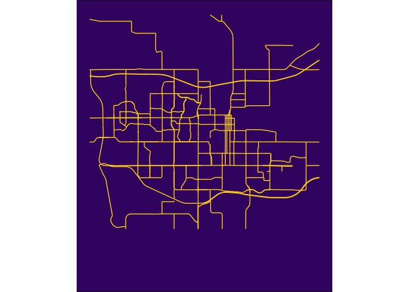
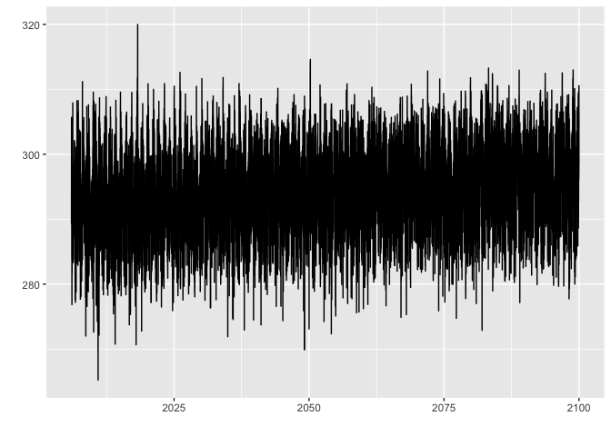
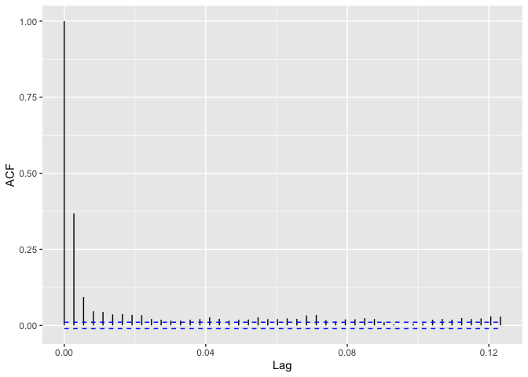
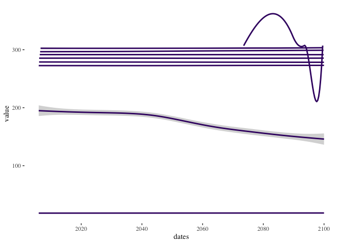

``` r
options(knitr.kable.NA = '')
```

# Climate futures for [Haskell Indian Nations University](https://www.haskell.edu)

## Prepare your environment

1.  Install Climate Futures Toolbox

``` r
install.packages("cft")
```

2.  Load other packages

``` r
library(tidyverse)
library(tidync)
library(cft)
library(sf)
library(ggplot2)
library(ggthemes)
library(ggpattern)
library(magick)
library(future)
library(forecast)
library(tidytable)
library(janitor)
options(timeout = 600)
library(ggfortify)
library(reticulate)
library(osmdata)
library(osmextract)
library(changepoint)
library(weathermetrics)
```

``` r
conda_update(conda = "auto")
py_install("numpy")
py_install("matplotlib")
py_install("pandas")
py_install("statsmodels")
py_install("osmnx")
py_install("geopandas")
```

### Set your color palette

1.  Download the Haskell university logo

``` r
seamless_image_filenames <- c(
  'Haskell_logo.png'
)
```


2.  Sample the colors on that logo to make a custom color palette for
    our basemap

``` r
our_blue <- "#3A4E8B"
our_yellow <- "#FFD60F"
our_beige <- "#EDEDF0"
our_purple <- "#3E1471"
```

## Finding basic layers in OpenStreetMap

Explain the basics of APIs and the premise of fast downloads.

### Use plain lnaguage to request a bounding box

1.  Find the general area on Open Street Map We use a function from the
    osmdata package to find a bounding box for our area of interest.
    This is a nice function for this purpose because it can use plan
    language declarations (e.g. “Lawrence, Kansas” or “Boulder,
    Colorado”) for the location. You do not need to use this function to
    define a bounding box. You can define your bounding box from any
    source. The benefit of this method is that is it is rather easy and
    reliable.

``` r
bb <- getbb("Lawrence, Kansas")
bb
```

    ##         min       max
    ## x -95.34454 -95.16662
    ## y  38.90447  39.03350

If you format your request a little differently, then it will return the
more complex polygon for the bounding box.

``` r
bb_sf <- getbb("Lawrence, Kansas", format_out = "sf_polygon")
ggplot(data=bb_sf$multipolygon) + geom_sf(fill=our_beige, color=our_purple) + theme_tufte()
```

<!-- -->

2.  Find any buildings associated with any University in our “Lawrence,
    Kansas” bounding box.

#### Using the package osmdata

This request first calls the opq() function, which mounts to the
OpenStreetMap database and then queries the “building” key (i.e. all the
building footprints) for any building types matching the value
“university”. This is a representation of the “key” and “value” system
that OSM uses to query data. The final step is to convert the OSM output
into a spatial format that works well in R, called sf.

``` r
library(osmdata)
University_buildings <- 
  opq(bb) %>% 
  add_osm_feature(key = "building", value = "university") %>% 
  osmdata_sf()
```

The output from this request shows a list of multipolygons, polygons,
linestrings, and points. Each of these data types have a different
storage structure, so we can’t look at them all at the same time.
Instead, lets start with polygons, which likely represent a single
building footprint. Printing ‘my_boundary$osm_polygons’ shows that there
are two Universities in Lawrence and we need to filter those results
down to only include Haskell building.

``` r
University_buildings <- University_buildings$osm_polygons
```

#### Using the package osmextract

The package OSMextract is calling the same OSM API, but it does it in a
slightly different way that can make if faster but also requires a
little better understanding of what you’re looking for. For example, by
default OSM extract only downloads the first 25 columns as their own
column and clumps the rest into a list that is difficult to read. You
can add columns to the api call as I did here (e.g. extra_tags =
c(“operator)) and it will return that column as a column instead of in
the list. You can also parse the list yourself or use osmdata() to
download a sample and then use osmextract to execute larger downloads.
This package usually clumps polygons and multipolygons by default so,
you just ask for multipolygons and get both back.

``` r
library(osmextract)
University_buildings <- oe_get(
  place = "Lawrence, Kansas", 
  layer = "multipolygons",
  query = "SELECT * FROM multipolygons WHERE building IN ('university')",
  quiet = TRUE,
  extra_tags = c("operator")
)

colnames(University_buildings)
```

    ##  [1] "osm_id"      "osm_way_id"  "name"        "type"        "aeroway"     "amenity"    
    ##  [7] "admin_level" "barrier"     "boundary"    "building"    "craft"       "geological" 
    ## [13] "historic"    "land_area"   "landuse"     "leisure"     "man_made"    "military"   
    ## [19] "natural"     "office"      "place"       "shop"        "sport"       "tourism"    
    ## [25] "operator"    "other_tags"  "geometry"

3.  Use the ‘operator’ column to identify the owner of those buildings
    and filter down to building operated by Haskell Indian Nations
    University.

``` r
Haskell_university_buildings <- University_buildings %>% 
  filter(operator == "Haskell Indian Nations University") 
Haskell_university_buildings1 <- Haskell_university_buildings[1,] #take the first building (e.g. first row) of the returns
head(Haskell_university_buildings1)
```

The janitor package is useful for performing automated cleaning tasks on
your data. Here we remove all of the columns that contain no data to
make our dataframe much smaller and easier to read.

4.  Plot our discovered footprint to visually confirm It looks like we
    found [Winona Hall](https://www.kansasmemory.org/item/449914) in the
    OpenStreetMap database. This is how we plot the perimeters
    associated with it. 

``` r
basemap <- ggplot(data = st_as_sf(boundaries1)) +
  geom_sf(fill = our_purple, color=our_yellow) +
  geom_sf_text(aes(label = name), size=10, color=our_yellow) +
  theme_tufte()

basemap
```


\#### OSM in python using osmnx The python interface for OSM uses a
slightly different syntax to write the requests, but it’s calling the
same OSM api that the R packages call. You still submit a plain-language
area-of-interest, a value, and a key. Those three inputs will return a
list of points, lines, and polygons for you to use and manipulate.

``` python
place_name = "Lawrence, Kansas"

# import osmnx
import osmnx as ox
import geopandas as gpd
import matplotlib.pyplot as plt

# Get place boundary related to the place name as a geodataframe
area = ox.geocode_to_gdf(place_name)
type(area)


# List key-value pairs for tags
```

    ## <class 'geopandas.geodataframe.GeoDataFrame'>

``` python
tags = {'building': 'university'}   


buildings = ox.geometries_from_place(place_name, tags)
buildings.plot()
plt.show()
```

<!-- -->

## Build a basemap from OpenStreetMap

### Download all the layers you want to include in your basemap

1.  Download the Haskell University footprint

``` r
amenity_poly <- oe_get(
  place = "Lawrence, Kansas", 
  layer = "multipolygons",
  query = "SELECT * FROM multipolygons WHERE amenity IN ('university')",
  quiet = TRUE,
  extra_tags = c("operator")
)


haskell_poly <- amenity_poly %>%
  filter(name =='Haskell Indian Nations University') %>%
  st_as_sf()
```

<!-- -->

2.  Download street vector layers The street vector is divided into two
    different downloads in order to create two different objects for
    coloring in the final figure. This first download will be in the
    foreground. It includes the larger and faster roadways.

``` r
# the big streets
big_streets_lines <- oe_get(
  place = "Lawrence, Kansas", 
  layer = "lines",
  query = "SELECT * FROM lines WHERE highway IN ('motorway', 'trunk',  'primary',  'secondary', 'tertiary')",
  quiet = TRUE
)

streets_crop <- big_streets_lines %>%
  st_crop(y = c(ymin = bb[2,1], ymax = bb[2,2], xmin = bb[1,1], xmax = bb[1,2]))
```

<!-- -->

The second street download is for the small side streets and footpaths.
These lines will be more faint and in the background.

``` r
small_streets <- oe_get(
  place = "Lawrence, Kansas", 
  layer = "lines",
  query = "SELECT * FROM lines WHERE highway IN ('residential', 'living',  'unclassified',  'service', 'footway')",
  quiet = TRUE
)

small_streets_crop <- small_streets %>%
  st_crop(y = c(ymin = bb[2,1], ymax = bb[2,2], xmin = bb[1,1], xmax = bb[1,2]))
```

<!-- -->

3.  Download water features. The water features are first divided into
    moving and stationary water. We will download the river layer from
    the waterway key.

``` r
water <- oe_get(
  place = "Lawrence, Kansas", 
  layer = "lines",
  query = "SELECT * FROM lines WHERE waterway IN ('river')",
  quiet = TRUE
)
```

We divide the water into large and small waterways in the same way we
did with the road. We are interested in making the main river much
larger and the remaining waterways collectively smaller. The Kansas
river is the large feature in this map so, we pull it out first.

``` r
Kansas_river_multi <- water %>%
  filter(name == "Kansas River")  %>% 
  st_as_sf() %>%
  st_crop(y = c(ymin = bb[2,1], ymax = bb[2,2], xmin = bb[1,1], xmax = bb[1,2]))
```

<!-- -->

After removing the Kansas river, we are left with a number of remaining
waterways that are stored as both linestrings and multilinestrings. We
need to download each of those data types individually.

``` r
small_water_lines <- water %>%
  filter(name != "Kansas River")%>%
  st_as_sf() %>%
  st_crop(y = c(ymin = bb[2,1], ymax = bb[2,2], xmin = bb[1,1], xmax = bb[1,2]))
```

<!-- -->

The stationary water bodies are a subcategory under the key=natural and
the value=water. We ask for the extra column named water to be include
in our returned sf table. We can use that column to filter our the lakes
and reservours as local water bodies.

``` r
# Request all water features using natural:water but also request the water tag be given it's own column. 
water_body <- oe_get(
  place = "Lawrence, Kansas", 
  layer = "multipolygons",
  query = "SELECT * FROM multipolygons WHERE natural IN ('water')",
  quiet = TRUE,
  extra_tags = c("water") #give water it's own column instead of clumping in supplimentary list
)

water_body_crop <- water_body %>%
  filter(water == 'lake' | water == "reservoir") %>%
  st_as_sf() 
```

<!-- -->

### Stack downloaded OSM layers into a final basemap.

This is a special edit to manually shift the bounding box so that it
better centered Haskell University in the basemap. Most people will not
need this adjustment but may enjoy the ability to microadjust their
basemap.

``` r
bbb <- bb
bbb[1,1] <- bbb[1,1] - 0.001
bbb[1,2] <- bbb[1,2] + 0.001
bbb[2,1] <- bbb[2,1] - 0.03
bbb[2,2] <- bbb[2,2] + 0.001
xlimit <- bbb[1,]
ylimit <- bbb[2,] 
xmid <- xlimit[1] + diff(xlimit) / 2 
ratio <- diff(xlimit) / diff(ylimit)
```

This is a long plot that calls each of the plot layers in order from the
back to the front. There is a section at the end that crop, format, and
append the basemap.

``` r
haskel_basemap <- ggplot() +
  # plot moving water layers first
  geom_sf(data = Kansas_river_multi, alpha = .8,
          size = 3, colour = our_blue) +
  geom_sf(data = small_water_lines, alpha = .8,
          size = 0.5, colour = our_blue) +
  # Layer bodies of water over the moving water layers
  geom_sf(data = water_body_crop, alpha = 1, fill = our_blue, size=0) +
  
  # Plot small streets in the background with a light fade
  geom_sf(data = small_streets_crop, alpha = .6, 
          size = .1, colour = our_beige) +
  # Layer large streets over the top of the small streets with a bold color.
  geom_sf(data = streets_crop, alpha = .8, 
          size = .4, colour = our_yellow ) +
  # Layer Haskell university property polygon in the foreground
  geom_sf( data=haskell_poly, color=our_yellow, size=1) +
  # Fill Haskell property polygon with Haskell logo
   geom_sf_pattern( 
     data = haskell_poly,
     size=0,
    pattern       = 'image',
    pattern_type  = 'tile',
    pattern_scale = 0.06,
    pattern_filename = seamless_image_filenames
  ) +
  # set limits on final figure 
  coord_sf(ylim = ylimit, xlim = xlimit, expand = TRUE) +
  # adding labels
  annotate(geom = "text", y = bbb[2,1]+ 0.013, x = xmid, 
           label = "Haskell Indian Nations University", size = 12, colour = our_beige
           ) +
  annotate(geom = "errorbarh", xmin = xlimit[1], xmax = xlimit[2], y = bbb[2,1]+ 0.005,   
           height = 0, size = 0.5, colour = our_beige) +
  annotate(geom = "text", y = bbb[2,1]+ 0.0001, x =  xmid,
           label = "38°93'88\"N  95°23'29\"W",  size = 6,
           colour = our_beige) +
  # clean out unused elements and set background color
  theme_void() +
  theme(panel.background = element_rect(fill = our_purple),
        plot.background = element_rect(fill = NA))
```


### Save the basemap in high resolution print

``` r
ggsave(haskel_basemap, filename = "All_roads_lead_to_Haskell.png", height = 11, width=8.5, 
       units="in", dpi=600)
```

## Mount the climate dataset

This dataset is way too big to download to a particular machine.
Instead, you mount to the analysis ready data cube (i.e. netCDF) and
only download the subsetted data that you want to pull.

 1. We calculate the center point for measuring to
the nearest climate data point.

``` r
haskel_centroid <- st_coordinates(st_centroid(haskell_poly))
lat_pt <- haskel_centroid[1,2]
lon_pt <- haskel_centroid[1,1]
```

2.  Connect to the web server and activate the proper data dimensions.

``` r
web_link = "https://cida.usgs.gov/thredds/dodsC/macav2metdata_daily_future"

# Change to "https://cida.usgs.gov/thredds/catalog.html?dataset=cida.usgs.gov/macav2metdata_daily_historical" for historical data. 

src <- tidync::tidync(web_link)
lons <- src %>% activate("D2") %>% hyper_tibble()
lats <- src %>% activate("D1") %>% hyper_tibble()
```

3.  Search through the database of climate prediction points to find
    which one is closest to our centroid. We then spatially project that
    chosen pt into an sf object.

``` r
known_lon <- lons[which(abs(lons-lon_pt)==min(abs(lons-lon_pt))),]
known_lat <- lats[which(abs(lats-lat_pt)==min(abs(lats-lat_pt))),]

chosen_pt <- st_as_sf(cbind(known_lon,known_lat), coords = c("lon", "lat"), crs = "WGS84", agr = "constant")
```


## Find and transfer climate data from an API

### Mount to the downscaled dataset and transfer metadata.

We cannot download the entire dataset. Instead, we mount to that dataset
by connecting to an api that route us to a particular part of the
dataset based on the bounding box specified. Mount to the USGS
downscaled dataset. The resultant object called ‘input’ includes three
elements The first is the full list of available data at each timestep.
The second is a list of possible time steps. The third is a list of
verbatim copy of the raw return from the server. This raw return shows
the dimensions of the data and how many elements are available in each
of those dimensions.

``` r
# Mount to the USGS downscaled dataset. 
inputs <- cft::available_data()
```

Element 1. Dataframe of availble data and descriptions of each of those
variables.

``` r
head(inputs[[1]])
```

Element 2. Short list of available data you can request

``` r
head(unique(inputs[[1]]$Variable))
```

    ## [1] "Specific Humidity"                   "Precipitation"                      
    ## [3] "Maximum Relative Humidity"           "Minimum Relative Humidity"          
    ## [5] "Surface Downswelling Shortwave Flux" "Maximum Temperature"

Element 3. Dataframe of available times

``` r
head(inputs[[2]])
tail(inputs[[2]])
```

### Decide which Variables, Scenarios, and Models you want to request

Your data order needs to include three things: Variable, Scenario, and
Model. Your options can be found in the input elements we explored in
the previous section.

``` r
input_variables <- inputs$variable_names %>% 
  filter(Variable %in% c("Maximum Relative Humidity", 
                       "Minimum Relative Humidity",
                       "Maximum Temperature",
                       "Minimum Temperature",                 
                       "Precipitation",
                       "Eastward Wind",
                       "Northward Wind")) %>% 
  filter(Scenario %in% c( "RCP 8.5")) %>% 
  filter(Model %in% c(
    "Beijing Climate Center - Climate System Model 1.1",
    "Beijing Normal University - Earth System Model",
    "Canadian Earth System Model 2",                                                                
  "Centre National de Recherches Météorologiques - Climate Model 5",                              
  "Commonwealth Scientific and Industrial Research Organisation - Mk3.6.0",                       
  "Community Climate System Model 4",                                                             
  "Geophysical Fluid Dynamics Laboratory - Earth System Model 2 Generalized Ocean Layer Dynamics",
  "Geophysical Fluid Dynamics Laboratory - Earth System Model 2 Modular Ocean",                   
  "Hadley Global Environment Model 2 - Climate Chemistry 365 (day) ",                             
 "Hadley Global Environment Model 2 - Earth System 365 (day)",                                   
 "Institut Pierre Simon Laplace (IPSL) - Climate Model 5A - Low Resolution",                     
 "Institut Pierre Simon Laplace (IPSL) - Climate Model 5A - Medium Resolution",                  
 "Institut Pierre Simon Laplace (IPSL) - Climate Model 5B - Low Resolution",                     
 "Institute of Numerical Mathematics Climate Model 4",                                           
 "Meteorological Research Institute - Coupled Global Climate Model 3",                           
 "Model for Interdisciplinary Research On Climate - Earth System Model",                         
 "Model for Interdisciplinary Research On Climate - Earth System Model - Chemistry",             
 "Model for Interdisciplinary Research On Climate 5",                                            
 "Norwegian Earth System Model 1 - Medium Resolution"  )) %>%
  
  pull("Available variable")

head(as.data.frame(input_variables))
```

### Prepare for parallelization

We have requested enough information to exceed our download limit and we
need to implement a ‘parallel’ approach to get all the data we want.
This strategy has each of the cores in your computer act as their own
computer and individually make small requests from the server and then
assemble all the little chunks into the final dataset you requested.
Here we tell our computer that we are about to send a parallel request
and tell the computer how we want to destribute the tasks we send.

``` r
# ask how many cores are available to be farmed out. I subtract one so I still have a core to use for controlling the whole process. 
n_cores <- availableCores() - 1

# set plan to take all cores except one. 
plan(multisession, workers = n_cores)
```

### Make parallel call to USGS server.

This is the parallel function from the CFT package. It will shuttle all
the data you requested, through all the cores you specified, for the
latitude and longitude you requested. This took about 45 minutes on my
home laptop with fiber internet. Virtual machines usually only have one
core. If you’re running this in the cloud, you may need to do some
special configuration to get this to actually parallelize.

``` r
out <- single_point_firehose(input_variables, known_lat, known_lon )
head(out)
```

### Save output

To save time, I have run the api request above and saved the results for
future use. There is no reason to run the api request over and over
again. It’s easy to save the data once their downloaded and save
yourself the download again in the future.

``` r
haskell <- out
save(haskell, file = "haskell.RData")
```

### Load saved output

If I have run my api request and saved it to my working directory, then
I can load it from here anytime I need. This will save you time as you
experiment with different downstream analyes.

``` r
load(file = "haskell.RData")
```

## Organize climate data

Our requested climate data are returned from the api server as two data
frames. The first data frame is the columns of data that are indexed by
a time reference number and the second, which is the list translations
from time reference number to actual time. We will join those tables
here to make those data easier to work with. Once joined, we convert the
time labels from characters to POSIX. POSIX is a special way of handling
time and date data in R. We reorder the columns so that the POSIX data
is in the first column. This will make it easy to later create a time
series object (ts) that can go into our statistical and forecasting
functions. Finally, we print the column names of the final transformed
data frame to verify that we have time data in the first column and all
the requested data as columns after that.

### Join data with dates

``` r
# make the time output into it's own dataframe and change column name
available_times <- inputs[[2]]
colnames(available_times)[1] <- "time"

# left join the time data into the spatial data
haskell_posix <- haskell %>%
  left_join(available_times, by="time")
  
# convert time format into POSIX, which is a format that deals with all the confusion of time and data formats (e.g. time zones and translation between numbers and word descriptions for time)
haskell_posix$dates <- as.POSIXct(haskell_posix$dates)
class(haskell_posix$dates)
```

    ## [1] "POSIXct" "POSIXt"

``` r
#reorder so that dates are the first column
haskell_posix <- haskell_posix[,c(93,2, 1,3:92)]
colnames(haskell_posix)
```

    ##  [1] "dates"                              "time"                              
    ##  [3] "pr_BNU-ESM_r1i1p1_rcp85"            "pr_CCSM4_r6i1p1_rcp85"             
    ##  [5] "pr_CNRM-CM5_r1i1p1_rcp85"           "pr_CSIRO-Mk3-6-0_r1i1p1_rcp85"     
    ##  [7] "pr_CanESM2_r1i1p1_rcp85"            "pr_GFDL-ESM2G_r1i1p1_rcp85"        
    ##  [9] "pr_GFDL-ESM2M_r1i1p1_rcp85"         "pr_HadGEM2-CC365_r1i1p1_rcp85"     
    ## [11] "pr_HadGEM2-ES365_r1i1p1_rcp85"      "pr_IPSL-CM5A-LR_r1i1p1_rcp85"      
    ## [13] "pr_IPSL-CM5A-MR_r1i1p1_rcp85"       "pr_IPSL-CM5B-LR_r1i1p1_rcp85"      
    ## [15] "pr_MIROC-ESM-CHEM_r1i1p1_rcp85"     "pr_MIROC-ESM_r1i1p1_rcp85"         
    ## [17] "pr_MIROC5_r1i1p1_rcp85"             "pr_MRI-CGCM3_r1i1p1_rcp85"         
    ## [19] "pr_NorESM1-M_r1i1p1_rcp85"          "pr_inmcm4_r1i1p1_rcp85"            
    ## [21] "rhsmax_BNU-ESM_r1i1p1_rcp85"        "rhsmax_CNRM-CM5_r1i1p1_rcp85"      
    ## [23] "rhsmax_CSIRO-Mk3-6-0_r1i1p1_rcp85"  "rhsmax_CanESM2_r1i1p1_rcp85"       
    ## [25] "rhsmax_GFDL-ESM2G_r1i1p1_rcp85"     "rhsmax_HadGEM2-CC365_r1i1p1_rcp85" 
    ## [27] "rhsmax_HadGEM2-ES365_r1i1p1_rcp85"  "rhsmax_IPSL-CM5A-LR_r1i1p1_rcp85"  
    ## [29] "rhsmax_IPSL-CM5A-MR_r1i1p1_rcp85"   "rhsmax_IPSL-CM5B-LR_r1i1p1_rcp85"  
    ## [31] "rhsmax_MIROC-ESM-CHEM_r1i1p1_rcp85" "rhsmax_MIROC-ESM_r1i1p1_rcp85"     
    ## [33] "rhsmax_MIROC5_r1i1p1_rcp85"         "rhsmax_MRI-CGCM3_r1i1p1_rcp85"     
    ## [35] "rhsmax_inmcm4_r1i1p1_rcp85"         "rhsmin_BNU-ESM_r1i1p1_rcp85"       
    ## [37] "rhsmin_CNRM-CM5_r1i1p1_rcp85"       "rhsmin_CSIRO-Mk3-6-0_r1i1p1_rcp85" 
    ## [39] "rhsmin_CanESM2_r1i1p1_rcp85"        "rhsmin_GFDL-ESM2G_r1i1p1_rcp85"    
    ## [41] "rhsmin_GFDL-ESM2M_r1i1p1_rcp85"     "rhsmin_HadGEM2-CC365_r1i1p1_rcp85" 
    ## [43] "rhsmin_HadGEM2-ES365_r1i1p1_rcp85"  "rhsmin_IPSL-CM5A-LR_r1i1p1_rcp85"  
    ## [45] "rhsmin_IPSL-CM5A-MR_r1i1p1_rcp85"   "rhsmin_IPSL-CM5B-LR_r1i1p1_rcp85"  
    ## [47] "rhsmin_MIROC-ESM-CHEM_r1i1p1_rcp85" "rhsmin_MIROC-ESM_r1i1p1_rcp85"     
    ## [49] "rhsmin_MIROC5_r1i1p1_rcp85"         "rhsmin_MRI-CGCM3_r1i1p1_rcp85"     
    ## [51] "tasmax_BNU-ESM_r1i1p1_rcp85"        "tasmax_CCSM4_r6i1p1_rcp85"         
    ## [53] "tasmax_CNRM-CM5_r1i1p1_rcp85"       "tasmax_CSIRO-Mk3-6-0_r1i1p1_rcp85" 
    ## [55] "tasmax_CanESM2_r1i1p1_rcp85"        "tasmax_GFDL-ESM2G_r1i1p1_rcp85"    
    ## [57] "tasmax_GFDL-ESM2M_r1i1p1_rcp85"     "tasmax_HadGEM2-CC365_r1i1p1_rcp85" 
    ## [59] "tasmax_HadGEM2-ES365_r1i1p1_rcp85"  "tasmax_IPSL-CM5A-LR_r1i1p1_rcp85"  
    ## [61] "tasmax_IPSL-CM5A-MR_r1i1p1_rcp85"   "tasmax_IPSL-CM5B-LR_r1i1p1_rcp85"  
    ## [63] "tasmax_MIROC-ESM-CHEM_r1i1p1_rcp85" "tasmax_MIROC-ESM_r1i1p1_rcp85"     
    ## [65] "tasmax_MIROC5_r1i1p1_rcp85"         "tasmax_MRI-CGCM3_r1i1p1_rcp85"     
    ## [67] "tasmax_NorESM1-M_r1i1p1_rcp85"      "tasmax_inmcm4_r1i1p1_rcp85"        
    ## [69] "tasmin_BNU-ESM_r1i1p1_rcp85"        "tasmin_CCSM4_r6i1p1_rcp85"         
    ## [71] "tasmin_CNRM-CM5_r1i1p1_rcp85"       "tasmin_CSIRO-Mk3-6-0_r1i1p1_rcp85" 
    ## [73] "tasmin_CanESM2_r1i1p1_rcp85"        "tasmin_GFDL-ESM2G_r1i1p1_rcp85"    
    ## [75] "tasmin_GFDL-ESM2M_r1i1p1_rcp85"     "tasmin_HadGEM2-CC365_r1i1p1_rcp85" 
    ## [77] "tasmin_HadGEM2-ES365_r1i1p1_rcp85"  "tasmin_IPSL-CM5A-LR_r1i1p1_rcp85"  
    ## [79] "tasmin_IPSL-CM5A-MR_r1i1p1_rcp85"   "tasmin_IPSL-CM5B-LR_r1i1p1_rcp85"  
    ## [81] "tasmin_MIROC-ESM-CHEM_r1i1p1_rcp85" "tasmin_MIROC-ESM_r1i1p1_rcp85"     
    ## [83] "tasmin_MIROC5_r1i1p1_rcp85"         "tasmin_MRI-CGCM3_r1i1p1_rcp85"     
    ## [85] "tasmin_NorESM1-M_r1i1p1_rcp85"      "tasmin_inmcm4_r1i1p1_rcp85"        
    ## [87] "pr_bcc-csm1-1_r1i1p1_rcp85"         "rhsmax_bcc-csm1-1_r1i1p1_rcp85"    
    ## [89] "rhsmin_bcc-csm1-1_r1i1p1_rcp85"     "rhsmin_inmcm4_r1i1p1_rcp85"        
    ## [91] "tasmax_bcc-csm1-1_r1i1p1_rcp85"     "tasmin_bcc-csm1-1_r1i1p1_rcp85"    
    ## [93] "geometry"

We imported temperature data, humidity data, and precipitation data.
Each of these are handled and modeled in a slightly different way. Here,
we’ll work through those three data types in sequence and try to draw
inference from synthesizing those three pieces of information.

### Temperature

Temperature is the most talked-about component of climate. It’s a great
indicator of the weather overall, it’s a direct output of climate
models, and it’s a defining characteristic of ecological niches.

#### Minimum temperature

1.  Organize data The climate data we are importing are ‘downscaled’
    from much larger and more complex models. This process of
    downscaling summarized that more complicated model. This means that
    we don’t need to calculate our own summary statistics (e.g. mean,
    minimum, or maximum) because we download those summary statistics
    instead of the raw data. We start by filtering our full downloaded
    data set and create a new data set with only minimum temperatures in
    it. We ordered one scenario from 18 different climate modeling
    agencies so, our filtered data set should be 18 columns of data plus
    geography and time tags. We then use the gather() function to
    reorganize that table so that we have three columns: dates,
    variable, and value. This reorganization makes the data easy to
    convert into a time series (ts) object for later analysis and
    visualization.

``` r
df_min_temp <- haskell_posix %>%
  st_drop_geometry() %>%
  select(dates, dates,  which(startsWith(colnames(haskell), "tasmin"))) %>%
  gather(key = "variable", value = "value", -dates)

df_min_temp <- df_min_temp[which(df_min_temp$value > 200), ]
df_min_temp$variable <- as.character(as.numeric(as.factor(df_min_temp$variable)))

colnames(df_min_temp)
```

    ## [1] "dates"    "variable" "value"

2.  Plot data If we plot our filtered minimum temperature data, we see a
    chaotic mess because all 18 models are represented on the same
    graph. We probably want to consider all of the models together.

``` r
all_climate_projections <- ggplot(data= df_min_temp, aes(x = dates, y = value, color = variable)) +
  geom_line()+
  geom_smooth() +
  scale_colour_viridis_d(option="A")

all_climate_projections
```

<!-- -->

3.  Plot as ensemble and fit a general additive model (GAM) to those
    data If we plot those same data again without the model distinction,
    we see the ensemble of all 18 climate models. These data were
    standardized during downscaling, so they are directly comparable now
    without any more fuss. Notice that these data are in Kelvin. You
    should alway complet all of your analyses in Kelvin and only
    translate to Celsius or Fahrenheit for final figures for a general
    audience. We apply a general additive model to the data to see what
    the basic trend looks like. It looks like we should expect a steady
    increasing in temperature from 281K to 289K between now and 2099.
    This line doesn’t offer much refinement to our existing expectation.
    Visually, it sits below an area of high data density and it doesn’t
    help us explain any of the season variation we see in the data. This
    fit makes us want something better.

``` r
ensemble_climate_projections <- ggplot(data= df_min_temp, aes(x = dates, y = kelvin.to.fahrenheit(value))) + 
  geom_line(color=our_purple)+
  geom_smooth(color=our_yellow) + #This applies a GAM (general additive model) to the data to find a trend line. 
  theme_tufte() +
  geom_hline(yintercept=32)+
  geom_hline(yintercept=87)+
  geom_hline(yintercept=105)

ensemble_climate_projections
```

<!-- -->

Number of days below freezing. Each generation will have one less month
of freeze.

Highest daily low. Each generation experiences an additional 10 days per
year with a daily low above 87 degrees F. Three generations see a lot of
change. for those trying to accomplish 8 generation planning, modern
science can only project less than half way there.

``` r
df_min_temp_F <- df_min_temp
df_min_temp_F$value <- kelvin.to.fahrenheit(df_min_temp_F$value)
df_min_temp_F$dates <- format(df_min_temp_F$dates, format = "%Y")

below_freezing <- df_min_temp_F %>%
  filter(value <=32) %>%
  group_by(dates)%>%
  summarise(cold_counts = n()/18)

high_lows <- df_min_temp_F %>%
  filter(value >=87) %>%
  group_by(dates)%>%
  summarise(high_lows_counts = n()/18)

 scorching_nights <- df_min_temp_F %>%
  filter(value >=105) %>%
  group_by(dates)%>%
  summarise(scorching_nights_counts = n()/18)

  ggplot(data = below_freezing, aes(x = dates, y=cold_counts)) +
           geom_point(color=our_purple)+
    geom_point(data = high_lows, aes(x = dates, y=high_lows_counts),color=our_yellow)+
    geom_point(data = scorching_nights, aes(x = dates, y=scorching_nights_counts),color=our_blue)+
  theme_tufte() +
    ylim(0,100) + 
    ylab("number of days") +
  geom_hline(yintercept=0)+
  geom_hline(yintercept=35)
```

<!-- -->

``` r
min_temp <- ts(df_min_temp[,3], frequency = 365, start = c(2006, 1), end = c(2099,365))
```

4.  Decompose the time series using fourier analysis. Fourier analyses
    are a convenient way to decompose repeating waves and are a mainstay
    of time series analyses. The analysis presented here finds the
    seasonal harmonic in the data and subtracts that harmonic from the
    data to show the difference between trend and noise. We start by
    converting our data into a ts object and passes that ts object to
    the decompose() function. When we plot that deconstruction, we see
    that the resultant trend line is much more nuanced than our previous
    fit.

Here is the GAM fit

``` r
min_temp %>%
  decompose() %>%
  autoplot() + theme_tufte()
```

<!-- -->

We can also use a different decompositions model, here the STL model,
which is a loess model for time series data. The STL

Here is the loess fit

``` r
min_temp %>%
 stl(s.window = "periodic") %>%
  autoplot() + theme_tufte()
```

<!-- --> \####
Estimate Spectral Density of a Time Series This is the fourier spectral
breakdown for the decomposition. You can see the strong first harmonic
that is easy to pull out and makes the decomposition of this data go
relatively fast for this size of dataset.

``` r
autoplot(spec.ar(min_temp, plot = FALSE))+ theme_tufte()
```

<!-- -->

#### Verify that our use of an additive model was appropriate.

Time series can come in a couple different flavors. The two that are
common in decomposition analyses are additive and multiplicative
harmonics. We made the assumption that temperature increase was additive
and we can validate that assumption here with an autocorrelation
function (ACF), which is the coefficient of correlation between two
values in a time series. The results show the gradual decline of ACF
along the time series. This is the result of our one-step-ahead climate
predictions that use the previous year to predict the next year. this
means that there is strong correlation between adjoining years, but that
the correlation degrades in one direction from no into the future. You
see that years in the near future are tightly coupled with each other
but that covariance degrades over time so we have less confidence in the
end of the time series than we do about the beginning. A multiplicative
relationship would inflate rapidly over time and show an exponential
relationship here. You might expect multiplicative relationships with
time series of demographic growth, stock trends, or social media ‘likes’
because those all present mechanisms that can multiply rather than add.

``` r
autoplot(acf(min_temp, plot = FALSE))+ theme_tufte()
```

<!-- -->

#### Forecast models

We need to make an important distinctions between the different types of
forecasting happening in this analysis. Our climate data are forecast
into the future using global mechanistic models simulating the collision
of air molecules and the accumulation of gasses that change climate and
weather patterns over decades. Those models produce the data we download
and use as raw data to describe our local future. The forecasting we’re
about to do, we’re looking for statistical trends contained within that
data. There is no natural or environmental mechanism in this
forecasting. The arima forecast is a statistical forecasting method that
fits a model to the data using the same decomposition method we
described above (GAN) and then calculates an acceptable forecast window
based on the predictability of the trend relative to the data.

``` r
seasonally_adjusted_min_temp <- min_temp %>% stl(s.window='periodic') %>% seasadj() 
min_plot <- autoplot(seasonally_adjusted_min_temp) 
#+ 
 # theme_tufte() + 
  #geom_smooth(col=our_yellow)

min_plot
```

<!-- -->

``` r
arima_min_temp <- auto.arima(seasonally_adjusted_min_temp)
arima_min_temp
```

    ## Series: seasonally_adjusted_min_temp 
    ## ARIMA(5,1,2) 
    ## 
    ## Coefficients:
    ##          ar1      ar2     ar3      ar4     ar5      ma1     ma2
    ##       1.3381  -0.6457  0.1785  -0.0374  0.0114  -1.4619  0.4723
    ## s.e.  0.1189   0.1019  0.0293   0.0119  0.0057   0.1188  0.1161
    ## 
    ## sigma^2 = 13.99:  log likelihood = -93934.25
    ## AIC=187884.5   AICc=187884.5   BIC=187952

``` r
bullseye <- autoplot(arima_min_temp) 
bullseye
```

<!-- -->

``` r
checkresiduals(arima_min_temp)
```

<!-- -->

    ## 
    ##  Ljung-Box test
    ## 
    ## data:  Residuals from ARIMA(5,1,2)
    ## Q* = 1218.6, df = 723, p-value < 2.2e-16
    ## 
    ## Model df: 7.   Total lags used: 730

``` r
seasonally_adjusted_min_temp %>% diff() %>% ggtsdisplay(main="") + theme_tufte()
```

<!-- --><!-- -->

``` r
autoplot(cpt.meanvar(seasonally_adjusted_min_temp), cpt.colour = 'blue', cpt.linetype = 'solid')
```

<!-- -->

``` r
arima_min_temp %>% forecast(h=2400) %>% autoplot()
```

<!-- -->

#### Maximum temperature

The cyverse folks join us from Arizona will think thi

``` r
df_max_temp <- haskell_posix %>%
  st_drop_geometry() %>%
  select(dates, dates,  which(startsWith(colnames(haskell), "tasmax"))) %>%
  gather(key = "variable", value = "value", -dates)

df_max_temp <- df_max_temp[which(df_max_temp$value > 200), ]
df_max_temp$variable <- as.character(as.numeric(as.factor(df_max_temp$variable)))

#df_min_temp_TS <- as.xts(df_min_temp)
colnames(df_max_temp)
```

    ## [1] "dates"    "variable" "value"

``` r
ensemble_climate_projections <- ggplot(data= df_max_temp, aes(x = dates, y = kelvin.to.fahrenheit(value))) + 
  geom_line(color=our_purple)+
  geom_smooth(color=our_yellow) + #This applies a GAM (general additive model) to the data to find a trend line. 
  theme_tufte() +
  geom_hline(yintercept=114)+
  geom_hline(yintercept=32) + 
  ylab("temperature (F)")

ensemble_climate_projections
```

<!-- -->

``` r
df_max_temp_F <- df_max_temp
df_max_temp_F$value <- kelvin.to.fahrenheit(df_max_temp_F$value)
df_max_temp_F$dates <- format(df_max_temp_F$dates, format = "%Y")

beyond_max_temp <- df_max_temp_F %>%
  filter(value >=114) %>%
  group_by(dates)%>%
  summarise(beyond_max = n()/18)

max_below_freezing <- df_max_temp_F %>%
  filter(value <=32) %>%
  group_by(dates)%>%
  summarise(below_freezing = n()/18)

  ggplot(data = beyond_max_temp, aes(x = dates, y=beyond_max)) +
           geom_point(color=our_purple)+
    geom_point(data = max_below_freezing, aes(x = dates, y=below_freezing), color=our_yellow)+
  theme_tufte() +
    ylim(0,15) +
    ylab("number of days")
```

<!-- -->

``` r
max_temp <- ts(df_max_temp[,3], frequency = 365, start = c(2006, 1), end = c(2099,365))
```

``` r
seasonally_adjusted_max_temp <- max_temp %>% stl(s.window='periodic') %>% seasadj() 
```

``` r
arima_max_temp <- auto.arima(seasonally_adjusted_max_temp)
arima_max_temp
```

    ## Series: seasonally_adjusted_max_temp 
    ## ARIMA(3,1,2) 
    ## 
    ## Coefficients:
    ##          ar1      ar2     ar3      ma1     ma2
    ##       1.3419  -0.6328  0.1624  -1.4760  0.4827
    ## s.e.  0.0623   0.0503  0.0089   0.0631  0.0616
    ## 
    ## sigma^2 = 13.14:  log likelihood = -92862.12
    ## AIC=185736.2   AICc=185736.2   BIC=185786.9

``` r
arima_max_temp %>% forecast(h=2400) %>% autoplot()
```

<!-- -->

``` r
autoplot(cpt.meanvar(seasonally_adjusted_max_temp), cpt.colour = 'blue', cpt.linetype = 'solid')
```

<!-- -->

``` r
min_temp_df <- kelvin.to.fahrenheit(as.data.frame(seasonally_adjusted_min_temp))
max_temp_df <- kelvin.to.fahrenheit(as.data.frame(seasonally_adjusted_max_temp))
ggplot(data=min_temp_df, aes(y=x, x=seq(1, length(x)))) + 
  geom_line(data=min_temp_df, color=our_purple) +
  geom_line(data=max_temp_df, color=our_purple) +
  geom_smooth(data=min_temp_df,color=our_yellow, alpha=1) +
  geom_smooth(data=max_temp_df,color=our_yellow, alpha=1) +
  theme_tufte() +
  
  geom_hline(yintercept=114)+
  geom_hline(yintercept=32) + 
  ylab("temperature (F)")
```

<!-- -->

### Relative Humidity

``` r
df_RH <- haskell %>%
  st_drop_geometry() %>%
  select(time,which(startsWith(colnames(haskell), "rhs")) ) %>%
  gather(key = "variable", value = "value", -time)
```

``` r
all_climate_projections_RH <- ggplot(data= df_RH, aes(x = time, y = value, color = variable)) + 
  #geom_line()+
  
  scale_colour_viridis_d(option="A", alpha = 0.8) +
  geom_smooth() +
  theme_tufte() +
  theme(legend.position = "none") 
  

all_climate_projections_RH
```

<!-- -->

#### Minimum RH

``` r
df_RH_min <- haskell %>%
  st_drop_geometry() %>%
  select(time,which(startsWith(colnames(haskell), "rhsmin"))) %>%
  gather(key = "variable", value = "value", -time)
head(df_RH_min)
```

#### Maximum RH

``` r
df_RH_max <- haskell %>%
  st_drop_geometry() %>%
  select(time,which(startsWith(colnames(haskell), "rhsmax"))) %>%
  gather(key = "variable", value = "value", -time)
head(df_RH_max)
```

### Precipitation

#### Zero-inflated data

``` r
df_precip <- haskell_posix %>%
  st_drop_geometry() %>%
  select(dates, which(startsWith(colnames(haskell), "pr"))) %>%
  gather(key = "variable", value = "value", -dates)
head(df_precip)
```

``` r
all_climate_projections_RH <- ggplot(data= df_RH_min, aes(x = time, y = value) )+ 
  geom_smooth(data= df_RH_min, color=our_purple) +
  geom_smooth(data= df_RH_max, color=our_purple) +
  theme_tufte() +
  ylim(0,100)
  

all_climate_projections_RH
```

<!-- -->

``` r
precip_ts <- ts(df_precip[,3], frequency = 365, start = c(2006, 1), end = c(2099,365))
decomp_precip <- decompose(precip_ts)
plot(decomp_precip, col=our_purple)
```

<!-- -->

``` r
all_climate_projections <- ggplot(data= df_precip, aes(x = dates, y = value, color = variable)) + 
  geom_line(color=our_purple)+
  theme_tufte()

all_climate_projections
```

<!-- -->

``` r
plot.ts(decomp_precip$trend, col=our_purple)
```

<!-- -->

``` r
autoplot(spec.ar(precip_ts, plot = FALSE))
```

<!-- -->

``` r
autoplot(stl(precip_ts, s.window = 'periodic'), ts.colour = our_purple)
```

<!-- -->

``` r
autoplot(acf(precip_ts, plot = FALSE))
```

<!-- -->

``` r
autoplot(acf(precip_ts, plot = FALSE), conf.int.fill = '#0000FF', conf.int.value = 0.8, conf.int.type = 'ma')
```

<!-- -->

``` r
precip_ts %>% stl(s.window='periodic') %>% seasadj() -> eeadj
autoplot(eeadj)
```

<!-- -->

``` r
eeadj %>% diff() %>% ggtsdisplay(main="")
```

<!-- -->

``` r
auto.arima(eeadj)
```

    ## Series: eeadj 
    ## ARIMA(3,0,1) with non-zero mean 
    ## 
    ## Coefficients:
    ##          ar1      ar2     ar3      ma1    mean
    ##       0.9563  -0.2837  0.0557  -0.5816  2.5955
    ## s.e.  0.1281   0.0476  0.0075   0.1282  0.0549
    ## 
    ## sigma^2 = 43.63:  log likelihood = -113453.1
    ## AIC=226918.1   AICc=226918.1   BIC=226968.8

``` r
(fit <- Arima(eeadj, order=c(3,0,1)))
```

    ## Series: eeadj 
    ## ARIMA(3,0,1) with non-zero mean 
    ## 
    ## Coefficients:
    ##          ar1      ar2     ar3      ma1    mean
    ##       0.9563  -0.2837  0.0557  -0.5816  2.5955
    ## s.e.  0.1281   0.0476  0.0075   0.1282  0.0549
    ## 
    ## sigma^2 = 43.63:  log likelihood = -113453.1
    ## AIC=226918.1   AICc=226918.1   BIC=226968.8

``` r
#(fit <- Arima(eeadj, order=c(3,0,1), seasonal=c(0,1,2),
#  lambda=0))

checkresiduals(fit)
```

<!-- -->

    ## 
    ##  Ljung-Box test
    ## 
    ## data:  Residuals from ARIMA(3,0,1) with non-zero mean
    ## Q* = 735.58, df = 726, p-value = 0.3944
    ## 
    ## Model df: 4.   Total lags used: 730

``` r
fit %>% forecast(h=12) %>% autoplot()
```

<!-- -->

``` r
autoplot(fit)
```

<!-- -->

``` r
length(eeadj)
```

    ## [1] 34310

``` r
 interval <- unclass(fit$tsp$interval)
    interval <- Filter(function(x) x!=0, interval)

eeadj %>%
  Arima( order=c(3,0,1)) %>%
  forecast() %>%
  autoplot() +
    ylab("min temp") + xlab("Year")
```

<!-- -->

``` r
df_precip_2 <- df_precip[which(df_precip$value != 0),]

ensemble_climate_projections <- ggplot(data= df_precip_2, aes(x = dates, y = value)) + 
   geom_line(color=our_purple)+
  geom_smooth(color=our_yellow)+
  theme_tufte()
  

ensemble_climate_projections
```

<!-- -->

``` r
ggplot(data= df_precip, aes(x = dates, y = value)) + 
     geom_smooth(color=our_purple)+
  theme_tufte()
```

<!-- -->

``` r
df_precip_quant_95 <- df_precip %>% 
  mutate(quant = ntile(value, 100)) %>%
  filter(quant == 95)

df_precip_quant_96 <- df_precip %>% 
  mutate(quant = ntile(value, 100)) %>%
  filter(quant == 96)

df_precip_quant_97 <- df_precip %>% 
  mutate(quant = ntile(value, 100)) %>%
  filter(quant == 97)

df_precip_quant_98 <- df_precip %>% 
  mutate(quant = ntile(value, 100)) %>%
  filter(quant == 98)

df_precip_quant_99 <- df_precip %>% 
  mutate(quant = ntile(value, 100)) %>%
  filter(quant == 99)

df_precip_quant_100 <- df_precip %>% 
  mutate(quant = ntile(value, 100)) %>%
  filter(quant == 100)

df_precip_quant_1000 <- df_precip %>% 
  mutate(quant = ntile(value, 1000)) %>%
  filter(quant == 1000)

df_precip_quant_100000 <- df_precip %>% 
  mutate(quant = ntile(value, 100000)) %>%
  filter(quant == 100000)
```

``` r
ggplot(data= df_precip, aes(x = dates, y = value)) + 
     geom_smooth(data= df_precip, color=our_purple)+ 
     geom_smooth(data= df_precip_quant_95, color=our_purple) +
    geom_smooth(data= df_precip_quant_96, color=our_purple) +
    geom_smooth(data= df_precip_quant_97, color=our_purple) +
    geom_smooth(data= df_precip_quant_98, color=our_purple) +
    geom_smooth(data= df_precip_quant_99, color=our_purple) +
  geom_smooth(data= df_precip_quant_100, color=our_purple) +
  geom_smooth(data= df_precip_quant_1000, color=our_purple) +
    geom_smooth(data= df_precip_quant_100000, color=our_purple) +
  theme_tufte()
```

<!-- -->
